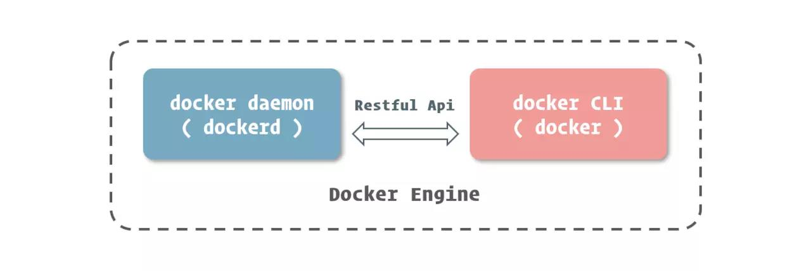

# 虚拟化技术
将计算机物理资源进行抽象、转换为虚拟资源交由应用程序使用的技术。并不是降低程序的资源占用率，而是提高计算机资源的使用率。


分类：

1. 硬件虚拟化：计算机硬件支持虚拟化技术，使得该硬件支持运行多种操作系统或者程序。例如Intel和AMD的CPU VT技术；
2. 软件虚拟化：在硬件和软件层中多了一层指令转化层，实现软件在不同硬件上的指令转换。例如虚拟机、JVM等。

<!--more-->
虚拟机：


Hypervisor的缺点是执行效率低，所以VMware Workstation使用了硬件辅助虚拟化技术，而JRE有JIT等技术。

# 容器技术
操作系统自身支持一些接口，能够让应用程序间可以互不干扰的独立运行，并且能够对其在运行中所使用的资源进行干预。

# docker与微服务
随着现代应用的功能越来越复杂，需要的迭代速度也越来越快，应用程序的开发趋向服务化，微服务架构开始火热起来。

    特点：单独进程、轻量级通信(常用HTTP)、针对特定业务或功能、全自动独立部署、集中管理、跨语言调用、跨数据库存储。
    
    优点：易于开发维护、部署启动快、技术扩性好、按需伸缩
    
    缺点：运维要求提高、分布式固有复杂性、接口可调性低、重复劳动
    
    设计原则：
    
    单一职责---单独的一个类、方法、服务只关注整个系统中某个部分或功能；
    服务自治---每个服务拥有自己的业务、运行环境、依赖；
    轻量通信---轻量级通信机制：REST、AMQP、STOMP、MQTT（协议）；
    粒度控制---参考“DDD”设计思想，设计之初即确定每个微服务边界，每个服务保持独立松耦合。
       
拆分成服务后，由于不同服务的环境依赖不一样，解决依赖问题就变得十分复杂。举个例子：公司前端是通过node运行的，后端有Java应用，有Python应用，如果要上线运行，要装node环境和python环境。然而对于开发者而言， 更愿意将时间花在编写和调试代码上，而不是去排查环境问题上，而docker则最大程度上解决了环境的问题，减少微服务的开发/部署成本。

## docker的技术实现
***命名空间 ( Namespaces ) ：***

命名空间是 Linux 核心在 2.4 版本后逐渐引入的一项用于运行隔离的模块。 相信很多开发者在不同的编程语言中都见过命名空间的概念，在这些编程语言中，命名空间的主要目的就是为了集合相同模块的类，区分不同模块间的同名类。 同样的道理，Linux 内核的命名空间，就是能够将计算机资源进行切割划分，形成各自独立的空间。 就实现而言，Linux Namespaces 可以分为很多具体的子系统，如 User Namespace、Net Namespace、PID Namespace、Mount Namespace 等等。 这里我们以进程为例，通过 PID Namespace，我们可以造就一个独立的进程运行空间，在其中进程的编号又会从 1 开始。在这个空间中运行的进程，完全感知不到外界系统中的其他进程或是其他进程命名空间中运行的进程。

***资源控制组(Control Groups)：***

Linux内核在2.6版本后逐渐引入的一项对计算机资源控制的模块。
CGroups不光能控制计算机资源的分离，还能控制计算机资源的分配。
        
        
***联合文件系统(Union File System)：***

一种能够同时挂载不同实际文件或目录到统一目录，形成一种联合文件结构的文件系统。


docker引入了一项对于UnionFS的改进，也就是AUFS（Advanced Union File System），原理和git的原理类似，其跟踪文件的改变并应用到宿主机的文件之上，而不去修改不更改的文件。

|属性|Docker|虚拟机
|---|---|---
|启动速递|	秒级|	分钟级
|空间|	MB|	GB
|性能|	接近原生|	较低
|普通机器支撑量	|数百个|几个

应用场景：

* 持续集成（Continuous Intergration）和持续交付（Continuous Delivery）。
* 跨平台、跨语言部署和动态伸缩。
* 提高计算机资源利用率，提高生产效率。
 
## docker核心组成
容器引擎：Docker Engine


由daemon和cli两个核心部件的C/S架构组成，通过Restful Api进行通信。

四大组成对象：

### 镜像（image）
一个虚拟操作系统最原始文件系统。

Docker是增量更新镜像，也就是一层一层的镜像，每次更新/修改都会生成一个新的镜像层，每一个镜像是由其下所有镜像组成。


### 容器（container）
用于隔离虚拟环境和真实物理环境的基础设施。

官方定义，容器应由以下几个部分组成：

* 一个Docker镜像
* 一个程序运行环境
* 一个指令集合

### 网络（network）
用于与外界通信，每一个容器都拥有其独立的网络系统或者共用一个网络环境。换句话说，每一个docker容器都可以有自己的域名，或者多个docker容器屏蔽硬件共同组成一个网络环境。

### 数据卷（volumn）
docker实现了简单轻松的目录挂载，除了能从宿主机挂载目录，还可以建立自己的目录存放数据并共享。

## Docker搭建配置
两个版本：

* 社区版（CE，Community Edition），免费，容器管理
* 企业版（EE，Enterprise Edition），收费，容器管理、镜像管理、插件、安全

Docker Engine的迭代版本又会分为稳定版和预览版，以年月命名版本号，如17.03，那么17.03.02就是对17.03的第二次修正。

 docker要求Linux的内核版本大于3.10：
 
 ```bash
 [root@localhost ~]# uname -r
3.10.0-693.el7.x86_64
 ```
 
 Centos:
 
 ```bash
 #卸载老版本Docker
 sudo yum remove docker \
                  docker-client \
                  docker-client-latest \
                  docker-common \
                  docker-latest \
                  docker-latest-logrotate \
                  docker-logrotate \
                  docker-selinux \
                  docker-engine-selinux \
                  docker-engine;
#yum-utils提供了yum-config-manager的作用，而device-mapper-persistent-data和lvm2存储驱动程序
sudo yum install -y yum-utils device-mapper-persistent-data lvm2;
#配置docker源
sudo yum-config-manager --add-repo https://download.docker.com/linux/centos/docker-ce.repo
#列出当前可用的的docker-ce版本
yum list docker-ce --showduplicates | sort -r;
#安装docker-ce,可以安装指定版本：sudo yum install docker-ce-18.03.0.ce
sudo yum install docker-ce
#开机自启用
sudo systemctl enable docker
#运行
sudo systemctl start docker
 ```
Debian:

```bash
$ sudo apt-get install apt-transport-https ca-certificates curl gnupg2 software-properties-common
$
$ curl -fsSL https://download.docker.com/linux/debian/gpg | sudo apt-key add -
$ sudo add-apt-repository "deb [arch=amd64] https://download.docker.com/linux/debian $(lsb_release -cs) stable"
$ sudo apt-get update
$ sudo apt-get install docker-ce
$
$ sudo systemctl enable docker
$ sudo systemctl start docker
```

Fedora:

```bash
$ sudo dnf -y install dnf-plugins-core
$
$ sudo dnf config-manager --add-repo https://download.docker.com/linux/fedora/docker-ce.repo
$ sudo dnf install docker-ce
$
$ sudo systemctl enable docker
$ sudo systemctl start docker
```

Ubuntu:

```bash
$ sudo apt-get install apt-transport-https ca-certificates curl software-properties-common
$
$ curl -fsSL https://download.docker.com/linux/ubuntu/gpg | sudo apt-key add -
$ sudo add-apt-repository "deb [arch=amd64] https://download.docker.com/linux/ubuntu $(lsb_release -cs) stable"
$ sudo apt-get update
$ sudo apt-get install docker-ce
$
$ sudo systemctl enable docker
$ sudo systemctl start docker
```
开启docker服务以后，就可以使用docker version查看docker daemon（服务端）和docker CLI（客户端）的版本信息。默认情况下，docker CLI连接的是本机的docker daemon，当然也可以通过RESTful接口修改配置用于操作其他机器上运行的docker daemon。
`docker info `可以看到正在运行的docker engine实例中运行的容器数量，存储的引擎等信息。

## 镜像与容器
### 命名


* username：识别不同用户上传的镜像，与github中的命名空间类似；
* repository：识别进行的内容，形成描述；
* tag：镜像的版本。

没有username的代表是docer官方在维护。
镜像通常采用软件名直接命名，但是软件名是软件名，镜像名是镜像名，它们是独立的。
有时候还会使用构建方式命名，例如：php:7.2-cli，和php:7.2-fpm。
> 约定：没有指定tag时，会默认以latest作为缺省tag，即最新版。
### 生命周期


* created：容器被创建，相关资源就绪，但程序还未运行；
* running：容器中的应用在运行；
* paused：容器中所有程序都处于暂停状态；
* stopped：相关资源依然被占用，但是程序未运行；
* deleted：容器删除，释放占用资源，移除存储在Docker中的管理信息。

**容器的生命周期与容器中PID为1的进程相关联，容器的启动即是该进程的启动，容器的停止即是向该进程发送结束信号。**

**写时复制(copy on write)：**

编程语言：对象或者数组的拷贝时，复制并不是立刻进行，而是先让两个变量指向同一个内存空间，并进行标记，当要对对象或者数据进行修改时，才真正进行拷贝。

docker：运行容器时并不是立刻把镜像里所有的内容拷贝到容器所运行的沙盒文件系统中，而是利用UnionFS将镜像以只读的方式挂载到沙盒文件系统中，只有容器中发生对文件的修改时，修改才会同步到沙盒环境中。
	
	docker inspect <image/container>：查看镜像详细构建信息或容器信息（包括容器IP地址，mac地址等），参数是镜像名或ID（支持模糊匹配）。
	
	docker rmi <image>：将镜像从本地engine移除，参数是镜像名或ID，支持多个，以空格分隔。
	
	docker create <image>：根据指定镜像创建容器，可以使用--name选项指定容器名称。
	
	docker start <container>：启动指定容器。
	
	docker run <image>：该命令相当于create和start命令的结合，可以使用--name指定容器名称，使用-d或者--detach选项指定后台运行。
	
	docker ps：列出docker容器，默认是列出当前正在运行的的容器，可以使用--all或者-a查看所有状态。
	


* command：容器中主进程/主程序的启动命令；
* status：容器所处状态：Created：创建但还未运行；Up[Time]运行中，time表示从开始运行到当前查看的时间间隔；Exited ([Code])[Time]容器结束运行，code表示主程序的退出码，time表示从运行结束到查看时时间间隔；
* ports：容器的3306映射到宿主机的3306和33060，即容器只开放了两个端口。


		docker stop <container>：停止容器。
		docker rm <container>：删除容器。-f或者--force强制停止并删除容器，不过不推荐。
		当短时间内不需要容器时，最佳的做法是删除它。因为：1、docker的轻量级容器设计可以保证我们以最低的成本构建一个全新的、干净的镜像；2、有数据卷可以用来存放非常重要的数据。
		docker exec <container><command>：在某个指定容器里(container)运行某个指定的命令(command)或bash。记住要使用-i或者--interactive保持我们的输入流，保证控制台正确识别我们的指令；并且使用-t或者--tty启用一个伪终端，形成我们与bash的交互。
		docker attach <container>：将当前的输入输出流连接到指定容器上，目前功能还不强大，用处不大。

## 网络配置
容器网络模型(container network model):


* sandbox：沙盒，提供容器虚拟网络栈，包括端口套接字，IP路由表，防火墙等内容，隔离了容器网络和宿主网络；
* network：容器间通信，虚拟子网；
* endpoint：位于容器或者网络隔离墙之间的洞，主要目的是形成一个可以控制的突破封闭网络的出入口。

cnm：由libnetwork模块实现，包含五大驱动：

* Bridge Driver（默认），通过网桥实现；
* Host Driver，借助docker集群模块Docker Swarm搭建的跨docker daemon网络；
* Overlay Driver；
* MacLan Driver；
* None Driver。

在docker create或者docker run时就可以使用--link选项连接容器:

```docker
dockerrun-d--namemysql-eMYSQL_RANDOM_ROOT_PASSWORD=yesmysql
dockerrun-d--namewebapp--linkmysqlwebapp:latest
```
这样的好处在于webapp里不再需要知道数据库的具体位置，只要知道容器名就可以由docker映射。

或者`--link <container>:<alias>`指定容器别名，这样在webapp里的配置文件只需要填例如："jdbc:mysql://alias:3306/webapp"即可。

在`docker create`或者`docker run`时可以使用`--expose`选项指定容器暴露的端口，多个可以写多个该选项暴露端口，接下来只需要容器内主进程/应用程序监听暴露的端口即可。

	docker network create：创建网络。-d可以指定驱动类型，例如-d bridge individual，创建名为individual的bridge驱动类型的网络，如果不指定,则默认是bridge，可以指定上面提到过的五种类型。
	docker network ls：同docker network list，查看docker中已存在的网络。
	在docker create或者docker run时可以使用--network来指定容器加入的网络类型，这样就不会加入到bridge这个网络中，但是仍然可以通过--network bridge加入。
	在docker create或者docker run时可以使用-p或者--publis来进行端口映射，即将容器端口映射到主机端口上，格式为：-p <ip>:<host-port>:<container-port>其中ip地址是宿主机操作系统的监听IP，可以用来控制监听的网卡，默认为0.0.0.0代表所有网卡。

