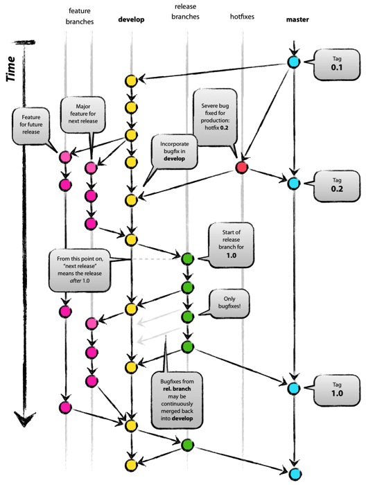
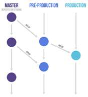

# 概述
官网：[https://git-scm.com/](https://git-scm.com/)。

CVS/SVN：集中式版本管理工具，没有网则无法提交，按文件方式存储内容，版本库只有中央服务器有，如果要提交代码，需要先获取最新版本库；


GIT：分布式，每个人电脑里都有要完整的版本库，分支管理功能强大，按元数据方式存储内容，提交代码无需获取最新版本库，只需交换差异代码，内容完整优于svn和cvs。

笔记主要记了基本概念、基本命令、命令大全（转载）以及流行的分支模型。
<!--more-->

# 安装
Windows:官网下载[https://git-scm.com/download/win](https://git-scm.com/download/win)，安装即可；
Linux:

```bash
yum install -y git
```
Ubuntu/Debian:

```bash
sudo apt-get install git Centos/RedHat
```
# 教程
## 基本概念：
git有三个区：

工作区，就是我们写的代码。

暂存区或者索引，stash或者index，在项目的隐藏目录.git里：.git/index；

版本库（本地仓库），即.git目录。
    贴一张从菜鸟教程盗来的图：
    
## 本地操作

	git init：初始化当前目录为一个仓库，加入git管理，此时，当前目录下出现隐藏目录.git，即版本库，版本库不能随意修改。
	
	git add：将文件添加到缓存区，可以添加多个，一次性提交。
	
	git status：查看当前缓存区列表；
	
	git commit：提交到该版本库。[-m]：强烈建议带上该参数，即git commit -m <message>，表示提交说明。
	
	git diff：<file>文件比对。
	
	git log：显示每次提交的记录。[--pretty=oneline]：美化显示，只显示message和版本号。
	
	git reset：回退版本，例如：git reset --hard HEAD^，代表往上回退一个版本，从modify的这个版本回退到initial的版本了，两个^即是上两个版本。需要注意的是，这样一来，再执行git log命令时，已经看不到modify的记录了。当然如果能找到modify版本的版本号，还是可以恢复的，比如：git reset --hard c0950，版本号可以不用写全，它会自己匹配，将内部的HEAD指针指向对应的版本号。git reset HEAD <file>：移除file在暂存区的内容。
	
	git reflog：然鹅，如果找不到版本号了，就需要这个指令了，记录了每一次所处的版本号和输入的命令，于是，还是可以恢复到最新版本的。
	
	git checkout：--<file>表示丢弃某个文件在工作区中的修改，如果更改没有放入暂存区，则恢复到版本库内容；如果已经放入暂存区后进行了修改，则恢复到暂存区内容；
	
	git rm：<file>删除文件，如果使用系统自带的rm命令，git将会忽略这种删除方式，同时再输入git add 需要跟上 -A/--all/--ignore-removal命令才能成功添加，'git add --ignore-removal <pathspec>'，是当前版本的默认操作，忽略本地工作区中移除的文件。 'git add --all <pathspec>' 将对删除操作进行记录，同git rm的方式类似。如果工作区删错了，也可以用git checkout --<file>的方式撤销工作区更改，git rm --cached <dir/file> 可以删除已经add但是还没有commit的记录。

## 远程操作

首先要有一个远程仓库和SSH-key，码云、github等都差不多。


1. 创建SSH Key。在用户主目录下，看看有没有.ssh目录，如果有，再看看这个目录下有没有id_rsa和id_rsa.pub这两个文件，如果已经有了，可直接跳到下一步。如果没有，打开Shell（Windows下打开Git Bash），创建SSH Key：`ssh-keygen -t rsa -C `，"liuhuijun\_2017@163.com"生成密钥对（记住邮箱那里要填自己在远程仓库的标识），找到.ssh目录找到id\_rsa（私钥）和id\_rsa.pub（公钥），复制公钥里的内容。
2. 登录代码托管网站，点击“Add SSH Key”，粘贴刚刚复制的内容。
3. 将本地工作区添加远程仓库，名为origin。git remote add origin git@gitee.com:guitar_coder/git-learning.git（SSH方式）或者 git remote add origin https://gitee.com/guitar\_coder/git-learning.git（HTTPS方式）。
		
		git pull:[origin] [remote-branch]:[local-branch]，如果参数全部带上，表示从origin主机的remote-branch更新代码到本地的local-branch分支，相当于git fetch+git merge。
		
		git push：[-u] [origin] [local-master]:[remote-master] 将本地master分支推送到远程master分支，并且将origin作为默认主机，在将来的推送或者拉取时就可以简化该命令，直接使用git push，只需要第一次推送使用这个命令即可。如果省略远程分支名，那么默认会将代码提交到与本地分支同名的远程分支，远程没有会自动创建。
		提示：如果创建远程仓库时使用了初始化模板，那么远程仓库就会有一些readme.md或者.gitignore等文件，那么需要先git  pull <remote> <branch>，在本文中就是git pull origin master，意为拉取远程主分支。也可以git branch --set-upstream-to=origin/<branch> master，<branch>处填入远程主分支，意为将本地主分支与远程主分支关联，然后执行git pull。如果提示refusing to merge unrelated histories，表示当前代码仓库和远程仓库是两个仓库，不能直接pull，可以执行git pull origin master --allow-unrelated-histories ，关联好后，最后可以直接执行git push。
	        
		git clone <url>：克隆远程仓库，加-b选项可以指定拉取仓库的某个分支代码，例如git clone ---b release url。
		
		git checkout：切换分支，[-b] <branch> 创建并切换到分支<branch>，相当于git branch <branch>，然后git checkout <branch>。
	 
		git branch：查看分支；<branch>创建分支；[-d|-D] <branch>删除分支|未合并强制删除。Git还会自动提示我们当前master分支比远程的master分支的超前状态。
	    
	    git merge：<branch>将<branch>分支合并到当前分支。有时候，比如你在这个分支上改了某一个地方，其他人在另一个分支上改了同样一个地方，这样就会导致冲突，需要解决冲突，需要手动合并修改该文件，再重新add并commit。这时候使用git log --graph --pretty=oneline --abbrev-commit,可以看到记录变更。使用git 默认的Fast-forward方式合并分支可能会导致在删除被合并分支后丢失合并信息，所以可以用--no-ff禁用Fast-forward的方式，这样   在合并的时候它会自动创建一个新的commit：git merge --no-ff -m "merge without fast-forward" <branch>。
	    
	    git stash：可以理解为将当前工作保存一份快照，执行该指令后，通过git status查看工作空间就如同上次提交后没有更改一样。然后我们可以新建分支去修复bug或者去做一些临时工作，然后切换到主分支，将修复的bug分支合并进来。这时候我们再恢复快照，git stash list可以查看快照列表，可以用git stash apply <stash@{0}> 选择恢复到哪个快照，如果产生冲突了，按照前面merge产生冲突的方案解决即可。apply恢复不会删除快照，可以使用git stash pop <stash@{0}>恢复并删除快照，如果产生冲突了，这个命令也不会删除快照，可以使用git stash clear清空快照。
	    
	    git remote：[-v]查看远程仓库地址，本地新建的分支如果不push到远程，那么别人就是看不到的。[add] <origin-name> <url>：为当前工作空间关联名为origin-name的远程仓库，[remove]<origin> 移除远程仓库关联。[rm]<origin>同删除远程仓库。在上面git push一节讲过如果仓库里有一些模板文件的时候，直接push是不成功的，需要先pull，如果提示no-tracking information，需要添加本地分支与远程分支的关联。
	     
	    git rebase：
	    
	    git merge合并：所有本地commit是基于当前本地的master，最终push会将远程最新master合并到本地，首先前移本地master，最终会形成一次新的commit推送到远程将远程master前移，这样就会形成分叉；
	    git rebase合并：它会挪动所有本地commit是基于远程最新的master，即最终push会直接将远程master前移，整理成一条直线，
	    
	    git tag：<tag>给分支打标签，如果不加该选项，则是查看所有标签，<commit_id>给某版本commit加上tag，默认是当前HEAD，git tag -a v0.1 -m "version 0.1 released" 1094adb ，[-a]指定标签名，[-m]指定说明文字，[-d]删除，推送某个标签到远程：git push origin <tagname>，一次性推送全部尚未推送到远程的本地标签：git push origin --tags，删除远程标签：git push origin :refs/tags/<tagname>。
	    
	    git show：<tag>查看标签信息。

总结下来，多人协作模式为（假设远程仓名为origin，远程主分支为master，本地主分支为master）：

1. 首先git pull origin master；
2. 如果没有关联，则git branch--set-upstream-to=origin/master master；
3. 如果产生冲突，本地解决冲突以后add并commit；
4. 然后git push origin master，如果推送失败，则代表远程分支比本地新，回到第一步。

## 常用命令大全
转载自阮一峰博客：


	一、新建代码库

	# 在当前目录新建一个Git代码库
	$ git init
	# 新建一个目录，将其初始化为Git代码库
	$ git init [project-name]
	# 下载一个项目和它的整个代码历史
	$ git clone [url]
	二、配置
	
	Git的设置文件为.gitconfig，它可以在用户主目录下（全局配置），也可以在项目目录下（项目配置）。
	# 显示当前的Git配置
	$ git config --list
	# 编辑Git配置文件
	$ git config -e [--global]
	# 设置提交代码时的用户信息
	$ git config [--global] user.name "[name]"
	$ git config [--global] user.email "[email address]"
	# 清空用户名密码
	$ git config --system --unset credential.helper
	# 保存用户名密码
	 $ git config --global credential.helper store
	三、增加/删除文件
	
	# 添加指定文件到暂存区
	$ git add [file1][file2]...
	# 添加指定目录到暂存区，包括子目录
	$ git add [dir]
	# 添加当前目录的所有文件到暂存区
	$ git add .
	# 添加每个变化前，都会要求确认
	# 对于同一个文件的多处变化，可以实现分次提交
	$ git add -p # 删除工作区文件，并且将这次删除放入暂存区
	$ git rm [file1][file2]...
	# 停止追踪指定文件，但该文件会保留在工作区
	$ git rm --cached [file]# 改名文件，并且将这个改名放入暂存区
	$ git mv [file-original][file-renamed]
	四、代码提交
	
	# 提交暂存区到仓库区
	$ git commit -m [message]
	# 提交暂存区的指定文件到仓库区
	$ git commit [file1][file2]...-m [message]
	# 提交工作区自上次commit之后的变化，直接到仓库区
	$ git commit -a
	# 提交时显示所有diff信息
	$ git commit -v
	# 使用一次新的commit，替代上一次提交
	# 如果代码没有任何新变化，则用来改写上一次commit的提交信息
	$ git commit --amend -m [message
	]# 重做上一次commit，并包括指定文件的新变化
	$ git commit --amend [file1][file2]...
	五、分支
	
	# 列出所有本地分支
	$ git branch
	# 列出所有远程分支
	$ git branch -r
	# 列出所有本地分支和远程分支
	$ git branch -a
	# 新建一个分支，但依然停留在当前分支
	$ git branch [branch-name]
	# 新建一个分支，并切换到该分支
	$ git checkout -b [branch]
	# 新建一个分支，指向指定commit
	$ git branch [branch][commit]
	# 新建一个分支，与指定的远程分支建立追踪关系
	$ git branch --track [branch][remote-branch]
	# 切换到指定分支，并更新工作区
	$ git checkout [branch-name]
	# 切换到上一个分支
	$ git checkout 
	# 建立追踪关系，在现有分支与指定的远程分支之间
	$ git branch --set-upstream [branch][remote-branch]
	# 合并指定分支到当前分支
	$ git merge [branch]
	# 选择一个commit，合并进当前分支
	$ git cherry-pick [commit]
	# 删除分支
	$ git branch -d [branch-name]
	# 删除远程分支
	$ git push origin --delete [branch-name]
	$ git branch -dr [remote/branch]
	六、标签
	
	# 列出所有tag
	$ git tag
	# 新建一个tag在当前commit
	$ git tag [tag]
	# 新建一个tag在指定commit
	$ git tag [tag][commit]
	# 删除本地tag
	$ git tag -d [tag]
	# 删除远程tag
	$ git push origin :refs/tags/[tagName]
	# 查看tag信息
	$ git show [tag]
	# 提交指定tag
	$ git push [remote][tag]
	# 提交所有tag
	$ git push [remote]--tags
	# 新建一个分支，指向某个tag
	$ git checkout -b [branch][tag]
	七、查看信息
	
	# 显示有变更的文件
	$ git status
	# 显示当前分支的版本历史
	$ git log
	# 显示commit历史，以及每次commit发生变更的文件
	$ git log --stat
	# 搜索提交历史，根据关键词
	$ git log -S [keyword]
	# 显示某个commit之后的所有变动，每个commit占据一行
	$ git log [tag] HEAD --pretty=format:%s
	# 显示某个commit之后的所有变动，其"提交说明"必须符合搜索条件
	$ git log [tag] HEAD --grep feature
	# 显示某个文件的版本历史，包括文件改名
	$ git log --follow [file]
	$ git whatchanged [file]
	# 显示指定文件相关的每一次diff
	$ git log -p [file]
	# 显示过去5次提交
	$ git log -5--pretty --oneline
	# 显示所有提交过的用户，按提交次数排序
	$ git shortlog -sn
	# 显示指定文件是什么人在什么时间修改过
	$ git blame [file]
	# 显示暂存区和工作区的差异
	$ git diff
	# 显示暂存区和上一个commit的差异
	$ git diff --cached [file]
	# 显示工作区与当前分支最新commit之间的差异
	$ git diff HEAD
	# 显示两次提交之间的差异
	$ git diff [first-branch]...[second-branch]
	# 显示今天你写了多少行代码
	$ git diff --shortstat "@{0 day ago}"
	# 显示某次提交的元数据和内容变化
	$ git show [commit]
	# 显示某次提交发生变化的文件
	$ git show --name-only [commit]
	# 显示某次提交时，某个文件的内容
	$ git show [commit]:[filename]
	# 显示当前分支的最近几次提交
	$ git reflog
	八、远程同步
	
	# 下载远程仓库的所有变动
	$ git fetch [remote]
	# 显示所有远程仓库
	$ git remote -v
	# 显示某个远程仓库的信息
	$ git remote show [remote]
	# 增加一个新的远程仓库，并命名
	$ git remote add [shortname][url]
	# 取回远程仓库的变化，并与本地分支合并
	$ git pull [remote][branch]
	# 上传本地指定分支到远程仓库
	$ git push [remote][branch]
	# 强行推送当前分支到远程仓库，即使有冲突
	$ git push [remote]--force
	# 推送所有分支到远程仓库
	$ git push [remote]--all
	九、撤销
	
	# 恢复暂存区的指定文件到工作区
	$ git checkout [file]
	# 恢复某个commit的指定文件到暂存区和工作区
	$ git checkout [commit][file]
	# 恢复暂存区的所有文件到工作区
	$ git checkout .
	# 重置暂存区的指定文件，与上一次commit保持一致，但工作区不变
	$ git reset [file]
	# 重置暂存区与工作区，与上一次commit保持一致
	$ git reset --hard
	# 重置当前分支的指针为指定commit，同时重置暂存区，但工作区不变
	$ git reset [commit]
	# 重置当前分支的HEAD为指定commit，同时重置暂存区和工作区，与指定commit一致
	$ git reset --hard [commit]
	# 重置当前HEAD为指定commit，但保持暂存区和工作区不变
	$ git reset --keep [commit]
	# 新建一个commit，用来撤销指定commit
	# 后者的所有变化都将被前者抵消，并且应用到当前分支
	$ git revert [commit]
	# 暂时将未提交的变化移除，稍后再移入
	$ git stash
	$ git stash pop
	十、其他
	
	# 生成一个可供发布的压缩包
	$ git archive
	
## 子模块管理
对于一个项目有多个模块，而每个模块又是一个单独的仓库，可以使用git submodule命令。
例如我的hexo博客项目在github上是一个仓库，而hexo的主题next主题又是单独的一个仓库，当我clone博客代码以后，还需要clone一份主题代码，有如下两种clone方式：

```git
##1.递归clone
git clone url --recursive
##2.先clone父项目，然后到父项目目录里更新submodule
git clone parent_url
git submodule init
git submodule update
```
更新代码也有两种方式可选：

```git
##1.递归pull
git submodule foreach git pull
##2.进入到submodule所在目录
git pull
```
提交代码：

```git
##进入到submodule所在目录
git add ./
git commit -m ""
git push
##然后回到父目录
git push
##更简单的方式:递推提交
git submodule foreach git commit -a -m ""
```
删除：

```git
##首先删除submodule缓存区内容
git rm --cached submodule
rm submobule
##删除git的.gitmodules隐藏文件
rm .gitmodules
##彻底清理文件，删除喝submodule有关的内容
vim .git/congig
```
# 常用代码分支策略
## TBD：主干开发
我当前所处公司使用的策略。所有开发者在一个称为"trunk"，即git的master分支中对代码进行协作，除了发布分支外没有其他开发分支。
工作机制：发布的分支时主干某个时刻的快照，以后的改bug和功能增强，都是提交到主干，必要时会cherry-pick（选择部分变更集合并到其他分支）。即分支只用来发布，主干用来开发。


代表公司：Google、Facebook。

优点：避免了分支合并时的麻烦；集成冲突少，集成效率高；有利于持续交付。

缺点：容易因一个人的代码导致崩溃等生产事故；要借助特性切换等机制来保证线上运行的正确性。
 
## 分支开发
工作机制：新建一个分支开发，保证其代码稳定，并通过自动化测试和代码审查后，然后合并到主干。
### Git Flow

于2011左右被大家当作了推荐的分支模型：



develop即开发分支，master是主分支，release是发布分支，hotfix为修复分支，feature是特性分支。然而，release和hotfix显得很多余，大多数都不会去用。
 
### Github Flow

GitHub Flow是GitHub所使用的一种简单流程，该流程只使用master和特性分支，并借助GitHub的pull request功能。
 

 
master只包含稳定的代码，即将发布到或部署到生产环境，任何开发人员都不允许把未测试或未审查的代码直接提交到master分支，对任何代码的修改、包括bug修复、热修复、新功能开发等都在单独的分支中进行。
当新分支中的代码全部完成以后，会有其他人对代码进行审查，提出相关的修改意见，有持续集成服务器对新分支进行自动化测试，然后才能合并到master，在部署到生产环境。
 
### GitLab Flow

GitLab Flow在GitHub Flow的基础上做了改良，额外衍生出三个子类模型：
带生产分支：


1. 无法控制准确的发布时间，但又要求不停集成的。
1. 需要创建一个production分支来防止发布的代码。

 
带环境分支：



1. 要求所有代码都在诸葛环境中测试过。
1. 需要未不同的环境建立不同的分支。

带发布分支：


1. 用于对外界发布软件的项目，同时需要维护多个发布版本。
1. 尽可能晚地从master拉取发布分支。
1. bug的修改应先合并到master，然后cherry pick到release分支。

代表公司：阿里、携程、美团、点评


优点：不同功能可以在独立分支上开发，消除了功能稳定前彼此干扰的问题；保证了主干分支的质量。


缺点：如果不及时合并，那么特性分支合并到主干会比较麻烦；如果要做CI/CD，需要对不同分支配备不同的构建环境。
 
# 致谢
感谢廖雪峰git教程:[https://www.liaoxuefeng.com/wiki/0013739516305929606dd18361248578c67b8067c8c017b000](https://www.liaoxuefeng.com/wiki/0013739516305929606dd18361248578c67b8067c8c017b000)，以及阮一峰git常用命令清单：[http://www.ruanyifeng.com/blog/2015/12/git-cheat-sheet.html](http://www.ruanyifeng.com/blog/2015/12/git-cheat-sheet.html)，文中大量借用并参考，致谢。