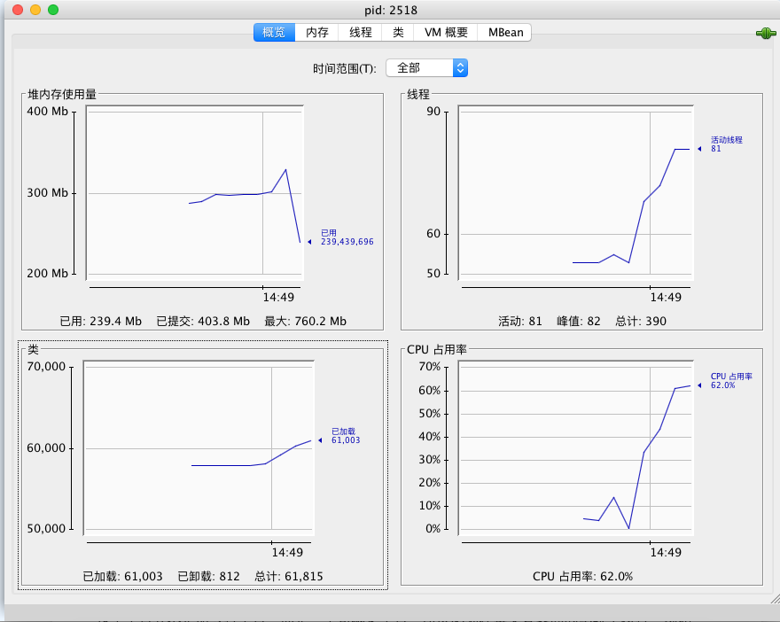

# 简述
阅读周志明先生著《深入理解Java虚拟机》所记笔记。
主要讲述虚拟机运行时区域、内存分配算法、垃圾回收算法以及虚拟机工具等基础内容。
<!--more-->

# 自动内存管理机制
## 区域概述
Java虚拟机管理的内存包括：

* 方法区（Method Area）
* 堆（Heap）
* 虚拟机栈（VM Stack）
* 本地方法栈（Native Method Stack）
* 程序计数器（Program Counter Register）
前两项是线程共享的的数据区，后三项是线程隔离的数据区，黑色区域是运行时数据区。

### 方法区

存储已被虚拟机加载的类信息、常量、静态变量、即时编译器编译后的代码等数据。也被称为非堆（non-heap），HotSpot虚拟机将GC分代扩展方法区，所以方法区也叫做永久代（Permanent Generation），但是实际上只是HotSpot虚拟机像管理堆一样管理方法区内存。在JDK1.7中，字符串常量池也从原来的永久代移到了堆中，而到了JDK1.8更是去除了永久带，改为了元数据空间（MetaSpace，但是本质都是方法区的一种实现），比较少出现垃圾收集的情况，当方法区无法满足内存分配时会出现OOM。
### 堆

存放对象实例，几乎所有的对象实例都在这里分配内存。但是随着JIT编译器的发展和逃逸分析技术逐渐程数，栈上分配、标量替换优化技术会让“所有对象都分配在堆上”渐渐变得不是那么绝对。堆中又划分：
新生代，由Eden空间，From Surivor和To Survivor等组成；
老年代；
线程私有的分配缓冲区（Thread Local Allocation Buffer，TLAB）。
### 虚拟机栈

线程私有的，和线程同生共死。描述了方法执行的内存模型：每个方法在执行的同时都会创建一个栈帧（Stack Frame）用于存储局部变量表、操作数栈、动态链接、方法出口等信息。每一个方法从调用直至执行完成的过程，就对应着一个栈帧在虚拟机栈中入栈到出栈的过程。
局部变量表所需内存再编译期就会完成分配，在方法运行期间不会改变，这个数据区可能会抛出oom或者StackOverFlowError。
### 本地方法栈

虚拟机栈执行的是class文件，是字节码。而本地方法栈对于所执行的对象没有强制规定语言和数据结构，是由虚拟机自己实现，对于HotSpot虚拟机来说，其做法是将本地方法栈和虚拟机栈放到一起管理，所以这个数据区可能会出现的异常同虚拟机栈。
### 程序计数器

该数据区的作用，可以简单理解记录了执行到的代码行号。分支、循环、跳转、线程恢复、异常处理等都需要程序计数器来完成，字节码指示器就是依靠程序计数器来选去下一条字节码指令。
如果线程执行的是字节码文件，那么程序计数器记录的就是虚拟机字节码执行地址；如果执行的是本地方法，那么它为空（Undefined），这是唯一一个在Java虚拟机规范中没有规定任何OOM情况的数据区域。
### 运行时常量池

曾经是方法区的一部分，存放编译器生成的各种字面量（基本类型、final类型变量、字符串）和符号引用，在类加载完后进入运行时常量池中存放，字符串常量池就是在运行时常量池之中，因为无论是类、接口还是方法中的字符串，总是在编译时就能确定的。
### 直接内存

JDK1.4引入了NIO（New Input/Output）类，提供了一种基于通道（channel）的和缓冲区（buffer）的I/O方式，它可以直接调用本地native方法分配堆外内存，然后通过在堆中建立一个DirectByteBuffer作为堆外内存的引用从而实现了直接操作堆外内存，也避免了在Java堆中和直接内存中来回复制。直接内存大小默认和堆大小相同，可以通过-XX:MaxDirectMomorySize参数指定，会出现OOM错误。
## HotSpot对象
### 对象的创建

new指令的执行过程：首先去运行时常量池里检查是否存在该类的符号引用，并且是否已经被加载解析和初始化过，如果没有还要先执行相对应的类加载过程。如果验证通过以后，会为一个类在堆上分配内存，分配方式根据堆的规整情况的使用不同的方法。在使用带整理过程的（compact）回收的收集器，例如Serial、ParNew等收集器，使用的就是指针碰撞法（Bump the Pointer），分配内存就是将临界点指针往空闲方向挪动与对象大小相等的距离；而CMS收集器使用的是Mark-Sweep算法的收集器通常使用空闲列表法（Free List），列表中记录了可用内存块，分配时划出足够大的内存。
线程安全性保证：

* CAS（该指令是硬件级原子操作指令）+失败重试
* 使用上文介绍的TLAB，可以通过-XX:+/-UseTLAB来决定是否启用，如果采用这种方式，在分配空间时就可以初始化零值，保证对象的实例字段可以不赋初始值即可使用
如果使用CAS方式，接下来需要初始化零值（不包括对象头），此时一个对象已经产生，但是还需要执行<init>方法来真正赋值。

### 对象的内存布局

Mark Word里根据虚拟机位数的不同分为32bit和64bit的非固定结构数据，以便在有限的空间存储尽可能多的信息，它会根据对象复用存储空间，其中，锁标志位为2bit，不同值存储不同信息：

|内容| 标志位| 状态|
|---|---|---|
|哈希码、对象分代年龄|	01|	对象未锁定|
|指向锁记录的指针	|00	|轻量级锁定|
|指向重量级锁的指针|	10	|重量级锁定|
|空	|11	|GC标记|
|偏向线程ID，偏向时间戳，对象分代年龄	|01|可偏向|
类型指针：对象指向它的类元数据，但是查找对象的类元数据不一定经过对象本身。对于数组来说，对象头中还有一块用于记录数组长度的数据。

实例数据：受到虚拟机分配策略参数（FieldsAllocationStyle）和字段在Java源码中定义的顺序的影响。长度相同的数据类型会被分配到一起。

对齐：HotSpot虚拟机的自动内存管理系统要求对象起始地必须是8字节的整数倍，也就是说对象必须是8字节的整数倍，对象头正好是8字节的1倍或者2倍，所以对齐通过占位保证对象大小是8字节的整数倍。
### 对象寻址

1.句柄池寻址方式

栈中的reference引用了句柄池的内存地址，而该内存地址又分别指向了对象类型数据和对象实例数据。当对象的地址发生变化时，只需要改变句柄池所存储的指向地址即可，句柄本身地址不用改变.

2.直接寻址

相对于句柄寻址少了一次实例数据指针定位的操作，效率高一些。HotSpot虚拟机是采用这种方案。
# 垃圾收集
## 对象引用
引用计数法：对象中有一个计数器，每当有一个地方引用该对象时就会在计数器里加1，但是解决不了循环引用的问题。

可达性分析法：GC Roots做根节向下寻找，搜索过的路径称为引用链。如果一个对象没有任何的链路到达GC Roots，就判定该对象是可以回收的对象。Jvm里可作为GC Roots的对象有以下几种：

* 虚拟机栈（栈帧中的局部变量表）
* 方法区中类静态属性引用的对象
* 方法区中常量引用的对象
* 本地方法栈中Native Method引用的对象

引用类型：

* 强引用（Strong Reference）：代码中使用Object obj = new Object一类的方法；
* 软引用（Soft Reference）：描述一些还有用但非必须的对象，内存不足时不会立即回收，而是会加入待回收列表，下一次再回收；
* 弱引用（Weak Referenct）：描述非必须的对象，只能存活到下一次回收之前；
* 虚引用：通过这个对象被收集器回收时收到一个系统通知。

## 方法区回收
方法区主要有废弃变量回收和无用类回收：
废弃变量回收与回收堆中的基本一致
无用类回收需要同时满足：堆中没有任何该类实例；加载该类的ClassLoader已经卸载；该类对象的java.lang.Class对象没有在任何地方被引用
## 垃圾收集算法
标记-清除算法（mark-sweep）：首先标记所有需要回收的对象，然后统一回收。但是两个节点的效率都不高，而且很容易产生空间碎片；
复制算法（copying）：将空间分为容量相等的两块，回收只需将存活的复制到另一块上，分配时直接可以使用指针碰撞法来分配；
标记-整理算法（mark-compact）：标记所有需要回收的对象，然后让所有对象往一端移动，然后直接清理掉边界以外的内存。
## 分代思想
根据对象不同的生命周期使用不同的收集算法：
新生代对象生存周期短，每次收集都会有大量对象回收，只有少数对象存活，复制算法比较合适；
老年代对象生存周期长，就必须使用标记清除或者标记整理算法。
## HotSpot算法实现
枚举根节点（GC Roots Tracing）：

可以作为GC Roots的节点必须是在全局引用或者执行上下文中；同时执行可达性分析的前提是建立在一致性快照的前提下----保证在进行可达性分析的情况下对象的引用情况不会发生变化（通常伴随着stop the world，即停止所有的Java线程的情况）；大多数虚拟机都采用的是准确式GC，所以无需检查所有变量和上下文。
HotSpot借助OopMap的数据结构，在编译时就能知道什么偏移量上是什么数据类型；同时在JIT编译过程中，也会在safe-point中记录寄存器和栈中哪些位置是引用。

安全点（safe-point）：

保证程序长时间运行（特征：指令序列复用，例如方法调用，循环跳转，异常跳转）的代码段中，选定安全点，在安全点执行GC时对象的引用关系不会发生变化。
抢先式中断（Preemptive Suspensuin）：GC发生时主动暂停所有线程；
主动式中断（Voluntary Suspension）：GC需要中断线线程时，修改某个标志位，线程主动轮询这个标识位，发现中断标志为真时会主动中断挂起。

安全区域（safe-region）：

安全点的扩大版，可以理解为该区域内的对象引用关系不会变化。线程执行待安全区域代码段时，会标记自己进入safe-region，GC时可以直接回收该线程的对象，如果线程要离开safe-region，首先会检查GC是否已经完成，如果完成了会继续执行，没执行完成则会等待知道GC完成。
## 垃圾收集器
并行与并发：并行（Parallel）是指多个垃圾收集线程工作；并发（Concurrent）是指垃圾收集线程和用户线程同时工作，但是可能是交替执行。
### Serial

新生代收集器，虚拟机client模式下默认的收集器，稳定高效，单线程，使用复制算法。
### Par new

新生代收集器，虚拟机server模式下默认的收集器，多线程（默认与CPU数量相同），Serial的多线程版。
### Parallel Scavenger

新生代收集器，多线程，吞吐量可控，自适应收集器。
吞吐量计算：用户代码执行时间/（用户代码执行时间+垃圾收集执行时间）
重要参数：
`-XX:MaxGCPauseMillis：`停顿时长；
`-XX:GCTimeRatio:`小于100的正整数，相当于GC时间占用户代码执行时间的倒数。例如99，则GC时间：用户代码执行时间=1:99，所以吞吐量为99/（1+99）=99%，默认也是99；
`-XX:+UseAdaptiveSizePolicy:`开启自适应模式，能够自动根据系统运行情况收集性能监控信息，动态调整例如新生代大小（`-Xmn`）、`Eden`区域和`Survivor`区域比例（`-XX:SurvivorRatio`）、对象晋升老年代年龄（`-XX:PretenureSizeThreshold`）等的参数，只需要设置好最大堆内存（`-Xmx`），停顿时长或者吞吐量等目标即可。
### Serial Old

老年代收集器，Serial的老年版，使用标记整理（mark-compact ）算法。
### Parallel Old

JDK1.6出现，Parallel Scavenger的老年代版本，使用标记整理算法。
拓展：
关于Parallel系的垃圾收集器，在Parallel Old出现以前，实际上6.3小节中提到的Parallel Scavenger并不是指某一个收集器，而是一个完整的垃圾收集框架，由PSScavenger（新生代）+PSMark-Sweep（老年代）组成，此处虽然名称是叫标记-清除算法，实际上只是在Serial Old的基础上加了一个壳。直到Parallel Old的出现，才算一套完整的吞吐量优先收集器。
`-XX:+UseParallelGC`实际上是PSScavenger+PSMak-Sweep
`-XX:+UseParallelOldGC`才是PSScavenger+Parallel Old
### CMS

Concurrent Mark Sweep，老年代收集器，使用标记清除算法，以低停顿为目标。

初始标记只是标记GC Roots能直接关联的对象，并发标记会进行GC Roots Tracing，重新标记则是对用户并发执行的用户线程产生变动的对象进行记录。时间：并发标记>重新标记>初始标记
缺点：
CPU资源敏感，默认回收线程数=（CPU数+3）/4，当CPU数低于2时很不划算；
浮动垃圾，即并发清除时用户线程留下来的未被清除的对象，只能等下一次GC，如果用户线程产生的对象大小大于GC预留的空间，会报“Concurrent Mode Failure”；
空间碎片，由于使用标记清除算法，会导致大量空间碎片，虽然默认开启了碎片整理（`-XX:+UseCMSCompactAtFullCollection`），但是碎片整理是无法并发的，因此可能会延长停顿时间。
重要参数：`-XX:CMSFullGCsBeforeCompaction`：不压缩Full GC次数，超过该次数后会进行一次压缩Full GC，默认是0，每次都会压缩。

### G1

Garbage-First，整个堆的收集器，基于复制算法和标记整理算法，未来有可能取代CMS。

G1把整个堆分成大小相等Region，Region之间通过复制算法，整体通过标记-整理算法。每个Region都会有一个Remembered Set（下文简称R Set），在对Reference类型数据进行写操作时会产生一个Write Barrier暂时中断写操作，检查Reference引用的对象是否处于两个不同的Region之间，如果是，通过CardTable把相关引用信息记录到被引用对象所属的Region的R Set中，进行内存回收时，在GC根节点的枚举范围中加入R Set即可保证不扫描整个堆也没有遗漏。
收集过程大体类似于CMS的过程，区别在于最终标记阶段，这一阶段G1会将对象变动记录记录在每个标记线程的R set logs中，最后再合并到R Set里。
`-XX：+UseG1GC`：启用G1 GC。JDK7和JDK8要求必须显示申请启动G1 GC，JDK可能会设置G1 GC为默认GC选项，也有可能会退到早期的Parallel GC，这个也请关注吧，JDK9预计2017年正式发布；

`-XX：G1NewSizePercent`：初始年轻代占整个Java Heap的大小，默认值为5%；

`-XX：G1MaxNewSizePercent`：最大年轻代占整个Java Heap的大小，默认值为60%；

# GC日志浅析

	[GC(MetadataGCThreshold)[PSYoungGen:22881K->5109K(71680K
	    )]26152K->9484K(159232K),0.0126338secs][Times:user=0
	    .02sys=0.01,real=0.02secs]
	[FullGC(MetadataGCThreshold)[PSYoungGen:5109K->0K(71680K
	    )][ParOldGen:4375K->6098K(52736K)]9484K->6098K(124416K
	    ),[Metaspace:20679K->20679K(1067008K)],0
	    .0529407secs][Times:user=0.11sys=0.00,real=0.05secs]
以上信息是使用了-XX:+PrintGCDetails打印出的GC日志。IDEA里可以点击

Edit Configurations，在VM Options里输入参数即可。[GC或者[Full GC 表示停顿类型，[Full GC（system）表示是由System.gc()引发的垃圾收集，Metadata表示是由元数据引发的GC，Allocation Failure表示是有新生代不足引发的GC，紧随其后的PSYoungGen表示使用的Parallel Scavenger收集的新生代，新生代和老年代的名称是根据收集器名称确定的。每个代的方括号内部的例如“22881K->5109K(71680K)”表示：“GC前该内存已使用容量->GC后该内存使用容量（该区域总容量）”，而最外层的"26152K->9484K(159232K)"则是表示整个堆。"0.0126338 secs"表示的是手机该内存区域使用的时间，单位为秒（secs），后面中括号里跟的Times则是具体时间详情，和Linux的time命令输出一致，分别代表用户态消耗的CPU时间、内核态消耗的CPU时间和操作从开始到结束的墙钟时间（Wall Clock Time）。CPU时间和墙钟时间的区别是：墙钟时间包括各种I/O，等待线程阻塞时间，而CPU时间则不包括时间，但当系统由多CPU或者多核的话，多线程操作会叠加这些时间。
拓展：
如果是开启或者关闭某个虚拟机选项，使用-XX:+/-<options>，如果是赋值某个选项，使用-XX:<options>=。
# 内存分配与回收策略
Minor GC：新生代GC，速度较快

Major/Full GC：发生在老年代的GC，经常会伴随至少一次的Minor GC，但并不绝对，比Minor GC慢

分配策略：

其中，跟大对象阀值有关的参数有：`-XX:PretenureSizeThreshold，`单位为byte，新生代会优先分配在Eden区，跟使用TLAB有关的是+XX:+/-UseTLAB，TLAB在Eden区域，默认情况下占10%
GC策略：

重要参数：
`-XX:MaxTenuringThreshold=15`：对象晋升年龄，每一次Minor GC以后仍然存活在Survivor区域中的对象年龄会+1

`-XX:HandlePromotionFailure=true`：是否允许担保分配失败
对象年龄并不是完全按照上面这个参数来的，它还有一个动态判定策略：如果在Survivor空间中相同年龄的对象大小之和大于Survivor空间的一般，也会晋升老年代。
# 虚拟机工具
## JDK自带命令行工具
JDK自带命令行工具只是jdk/lib/tools.jar的一层薄封装而已。

|名称	|作用|
|---|---|
|jps|	JVM Process Status Tool显示当前系统所有进程|
|jstat|	JVM Statistics Monitoring Tool 收集虚拟机各方面运行数据|
|jinfo|	显示虚拟机配置信息|
|jmap	|Memory Map for Java 生成虚拟机的内存转储快照（heapdump文件）|
|jhat	|JVM heap dump Browers 建立一个HTTP/HTML服务器方便用户分析heapdump文件|
|jstack	|Stack Trace for Java 显示虚拟机的线程快照|
### jps

JVM Process Status Tool

格式： jps [option] <hostid>

作用：通过RMI协议查询开启了RMI服务的远程虚拟机进程状态。

常用options:

option	作用
-q	只输出LVMID，省略主类名称
-l    	输出主类的全名，如果进程执行的是Jar包，输出该包路径
-m	输出虚拟机进程启动时传递给主类main()函数的参数
-v    	输出虚拟机进程启动时JVM参数
hostid 为RMI注册表中注册的主机名 
### jstat

JVM Statistics Monitoring Tool

格式：jstat [option vmid [interval[s|ms] [count]]]

作用：监视虚拟机各种运行状态信息
如果是本地虚拟机进程，那么vmid和lvmid是一致的，如果是远程虚拟机进程，那么vmid的格式为：[progocol:][//]lvmid[@hostname[:port]/servername]，interval 和count 分表代表查询间隔和次数，如果省略这两个参数代表只查询一次。
常用options：

|选项	|作用|
|---|---|
|-calss|	监视类装载、卸载数量、总空间以及类装载所耗费的时间|
|-gc	|监视Java堆状况各个区容量、已用空间、GC合计时间等信息|
|-gccapacity|	基本同-gc，但是更关注各个区使用到的的最大、最小空间|
|-gcutil	|基本同-gc，但是输出的是已使用的百分比|
|-gccause|	-gcutil基本一样，但是会额外输出导致上一次GC产生的原因|
|-gcnew	|监视新生代GC状况|
|-gcnewcapacity|	新生代使用到的最大最小空间|
|-gcold|监视老年代GC状况|
|-gcoldcapacity	|老年代使用到的最大最小空间|
|-compiler	|输出JIT编译器编译过的方法、耗时等信息|
|-printcompilation |	输出已经被JIT编译的方法|
示例以及解析：

s0表示Survivor的from区，s1表示to，E表示Eden区的已经使用量，O代表老年代，M代表MetaSpace，CCS表示压缩使用比例，YGC表示新生代回收次数，FGC表示Full GC次数，FGCT表示Full GC时间，GCT表示总的GC时间。
### jinfo

Configuration Info for Java
格式：jinfo [option] pid
作用：实时地查看和戴哦整虚拟机各项参数。

|选项|	作用|
|---|---|
|-sysprops	|可以把System.getProperties()的内容打印出来|
|-flag|	flag后面可以跟javm参数的key，这样就可以获得该key的值|

### jmap

Memory Map for Java

格式：jmap [option] vmid

options列表：

|选项	|作用|
|---|---|
|-dump|生成Java堆转储快照，格式为-dump:[live,]format=b,file=<filename>|
|-finalizerinfo	|显示在F-Queue中等Finalizer线程执行finalize方法的对象，只在Linux/Solaris下有效|
|-heap|显示Java堆详细信息，如回收器、参数配置、分代状况等，只在Linux/Solaris下有效|
|-histo|显示堆中对象统计信息，包括类、示例数量、合计容量|

Minor GC：新生代GC，速度较快
Major/Full GC：发生在老年代的GC，经常会伴随至少一次的Minor GC，但并不绝对，比Minor GC慢
分配策略：

其中，跟大对象阀值有关的参数有：`-XX:PretenureSizeThreshold`，单位为byte，新生代会优先分配在Eden区，跟使用TLAB有关的是`+XX:+/-UseTLAB`，TLAB在Eden区域，默认情况下占10%
GC策略：

重要参数：
`-XX:MaxTenuringThreshold=15`：对象晋升年龄，每一次Minor GC以后仍然存活在Survivor区域中的对象年龄会+1
`-XX:HandlePromotionFailure=true`：是否允许担保分配失败
对象年龄并不是完全按照上面这个参数来的，它还有一个动态判定策略：如果在Survivor空间中相同年龄的对象大小之和大于Survivor空间的一般，也会晋升老年代。
### jhat

JVM Heap Analysis Tool
格式：jhat <file>
可以对dump出来的文件进行解析，并且会创建一个微型的HTTP/HTML服务器，可以在浏览器中查看页面，但是一般并不推荐这么做。
### jstack

Stack Trace for Java
格式:jstack [option] vmid
options:

|选项	|作用|
|---|---|
|-F	|当正常使出的请求不被响应时，强制输出线程堆栈|
|-l|	出堆栈外，显示关于锁的附加信息|
|-m	|如果调用到本地方法的话，可以显示C/C++的堆栈|
### jconsole

这个工具并不是命令行工具，而是一个可视化工具，所以必须在带交互界面的系统上执行，例如Windows和Mac，位于JDK/bin目录下，也可以在命令行中直接执行jconsole。
下图是在IDEA中打开某个项目的情况：

### VisualVM

多合一故障处理工具，可以在IDEA里或者Eclips里以插件形式启动。同时它还有一个插件BTrace，这个插件可以作为程序独立运行，作用是在不停止目标程序运行的前提下，通过HotSpot VM的HostSwap技术动态加入原本不存在的调试代码。

需要注意的是，如果要使用VisualVM连接远程的程序，需要在程序启动时加上以下VM参数：
	
	-Djava.rmi.server.hostname=localhost
	-Dcom.sun.management.jmxremote
	-Dcom.sun.management.jmxremote.port=1099
	-Dcom.sun.management.jmxremote.authenticate=false
	-Dcom.sun.management.jmxremote.ssl=false

启用jmx并且不使用ssl和用户名密码校验，并且在Visual VM里添加jmx连接才能连接远程项目。
# 参考
《深入理解Java虚拟机：JVM高级特性和最佳实践》周志明 著
https://hllvm-group.iteye.com/group/topic/37095 