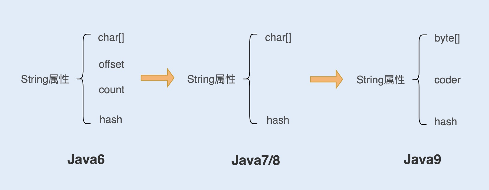

# String 调优



<!--more-->

以上是几个版本JDK中String对象的组成。

JDK6的时候是通过offset和count来定位char[]数组；

JDK7去处了offset和count，解决了substring方法导致的内存泄漏问题（该方法里的char数组仍然指向原字符串导致String字符串无法回收）；

JDK9使用byte[]来代替char，char是两个byte，因此9的String更节省空间，coder的作用适用于在`indexOf()`函数时，计算字符串长度，coder属性有0，1两个值，0代表Latin-1（单字节编码），1代表UTF-16（双字节编码）。

在Java中，常用的构造字符串的方式有两种：

```java
String str = "abc";
String str = new String("abc");
```

第一种：str引用的是字符串常量池的地址；

第二种：编译类文件时，“abc”加入到类常量，类加载时，字符串将会在常量池中创建；最后在new时，调用构造函数，同时引用常量池中的“abc”字符串，在堆内存中创建一个String对象，最后将str指向String对象；

**字符串常量会直接放到字符串常量池，字符串变量对象是创建在堆内存中，同时也会在字符串常量池中创建一个字符串对象，复制到堆内存对象中，并返回堆内存引用。**

如果在运行时创建字符串对象，例如new 了一个包含String类型成员变量的类，那么这个字符串对象会放入到堆中，只有当调用intern方法时并且常量池中没有时，才会将这个字符串对象放到常量池中，以后当堆中其他的字符串对象调用intern方法获取字符串引用对象时，才会去常量池中判断是否有相同值的字符串的引用并且返回（JDK7以后）。JDK6的做法是调用intern方法会去常量池中创建常量并且返回字符串引用。


所以，对于类似国家、地名等具有重复性的名字，可以使用intern方法来节省空间。

> 常量池分为：类文件常量池，运行时常量池，字符串常量池。JDK7之前运行时常量池包含字符串常量池，都在方法区，此时对方法区的实现为永久代；
>
> JDK7运行时常量池还在方法区，但是字符串常量池放到了堆；
>
> JDK8时，永久代移除，变为了元空间，此时运行时常量池在元空间，字符串常量池在堆。

