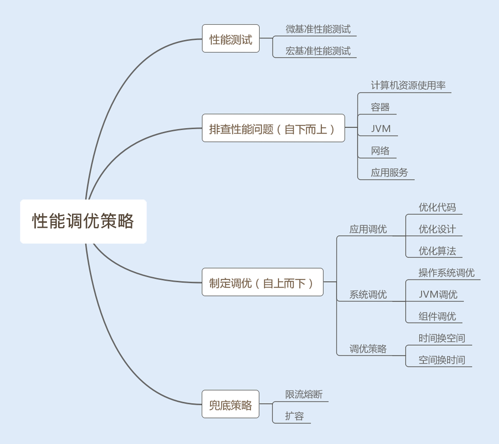

# 概述

最近在阿里做驻场开发，发现阿里的员工考虑问题习惯从How、When、What三个角度来考虑事情，针对Java调优，恰好在这篇文章中也锻炼一下这种思维。

<!--more-->

# What？

Java调优不只是针对代码的调优，还有对项目的调优、JVM的调优、数据库的调优，甚至还有设计方面的调优。学习调优的好处不仅能够提高系统性能指标，还可以节省公司资源。

# When？

介入性能调优的时期最好是在系统编码完成以后，在进行功能测试的同时可以再做性能测试，借此分析是否按足访问量的要求。

# How？

首先了解哪些计算机资源会成为系统性能瓶颈：

* 内存；
* 磁盘I/O；
* 网络I/O；
* 异常：Java应用中，抛出异常需要构建异常栈，高并发场景中会影响到系统性能；
* 数据库：数据库的操作往往涉及到磁盘I/O，而调用数据库也会产生网络消耗；
* 锁竞争。

衡量系统性能的因素：

* 响应时间：
  * 数据库操作消耗时间；
  * 服务端响应时间：Nginx分发+服务端程序执行；
  * 网络响应时间；网络传输时硬件解析的耗时；
  * 客户端响应时间：客户端处理耗时。
* 吞吐量：TPS，包含两个方面：
  * IOPS：磁盘吞吐量；
  * 网络吞吐量。
* 资源分配使用率；
* 负载承受力。

# 调优策略

**测试 - 分析 - 调优**

## 微基准性能测试

定位到某个模块或者某个方法的性能问题。

## 宏基准性能测试

考虑到测试环境、测试场景和测试目标，如果达标可以继续加大测试的并发数，探底TPS。

### 1.热身问题

虚拟机会将频繁运行的方法或者代码块通过JIT编译成与本地平台相关的机器码，并进行各个层次的优化，然后存储在内存中。

### 2.测试结果不稳定

通过多次测试，统计结果获得平均值。

### 3.多JVM

避免多JVM的环境。

> 性能测试报告包含元素：接口平均、最大、最小吞吐量，响应时间，服务器CPU、内存、I/O、网络使用率、GC频率等。

## 策略

自下而上：

1. 操作系统层面；
2. JVM层面；
3. 应用程序。

策略：

1. 优化代码：例如遍历循环时采用合适的方式；

2. 优化设计：例如使用单例模式创建常被使用并且无状态的类，例如Spring Bean；

3. 优化算法；
4. 时间换空间：存储空间要求比较严苛的场景；
5. 空间换时间：Mysql分库分表提升访问性能；
6. JVM参数调优，减少GC占用时间；

制定兜底策略（保证系统稳定性）：

1. 限流；
2. 根据需求自动横向新增服务；
3. 提前扩容（例如抢购业务）；

# 总结

