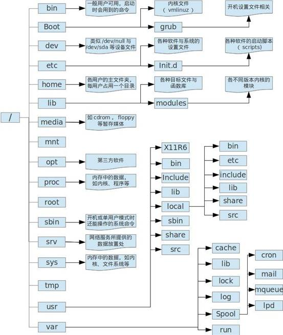

# 概述
Linux（里那科斯）是一种UNIX-like系统，其前身是minix，而minix是由一个教授由于UNIX源码被限制不方便教学而自己编写，后来由于得不到技术支持，因此Linus Torvalds开始自己编写类minix系统。

<!--more-->
# 目录解析

    
"/" : 根目录Linux文件系统的入口.也是最高级，最重要的的目录.除衍生出其它目录，还和系统的开机，还原，系统修复有的，一般要求不要把任务应用程序直接放在根目录下，如果满了，可能就登录不了了（需要注意是否日志输出在根目录下）
 
"/bin":基本系统所需要的命令,主要是单用户模式下，还能执行的命令。主要有cat，mv,mkdir,cp,bash ,ls
 
 
"/boot":内核和加载内核所需要的文件.grub系统引导管理器也在这个目录下,存在/boot/grub/
 
"/dev":在linux系统下，任何设备及接口设备，都是以文件的形式存在，设备文件存储目录.像终端.磁盘等.比较重要的有/dev/null （crontab经常把不想输出输到这里）;/dev/zero;/dev/tty;/dev/lp\*;/dev/hd\*;/dev/sd\*
 
"/etc":系统的主要配置文件都放在这个目录下，一般来说，这个普通人是看不到这些文件的;这里最好也不要放可执行文件。常见的目录有如下：
    /etc/inittab ;
    /etc/init.d/;
    /etc/modprobe.conf ;
    /etc/X11/ ;
    /etc/fstab/ ;
    /etc/sysconfig/ ;
    /etc/init.d/开机启动脚本放在这里;
    /etc/xinetd.d/ super daemon启动脚本放在这里
    /etc/sysconfig/network/scripts/网管配置放在下面下
 
"/home":普通用户的目录默认存储目录.主文件夹有两种代号：
    ~ 代表这个用户的主目录
    ~dmtsai:代表 dmtsai的主文件夹

"/lib":库文件和内核模块存放目录.主要是开机用到，以及在/bin/;/sbin目录下命 令会调用的库函数。/lib/modules会放内核相关的模块。
"/lib64":和/lib类似，主要是64的库函数
 
"/media":即插即用设备的挂载点自动存放在这个目录下.像U盘,cdrom/dvd自动挂载后,就会在这个目录下.常见有/media/floppy,/media/cdrom
 
"/mnt":临时文件系统的挂载点目录.以前和/media一样，但有专门/media后，专门做临时挂载
 
"/opt":第三方软件的存放目录.什么叫第三方呢？像KDE，就是第三方的，只是集成到linux里，当然你可以放自己的东西到下面。
 
"/proc" 是一个虚拟文件系统。放置内存中的数据，当有一个进程启动时，就有一个文件夹。比较重要的/proc/meminfo,/proc/cpuinfo可以通过这两文件查看内存和CPU情况，当然还有/proc/dma,/proc/interrupts,/proc/ioports,/proc/net/*等
 
"/root":Linux超级权限用户root的跟目录.单独存放，也方便在进入单用户模式的操作。
 
"/sbin":基本的系统维护命令,只能由超级用户使用.这些命令为开机、修复、还原系统过程所需要的。常见的命令有fdisk,fsck,ifconfig,init,mkfs
 
"/srv":存放一些服务器启动之后需要提取的数据.主要存放网络服务后的一些数据，如www,ftp
 
/sys 和/proc相似，也是虚拟文件系统，主要记录内核相关，比如内核模块，内核检测的硬件信息。
 
"/tmp":临时文件目录,这个目录任何人可以访问，有可能需要定期清理。
 
"/usr" 是存放可以分享与不可以动的内容，不是user的缩写，而是UNIX Software Resource 的缩写，就是UNIX操作系统的软件资源
主要子目录有：
    /usr/X\*\*/ X Windows数据存在于此
    /usr/bin/ 绝大部分用户可用命令在此
    /usr/include/ C/C++等的头文件与包含文件在些。如果以源码的*.tar.gz安装软件时，可能会引用下面的文件
    /usr/lib/ 包含应用程序函数库及目标文件，以及不被一般用户惯用的执行文件或脚 本
    /usr/lib64/ 与/usr/lib/相似，会对64位的
    /usr/local/ 本机自己安装的的软件，建议安装到这里，下面也有bin,etc,include,lib子目录，这些子目录功能大家可以想到
    /usr/sbin/ 非系统正常运行所需要的命令，最常见的就是网络服务器软件的daemon
    /usr/share/ 放共享文件的地方，基本是文本文件，可读的。子目录有
    /usr/share/man 在线帮助文件
    /usr/share/doc 软件杂项的说明文件
    /usr/share/zoneinfo 软件杂项的说明文件
    /usr/src 软件源码放在这里
 
"/var":存放经常变动的数据,像日志.邮件等.这个目录下的数据，需要定期清理，最好写个脚本，放在crontab里。常见的子目录：
    /var/cache/ 执行中的缓存文件
    /var/lib/ 软件本身执行的过程中，用到的数据。比如Mysql数据一般放在/var/lib/mysql/;而rpm数据则放在 /var/lib/rpm/
    /var/lock/ 资源被锁时，放在此。有些资源只能一个程序使用，比如刻录机。
    /var/log/ 系统日志存在地，有可能需要定时清理
    /var/mail/ 系统邮件，看情况需要定时清理
    /var/run/ 某些程序或服务启动后，PID放在下现
    /var/spool/放置队列数据， 看情况需要定时清理
 
"/lost+found" 是ext2/ext3文件系统才产生的，目的是当文件系统产生错误里，将一些丢失的片段防在这个目录下。

# 系统解析
## 引导过程
加载BIOS（通电自检），引导系统（BIOS设定）读取MBR，运行Grub，加载初始化配置文件，启动服务，运行rc.locak，生成终端或者X Window等待登录。

BIOS：每个主板都有一个自己的BIOS，启动硬件的第一步。
MBR：主引导记录，BIOS会默认从硬盘的第0柱面、第0磁道、第一个扇区中读取。一个扇区=512字节，446引导程序+64地盘分区表DPT+2MBR结束位，由fWindows的disk.ext或者Linux的fdisk程序产生，不依赖操作系统。

MBR记录可以修改因此可以实现多系统共存。

Grub：引导操作系统程序。地址记录于MBR中，其功能是根据配置文件加载kernel镜像，并运行/sbin/init，根据/etc/inittab进行初始化工作，根据runlevel确定系统运行级别和对应服务启动脚本。
   
## 引导级别
引导级别在/etc/inittab文件中，但是使用systemd以后，引导级别将不再使用，而使用targets来代替，默认是：

	 multi-user.target: analogous to runlevel 3
	 graphical.target: analogous to runlevel 5

一共有以下几个级别：

    0：关机
    1：单用户模式，用于系统维护，可以在忘记root密码时进入此模式修改密码。
    2：无网络链接，多用户。
    3：完全多用户模式，一般使用此级别。
    4：保留未使用。
    5：窗口模式，多用户网络链接。
    6：重启。
   
## 命令管理
    Linux中，一切配置皆文件。
    man：<order_name>查看命令的帮助，如：man ls。
    种类：9
    常见说明
    可调用的系统
    函数库
    设备文件
    文件格式
    游戏说明
    杂项
    系统管理员可用的命令
    与内核有关的说明
    man 2 reboot：查看reboot在第2章里的说明。
   
## 命令格式

命令的一般格式:command [options] [arguments]

说明:

command:命令名。

options:命令的选项，一般是一个单词或字母。有的命令有选项，有的命令没有选项。选项前面一般有“-”符号。选项是对命令参数的补充，当存在参数时才可能有选项。

arguments:命令的参数，有时候选项也带参数。有的命令有参数，有的命令没有参数。

[]:方括号表示可有可无的意思。[options]表示有的命令有选项，有的命令 也可能没有选项。[arguments] 表示有的命令有参数，有的命令可能没有参数。

举例:

(1) 没有参数的命令像 ls，pwd 都没有选项和参数。直接输入命令，回车即可执行命令。

(2) 有参数没有选项的命令例如删除文件 myfile.txt 的命令，myfile.txt 就是参数:rm myfile.txt

(3) 有参数也有选项的命令通过命令“rm myfile.txt”删除文件，系统会有确认提示，询问是否确定要
删除。可以通过一个选项，在执行命令时不再需要确认提示，命令格式如下:
rm -f myfile.txt此处的-f 就是选项，作用是进行强制删除，也就是没有确认提示。