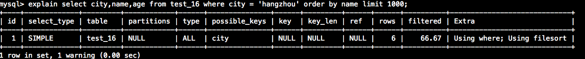

# 简述
用于记录一下mysql工作中的Explain用法，随时更新。
<!--more-->
# explain
作用：分析查询语句的执行计划；
示例：在查询语句前面加explain即可

字段说明（可能随着版本的不同，字段数量也可能不同）：

* id：id相同时，id是sql执行的顺序；id不同是，id越大的值越先执行；id相同的可以认为一组；

* select_type：
	* SIMPLE:简单查询，不使用UNION或子查询等；
	* PIRIMARY:包含子查询时，最外层的select被标记为PRIMARY；
	* UNION:UNION中的第二个语句；
	* DEPENDENT UNION:UNION中的第二个语句或外面的语句，取决于外面的查询；
	* UNION RESULT:UNION的结果；
	* SUBQUERY:子查询的第一条select语句（独立子查询）；
	* DEPENDENT SUBQUERY:子查询中第一条select语句（相关子查询）；
	* DERIVED:派生表；
	* UNCACHEABLE SUNQUERY:一个子查询的的结果不能被缓存，必须重新评估外链接的第一行；
table：表名，也有可能<derived>形式的派生表名；
type：扫描类型，mysql在表中找到数据的方式；

	* ALL：全表扫描；
	* index：扫描索引树；
	* range：只检索给定的行；
	* ref：表示上述表的连接匹配条件；
	* eq\_ref：类似ref，只不过使用的索引时唯一索引；
	* const、system：对查询进行优化，转化为一个常量。例如根据主键查询，system表示查询的表只有一行；
	* NULL：不需要访问表或索引。
* possible\_keys：涉及到的索引，但是不一定用到；
* key：mysql决定使用的索引，如果没有就是NULL，如果想强制mysql使用或者忽视possible\_keys中的索引，在查询中使用FORCE INDEX、USE INDEX或者IGNORE INDEX;
* key_len：索引使用的字节数，可以通过该列计算查询中的使用的索引的长度。注意显示的是索引字段的最大可能长度，而不是实际使用长度；
* ref：表示上述表的连接匹配条件；
* rows：根据表统计信息以及索引选用情况估算而出需要读取多少行；
* extra：解决查询的详细信息：

	* Using Where：使用了索引信息，但是并没有读到实际数据，可能还要进行回表真正读数据；
	* Using index condition：使用了索引条件并且读取到了实际数据；
	* Using temporary：需要使用临时表存储结果集；
	* Using filesort：无法利用索引完成的排序操作；
	* Using join buffer：强调了在获取链接条件时没有使用索引，并且需要连接缓冲区来存储中间结果；
	* Impossible where：强调了where语句会导致没有符合条件的行；
	* select tables optimizer away：仅通过使用索引，优化器可能从聚合函数结果中返回一行；
	* Using Where；Using index：表明使用索引覆盖。