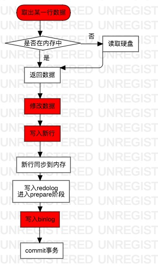

# 基本架构
一条sql语句在mysql中的执行过程：客户端-连接器-分析器-优化器-执行器-存储引擎

大体来说。mysql可以分为server层和存储引擎层，连接器、分析器、优化器、执行器都属于server层。

功能介绍：

* 连接器：与客户端建立、维持连接并获取权限和管理连接
* 分析器：实际上连接器会首先查询缓存，但是缓存一般弊大于利，所以不推荐使用，并且在mysql 8的版本里缓存直接移除了。分析器会做词法识别（即识别出要查询的列、表等）、语法分析
* 优化器：在表里有多个索引的时候，决定使用哪个索引；以及在表关联的时候，决定各个表的连接顺序
* 执行器：判断执行权限，然后根据表的引擎定义，去使用引擎提供的接口，一行一行去取数据，如果符合条件则将这行存在结果集中，如果不符合则跳过取下一行

redo log：WAL(Write-Ahead Logging)技术的组成之一。每当有一条记录需要更新的时候，InnnoDB引擎会先把变更记录写到redo log里，并更新内存。引擎会在适当时候将该操作记录更新到磁盘。redo log大小固定，写到末尾回从开头循环写，其中有两个标记：write pos当前记录的位置，一边写一边后移，checkpoint是当前要擦除的位置，也是往后推移并循环的。如果checkpoint追上了write pos则需要擦除记录了。

redo log作用：creash-safe，InnoDB保证即使数据库发生了异常重启，之前提交的记录都不会丢失。

undo log：在数据修改的时候，不仅记录了redo，还记录了相对应的undo，如果因为某些原因导致事务失败或回滚了，可以借助该undo进行回滚，它没有日志文件，只是一个逻辑日志，可以理解为当delete一条数据时，undo log里记录了insert一条数据，undo log借助redo log实现持久化保护。

undo log作用：提供回滚和多个行版本控制(MVCC)。

binlog：binlog跟redo log主要不同之处在于不限于InnoDB，它是面向server层的，而server层可以调用不止一种类型的存储引擎。binlog是采用的追加写入的方式记录日志。它有两种模式：row格式会记录行的内容，statement格式是记录sql语句。
执行过程如下：



其中，红色部分表示是在执行器里做的操作，commit的时候会将prepare状态的redolog改成commit状态，更新完成。
> 拓展：innodb\_flush\_log\_trx\_commit这个参数设置为1的时候，表示每次事务的redo log都直接持久化到磁盘；sync_binlog这个参数设置成1的时候，表示每次的事务的binlog都持久化到磁盘，能够保证mysql异常重启之后binlog不丢失。

# 事务
## ACID
事务的四大特性：

* Atomicity：原子性
* Consistency：一致性
* Isolation：隔离行
* Durability：持久性

多个事务会导致的问题：

* 脏读（dirty read）：事务A读取了事务B未提交的数据；
* 幻读（phantom read）：事务A两次读取数据数量不一致；
* 不可重复读（non-repeatable read）：事务A在执行过程中对于某一条数据的多次读取会有不同结果。

## 隔离级别
* 读未提交（read uncommited）：一个事务未提交时，它所做的变更就能被其他事务读取到
* 读提交（read commited）：一个事务提交以后，它所做的变更才能被其他事务看到
* 可重复读（repeatable read）：一个事务执行过程中看到的数据，和启动时看到的是一致的
* 串行化（serializable）:对于同一行数据的读和写都会加锁，后续事务必须等前一个事务执行完才可以继续执行


**原理浅析：
读提交会在每个sql语句开始执行时创建一个视图；
可重复读会在每个事务开始时创建一个视图；串行化直接通过读写锁的方式避免并行访问，可以通过`show variables like 'transaction_isolation'`;来查看当前数据库的隔离级别。每次更新都会在undo log里产生记录，不同事务启动时都会有不同的read-view，所看到的记录的值也可能不一样，因此同一条记录系统中可能存在多个版本，这就是数据库的多版本并发控制（MVCC）。当系统里没有比这些日志更早的read-view时，这些undo log会被删除。**

## 启动方式
```sql
begin/start transaction
...
commit/rollback
```

或者`set autocommit=0`，这个命令会关闭自动提交事务，直到主动执行commit或者rollback或者断开连接。
推荐使用`set autocommit=1`，这样可以使用commit提交事务或者`commit work and chain`提交并自动启动下一个事务。

> 拓展：在information\_schema库的innodb\_trx这个表中查询超过60s的事务：
> 
> ```sql
> select * from information_schema.innodb_trx where time_to_sec((timediff(now(),trx_started)))>60;
> ```

## 事务隔离
在可重复独隔离级别下，事务在启动的时候就会对整库生成一个快照。

Mysql里有两种"视图"：

* view，即正常情况下create view as select ……，查询方式与查表一样
* consistent read view...，用于支持RC(Read Committed)和RR(Repeatable Read)隔离级别的实现


快照的生成原理并不是拷贝整个库的数据，拷贝的是事务的ID，因为每个事务都会向事务系统申请，并且按照申请顺序严格递增，每一行数据都会有一个transaction id，每个事务更新数据的时候，都会生成一个新的数据版本，并且将transaction id作为该版本的事务ID，记为 row trx_id，同时旧的数据版本会保留，能够在新的数据版本中拿到它。
对于一个事务视图来说，除了自己的更新总是可见以外，有三种情况：

* 版本未提交，不可见；
* 版本已提交，但是是在视图创建以后提交的，不可见；
* 版本已提交，但是实在视图创建以前提交的，可见


如果设置了**当前读（current read）**，那么所查到的可以是版本未提交更新的数据，对某一行数据的更新就是使用当前读然后更新。如果select 语句加锁，例如`select * froom t where id = 1 lock in share mode`的话就能读到在它之前启动的事务还未提交的事务，所以对于操作频繁的数字类型数据，不推荐在代码里首先查询数据然后更改再update回去，推荐`update t set k = k + n where id = 1的`形式，这种就是加了**读锁（S锁，共享锁）**，当然还可以加**写（X锁，排他锁）锁**，即`select * from t where id = 1 for update`。

# 索引
## 简述
索引就类似于一本书的目录
## 结构

* 哈希表：键-值对或key-value的结构，如果多个key的的哈希值相同，在会在key的位置拉出一条链表，适用于等值查询的场景，如Memcached； 
* 有序数组：在等值查询和范围查询场景中的性能都非常优秀，适用于静态炖出引擎；
* 二叉搜索树(B+ Tree)：每个节点的左儿子小于父节点，父节点小于右儿子。但是由于二叉很容易导致树的高度变高，所以一般数据库中使用N叉树，N取决于数据块的大小。

PS：关于数据结构，明年应该会有系统的学习过程。

## InnoDB的索引模型
在InnoDB中，表都是按照主键顺序以索引的形式存放的，这种存放形式叫索引组织表。因为InnoDB使用了B+树的索引模型，所以数据都是存储在B+树中的。

**每一个索引都对应一个B+树。**

根据叶子节点的内容，索引类型分为主键索引和非主键索引。

* 主键索引：叶子结点存放的是整行内容，在InnoDB里也叫聚簇索引；
* 非主键索引：叶子几结点存放的是主键索引的值，在InnoDB里也叫二级索引。


**查询的时候如果使用的是非主键索引，那么会首先使用非主键索引去查询主键索引的值，然后回表使用主键索引的值去查询数据，所以推荐使用主键索引查询，省去一次扫描索引树的过程。**

## 索引维护
每次插入或者删除都会进行索引维护。如果插入的数据的主键值大于当前所有节点的ID，那么只需要在最大的节点的后面插入一个新记录。如果新数据的主键不是最大的而是在某两条数据的中间，那么就需要挪动比新数据大的所有数据了，还可能造成数据页页分裂，影响性能，降低空间利用率；所以在定义主键的时候推荐使用：`not null primary key auto_increment`。

当利用率很低的时候，数据页会进行合并。

> 拓展：主键长度越小，非主键索引占用的空间就越小（因为叶子结点存放的都是主键索引），所以推荐使用整型作为索引字段的数据类型。

## 索引覆盖
例如一个语句：`select * from t where k = 6`（假定表中有两个索引，一个主键索引，一个k列索引）;

那么执行过程是：**首先在k索引树上找到ID的值，然后再到主键索引树上找到ID对应某一行数据（回表）。**

而索引覆盖的意思就是：`查询k索引树时，只查ID，这样就无需再进行回表操作，因为k索引树能查到ID的值。`

一个很常用的场景就是limit分页时的场景，当limit n m的时候，mysql的实际做法是首先查出n+m行的所有数据，然后丢弃前n行，尤其当select *的时候，mysql的执行效率非常低。而如果使用索引覆盖，即：

```sql
select a.* from t a,(select id from t limit 1000000 10) b where b.id = a.id​
```
关联表走一次非主键索引，只需要获取到ID，然后通过表关联根据ID条件查询完整数据。

## 联合索引
多个列联合组成一个索引的，称之为联合索引。

联合索引的使用场合一般是业务中的某个高频请求，用到了多个字段作为条件。

**最左前缀原则**：假定一个表中有一个联合索引由(a,b,c)三个字段组成，那么能够使用该索引加速检索的语句有以下三种：

* 查询时使用了a，b，c三个字段作为检索条件；
* 使用了a，b作为检索条件；
* 使用了a作为检索条件
作为检索条件：我目前所知是where 语句和order by语句都是可以使用索引的。

如果是某个字符串类型的字段作为索引，那么最左前缀同样适用于字符串前n个字符，**所以对于高频模糊查询，推荐使用'str%'+字符串索引的查询方式。**

符合最左前缀原则就是满足联合索引的前n个字段或者字符串索引的前n个字符的查询都可以使用索引。

**索引下推**：mysql 5.6引入的索引下推优化（index condition pushdown）的功能。在引入索引下推优化以前，假如根据多个条件查询数据，InnoDB在查询时只会以第一个条件（第一个条件是指经过优化器优化之后的条件）去查询ID的值再回表去检索数据。引入索引下推优化以后，InnoDB在检索非主键索引时就会自动根据检索条件里索引包含的字段，说白了就是多个索引字段条件去查询ID再回表。

> 拓展：有可能表的数据只是10G，但是索引却有30G，所以有的时候会通过重建索引来达到节省空间的目的。但是重建的索引一般是非主键索引，因为如果无论是删除主键还是创建主键，都会将整张表重建，那么重建主键索引会导致非主键索引的工作白做，所以对于重建主键索引的行为，推荐使用`alter table T engine = InnoDB`有类似的效果。 

## 唯一索引
对于普通索引来说：查到满足条件的第一个记录后，需要查找下一个记录，直到碰到第一个不满足条件的记录；

对于唯一索引来说：查到满足条件的第一个记录以后，就会立即停止查找。

效率对比：差距微乎其微；
原因：InnoDB是按照页来读取的，每个页默认大小是16K，差不多近千个key，在现代CPU中，这点差距可以忽略不计

**change buffer**：当需要更新一个数据的时候，如果内存中有，那么直接更新内存；如果内存中没有，那么就存到change buffer中，等到下次数据页读入内存中的时候对旧的数据页进行操作得到新的数据页（merge）。除了访问这个数据页会触发merge以外，mysql后台会有线程定期merge，此外，在数据库正常关闭（shutdown）的时候也会触发merge。在内存中它占用的是**pool buffer**的空间，即内存读数据页的空间，可以通过`innodb_change_buffer_max_size`来动态设置百分比。


使用场景：二级索引，写入频繁。如账单类，日志类，change buffer能够大幅节省随机读磁盘的IO消耗；


插入语句中的change buffer：如果数据页已经读入到内存，直接更新内存；如果没有，那么在change buffer里记录一下插入语句。最后将所有这些语句记到redo log-（add (id ,value) to page,new change buffer item "add (id,value) to page"）里。

查询语句中的change buffer：如果在上述插入语句后立即执行了查询，如果内存页中有，那么直接返回内存页中数据；如果没有，首先读取磁盘中的页到内存，然后merge change buffer中的内容到页中，再返回数据。
redo log主要节省的是随机写磁盘的消耗（转换成顺序写），而change buffer主要节省的是随机读磁盘的IO消耗。

## 索引优化
优化器是如何选择索引的？

扫描行数，临时表，是否排序。

扫描行数：根据统计信息来估算记录数，这个统计信息是指索引的"区分度"，一个索引上不同的值越多，区分度就越好， 值的个数称之为"基数（cardinality）"。

使用`show index from t`可以看到t表上索引的基数。基数的计算采用的是**"采样统计"**的方式计算而来，即：***默认选择N个数据页，统计这些页面上的不同值，得到平均值，然后乘以这个索引的页面数，就得到了索引的基数；当变更的数据行超过1/M的时候，会自动触发重新做一次索引统计。***

当`innodb_stats_persistent=on`时：统计信息会持久化，N默认为20，M默认为10。

当`innodb_stats_persistent=off`时：统计信息不回持久化，N默认为8，M默认为16

使用explain分析时，rows表示预计扫描行数，但是有的时候，优化器可能会选择扫描行数比较多的执行计划，是因为它会把回表查找的行数页算进去，所以虽然行数比较多，但是由于是主键，省去了回表的操作。
当mysql优化器选择了错误的索引导致执行比较慢时，常用的策略如下：

* `analyze table t`，该语句会重新统计索引信息，能解决单纯扫描行数计算错误的问题；
* `select * from t force index(a) where ...`，强制使用某索引；
* `select * from t where ... order by b  limit 1`改为`order b,a`，引导mysql使用a索引，mysql使用b索引的原因是因为使用索引b可以避免排序（b本身是索引，已经是有序的），所以即使b扫描行数多也会认为代价更小，这种方式只适用于limit 1这样两种排序方式结果都返回b最小的那一行的情况；
* 新建索引或者删掉误用的索引。

# 锁
msyql根据加锁范围，大概有全局锁、表级锁和行锁三类。
## 全局锁
加全局读锁的方法：`Flush tables with read lock（FTWRL）`

使用场景：全库逻辑备份。与前面提到的一致性视图不一样的在于，一致性视图只适合于支持事务的存储引擎，如InnoDB可以使用`mysqldump -sigle-transaction`开启事务确保拿到一致性视图。而FTWRL适合于不支持事务的存储引擎，例如MyISAM。

另一种全局读锁的方法：`set global readonly=true`，但是readonly的值可能会被用来做其他逻辑例如判断一个库使主库还是备库；而且如果客户端设置了该值，一旦客户端异常以后，数据库就会保持readonly的状态，影响会很大；**但是FTWRL方式会自动释放全局读锁**。
## 表级锁
表级锁分为两种：表锁，元数据锁（MDL）


语法：lock tables ... read/write

作用：lock tables不仅限制了其他线程的读写，也限制了本线程接下来操作的对象。例如线程A执行了`lock tables t1 read,t2 write`；那么其他线程写t1，读写t2的都会被阻塞，并且A自己连写t1都不行，只能unlock tables之后再进行。

而**元数据锁**无需显式启用，在进行访问一个表时会自动加上，保证表结构不会在读期间发生变更。所以在做表结构变更的时候要小心不能锁住线上查询和更新。可以考虑暂停DDL操作然后kill掉mysql里的长事务。

> 拓展：MariaDB和AliSQL已经支持DDL的NOWAIT/WAIT n，表示不重试/重试修改字段：
> ```sql
> ALTER TABLE T NOWAIT add column...
ALTER TABLE T WAIT N add column...
> ```

## 行锁
Mysql的行锁是在引擎层由引擎层实现的，所以例如MyISAM等引擎就不支持行锁。

行锁是在需要的时候才加上，也就是说在真正执行对某一行数据操作的时候才加上，并且等到事务结束时才是放。这个称之为两阶段锁协议，所以尽可能把造成锁冲突的、影响并发度的锁往后放。

假设一个事务里一个持有锁时间比较长的操作再前面，直到所有操作完成才会释放锁，那会导致加锁时间比较长。

死锁和死锁检测
死锁：例如：

```sql
#事务A
begin；
update t set k = k+1 where id = 1;
update t set k = k+1 where id = 2;
commit;
#事务B
begin;
update t set k = k+1 where id = 2;
update t set k = k+1 where id = 1;
commit;
```

当事务A启动以后，事务B也启动，执行到第4行时会发现id=2这一行的锁已经属于B，而B也在等待A释放id=1的锁，这个时候两个事务就会进入死锁状态。
有两种解决策略：

* 直接进入等待，直到超时，超时时间可以通过`innodb_lock_wait_timeout`来设置，默认为50
* 发起死锁检测，发现死锁后，主动回滚死锁链中某一个事务，将`innodb_deadlock_detect`设置为on，即可开启这个逻辑
正常情况下用第二种策略比较多，其逻辑是：

**每当一个事务被锁住的时候，就要看看它锁依赖的线程有没有别的事务锁住，如此循环，最后判断是否出现了循环等待。如果所有事务更新的都是同一行，每个新来的被堵住的线程，都要判断会不会由于自己的加入导致了死锁，这是一个复杂度为o(n)的操作。假如1000万个并发线程，最后的检测结果是没有死锁，但是消耗了大量CPU判断循环等待。**

所以这又引发了一个问题：如何解决死锁检测的性能消耗问题？

* 确定业务不会出现死锁，直接关闭死锁检测（不推荐）
* 控制并发度， 在数据库服务端做（在中间件做并发控制或者修改Mysql源码）