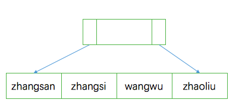
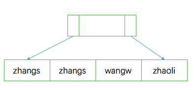
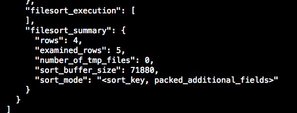

# 字符串索引
两种方式：

* 整个字段（消耗内存多）
* 字段前几个字符（消耗内存少，可能会导致扫描次数变多）

语法：

`alter table t add index index1(name);`
`alter table t add index index2(name(n));`
<!--more-->

两种不同方式的索引结构如下：


上图用整个字段作为索引的结构，B+树的叶子结点之间有链指针；


上图n=6时，前6个字符作为索引。

第一种占用空间比较大，但是扫描次数比较少，如果一个`select * from t where nam = 'zhangsan'`语句，使用第一种索引方式，找一次，然后再回表根据ID查出完整数据即可；

如果使用第二种索引方式，根据最左前缀原则，在本例子中，由于第一个就是zhangsan，因此也只需要找一次，但是如果zhangsan和zhangsi换一个位置，那么第二个索引就需要找两次了。

优化方案：

1. 索引长度调整为需要的长度，根据前面基础入门里的理论，索引的区分度越大越好，即不同的数据越多越好。可以使用`select count(discount name) as L from t`找出总共有多少条数据，然后使用：
1. `select count(distinct left(name,4)) as L1,select count(distinct(name,5)) a L2... from t`。最后使用L1和L2去除以总条数，找出比例大于等于95%，损失数小于5%的字段长度
1. 将一些数据倒序存储，查询的时候可以通过`where name = reverse(`name`)`;
1. 表中多加一个字段，使用crc32函数（或者其他任意哈希函数）将字符串生成的校验码存储到新加字段上（保证唯一即可），查询的时候可以根据名字字段和新加的字段作为条件。

# MySql执行效率波动
可能是在flush脏页（即内存和磁盘中数据不一致的数据页）。

发生情况：

* redo log空间不足，必须先将redo log中记载的对应脏页数据flush到磁盘上去；
* 内存不足，需要淘汰一些数据页，淘汰之前需要将内存中的脏页flush到磁盘上去；
* 系统空闲时；
* 系统慢关闭时。
所以，如果一次查询要淘汰的脏页个数太多，会导致查询响应时间明显变长；或者日志写满了导致更新全部堵住。

InnoDB使用缓冲池（buffer pool）管理内存，缓冲池中的内存页要么是干净页，要么是脏页，要么就是尚未使用的。当InnoDB读入的数据页不在内存中时，就必须到缓冲池中申请一个数据页，如果没有未使用的，就必须把某个最久没使用的数据页从内存中淘汰掉，干净页可以直接释放然后复用，脏页必须先刷到磁盘才能复用。

InnoDB刷脏页的控制策略：
`innodb_io_capacity`这个参数会告诉innodb服务器的磁盘能力，建议设置成磁盘的IOPS。磁盘的IOPS可以通过fio这个工具来测试随机读写：

```bash
fio -filename=/root/1.txt -direct=1 -iodepth 1 -thread -rw=randrw -ioengine=psync -bs=16k -size=500M -numjobs=10 -runtime =10 -group_reporting -name=mytest
```
InnnoDB根据脏页比例和redo log写盘速度会单独算出两个数字，innodb_max_dirty_pages_pct是脏页比例上限，默认是75%，假设当前脏页比例为M，首先需要根据如下公式计算一个0～100之间的数字：

	F1(M){
    if M>=innodb_max_dirty_pages_pct then
        return 100;
    return 100*M/innodb_max_dirty_pages_pct;    
	}
	
InnoDB每次写入的日志都有一个序号，当前写入的序号跟checkpoint对应的序号之间的差值假设为N。InnoDB会根据这个N算出一个范围在0～100之间的数字，N越大那么计算出来的值页越大。然后取其中较大的值获得百分比数（除以100）乘以`innodb_io_capcaity`的数值即是innodb刷脏页的速度。

优化方案：合理设置`innodb_io_capacity`，并且关注脏页比例不要接近75%（`Innodb_buffer_pool_pages_dirty/Innodb_buffer_pool_pages_total`)。

查询代码参考：

```sql
select VARIABLE_VALUE into @a from global_status where VARIABLE_NAME='Innodb_buffer_pool_pages_dirty';
select VARIABLE_VALUE into @b from global_status where VARIABLE_NAME = 'Innodb_buffer_pool_pages_total';
select @a/@b;
```
在flush的时候，脏页连同附近紧挨着的脏页会一同被刷到磁盘，并且这个作用是会蔓延的。可以通过`innodb_flush_neighbors`这个参数设置，推荐IOPS只有几百的机械硬盘打开这个参数，能够减少随机IO，即设置为1，使用SSD硬盘的设置为0，即不需要找邻居，只刷自己就好。

# 表数据和表文件
从mysql5.6.6以后，`innodb_file_per_ table`就被设置为ON，开启这个选项表示表数据存储在一个以.ibd为后缀的文件中，也推荐设置为ON，如果是在文件中，使用drop table会删除这个数据文件，如果off的话放在共享表空间中，即使表删除空间也不会回收。

**数据在删除的时候，会把这一行删除的数据标记为可复用，但是并不是真正缩小的空间。例如删除了ID=5的这一行，那么会标记为可复用，如果这时候插入了ID=6的记录，那么5这一行空间就不能被复用了，成为“空洞”。
如果删除了整个数据页或者表，空间同样不会变小，只是说当前数据页可以任意复用而已。**

**如果插入数据不是按照索引递增顺序插入的，同样也会造成空洞。
同样，更新数据也可以理解为先删除后插入，有可能造成空洞。
如果相邻两个页的利用率都不高，那么会将两个页的数据合并到其中一个页上，另一个数据也就会被标记为可复用。**

如果此时新建一个表，将原来产生“空洞”的表数据按照主键递增的顺序插到到新表中，就能去掉数据空洞了，提高空间利用率。`alter table t engine=InnoDB`就能起到这个作用，只不过这个新表不需要自己建，它会自动完成建立新表、交换表名和数据、删除旧表的操作。
在mysql 5.6.6以后，引入了Online DDL，这个操作流程进行了优化：


1. 建立临时文件，扫描表A的所有数据页；
1. 用数据页中的数据生成B+树，存储到临时文件中；
1. 在前两步操作中，所有对表A的操作都会记录到redo log中；
1. 临时页建立完成后，会将redo log中对A的操作应用到临时文件中；
1. 用临时文件替换表A的数据文件。

在alter语句启动的时候需要获取MDL写锁，但是真正拷贝数据的时候，写锁会退化成为读锁，这样就不会阻塞到对表的增删改操作，同时，这个读锁也会阻塞其他DDL的操作。

**需要补充的是，这个操作很消耗I/O和CPU资源。**

Online和Inplace：

在5.6.6以前，拷贝数据出来的地方在server层，名为tmp_table;
而引入Online以后，数据拷贝出来的地方就在innodb内部，对于server层来说，没有把数据挪到临时表，所以是一个原地操作，就是“inplace”的来源。

`alter table t engine=InnoDB`的隐含语句为：`alter table t engine = InnoDB ,ALGORITHM=inplace`;
对应的就是copy方式：：`alter table t engine = InnoDB `, `ALGORITHM=copy`;

在重建表时，看起来inplace和online逻辑差不多，但是实际上如果是online的，那么必定是inplace的，而inplace方式不一定是online，例如给一个字段加全文索引（FULLTEXT index）或空间（SPATIAL index）索引：`alter table t add FULLTEXT(column)。`
拓展：从5.6.6开始，`alter table t engine = InnoDB`（也就是recreate）；`analyze table t `是对索引重新进行统计，加了MDL锁；`optimize table t`等于recreate + analyze。
COUNT()争取姿势
# COUNT()实战
实现方式：


count（）是一个聚合函数，低于返回的结果集，一行行地判断，如果count函数的参数不是NULL，累计值就加1。


count(1)：遍历表，但是不取值，server层对于每一行数据都会放一个1进入，判断是不可能为空的，按行累加；

count(id)：遍历表并且取值，server层拿到id后判断是不可能为空的，就按行累加；

count(\*)：不会把全部字段提取出来，即不取值。count（\*）肯定不为null，按行累加；

count(字段)：遍历表且取值，如果字段是“not null”的话，一行行地从记录里读数据，判断不能为null，按行累加；如果允许为null，执行的事耦，判断到有可能为null，还要把值取出来再判断一下。

效率：count(字段)<count(主键ID)<count(1)约等于count(*)

即：

* srver层要什么，引擎就给什么；
* InnoDB只给必要的值
* count(*)就是统计行数，mysql做了优化。
如果使用count（\*）还是比较慢，可以考虑将每个表总数据量数据放到redis里或者数据库里，最好是放数据库，因为插入或者删除数据时可以通过事务将数量修改同步到专门记总数量的表里，redis目前则实现不了。

## order by
`sort_buffer`：mysql会为每个请求线程分配一块内存用于排序。
例如，要执行一个sql：`select city,name,age from t where city = 'hangzhou' order by name limit 1000`;主键id，索引city。

mysql会有两种算法来进行排序：
全字段排序：**初始化sort_buffer，放入city，name，age三个字段，然后到city索引上读取第一个符合city=‘hangzhou’的ID，然后到ID索引上读取city，name，age的值放入sort_buffer，然后取下一个，依次循环，最后取前1000行返回给客户端；**
如果`SET max_length_for_sort_data = 16`;`max_length_for_sort_data`是用来标记排序的字段总的数据长度的，假如name，city，age三个字段之和大于16，那么mysql会换一种排序算法。

rowid排序：**初始化sort_buffer，放入name和id两个字段，首先读取city索引上第一个符合city='hangzhou'的id，然后到ID索引上读取city，name，age的值放入sort\_buffer，然后取下一个，依次循环，最后取前1000行的id到id索引上取得city，name，age的值返回给客户端。
全字段排序，参加排序的是4000行，rowid排序参加排序的也是4000行，但是会多1000行去id索引树取数据的过程。**

可以使用如下语句查看：

```sql
/* 打开optimizer_trace,只对本线程有效 */
mysql> set optimizer_trace='enabled=on';
/* 保存初始值*/
mysql> select VARIABLE_VALUE into @a from performance_schema.session_status where variable_name='Innodb_rows_read';
/* 执行查询语句*/
mysql> select city , name ,age from test_16 where city = 'hangzhou' order by name limit 1000;
/* 查看optimizer_trace结果*/
mysql> select * from information_schema.optimizer_trace\G;
/* 保存执行之后的值*/
mysql> select VARIABLE_VALUE into @b from performance_schema.session_status where variable_name='Innodb_rows_read';
/* 计算读取了多少行数据*/
mysql> select @b-@a;​
```

在filesort_summary里，可以看到如下结果（该表匹配数据仅有4条，懒得造数据了，所以在这里mysql会使用全表扫描，使用explain 可以看到type = all，可以使用强制索引`force index(city)`保证using index condition……）:


rows表示匹配的数据行，examined_rows表示读取的行数，此处是5行，`select @b-@a`在InnoDB的条件下查询的可能是6行，因为查询optimizer_trace的时候要用到临时表，InnoDB把数据从临时表取出来时，会让`Innodb_rows_read`的值加1，可以将`internal_tmp_disk_storage_engine`设置成MyISAM。

`number_of_tmp_files`表示使用了多少个临时文件，如果`sort_buffer_size`足够完成排序，那么会优先在内存中完成，所以上图为0。

mysql会优先使用全字段排序，rowid由于要回表读磁盘，所以效率比较低。如果不想有Using filesort，那么可将索引city替换为联合索引(city,name)，由于索引本身保证了有序，在加上最左前缀匹配原则，效率可以进一步提高（因为不需要在sort_buffer里进行排序了），当然这种方式并不适用于`select city,name,age from t where city in ('hangzhou','anqing') order by name limit 1000`，因为这种联合索引只能保证在'hangzhou'或者'anqing'中是有序的，所以这种in类型的就无法保证有序了。

# 随机查询数据
```sql
CREATE TABLE `words` (
  `id` int(11) NOT NULL AUTO_INCREMENT,
  `word` varchar(64) DEFAULT NULL,
  PRIMARY KEY (`id`)
) ENGINE=InnoDB;

delimiter ;;
create procedure idata()
begin
  declare i int;
  set i=0;
  while i<10000 do
    insert into words(word) values(concat(char(97+(i div 1000)), char(97+(i % 1000 div 100)), char(97+(i % 100 div 10)), char(97+(i % 10))));
    set i=i+1;
  end while;
end;;
delimiter ;

call idata();
```
算法一：

```sql
select word from words order by rand() limit 3;
```
缺点：需要临时表，且需要在临时表上使用rowid排序，首先扫描全表（10000行），放入临时表，然后初始化sort\_buffer，并从内存临时表中取出rowid和需要参与排序的数据放入sort\_buffer（10000行），排序完取出需要的rowid到内存临时表中获得需要的信息。这里的rowid就是数据的位置信息，**如果没有指定主键，那么系统会自动生成一个6字节的rowid**，需要注意的是，如果配置tmp\_table\_size的大小，一旦内存临时表大小超过该限制，那么内存临时表就会转成磁盘临时表，对于磁盘临时表的引擎，是由参数`internal_tmp_disk_storage_engine`来控制的。

算法二：

```sql
select max(id),min(id) into @M,@N from t ;
set @X= floor((@M-@N+1)*rand() + @N);
select * from t where id >= @X limit 1;​
```
特点：效率高，max(id)和min(id)都不需要扫描索引，而第三步的select也可以用索引快速定位。但是实际上，这个算法因为ID中间可能有空洞，因此选择不同行的概率不一样。

算法三：

```sql
select count(*) into @C from t;
set @Y = floor(@C * rand());
set @sql = concat("select * from t limit ", @Y, ",1");
prepare stmt from @sql;
execute stmt;
DEALLOCATE prepare stmt;
```
特点：解决了算法二里面概率不均匀的问题，由于需要扫描C+Y+1行因此执行代价比算法二要稍高。

算法四：

```sql
select count(*) into @C from t;
set @Y1 = floor(@C * rand());
set @Y2 = floor(@C * rand());
set @Y3 = floor(@C * rand()); 
select * from t limit @Y1，1； // 在应用代码里面取 Y1、Y2、Y3 值，拼出 SQL 后执行
select * from t limit @Y2，1；
select * from t limit @Y3，1；
```
# 查询中的坑
## 条件查询中的函数
在查询语句中，即使是单表查询，如果没有用索引或者破坏了索引的有序性，也会导致查询效率极低。
例如如下语句：

```sql
mysql> select count(*) from tradelog where month(t_modified)=7;

```

此时在t\_modified这个字段上和主键都存在一个索引，但是由于函数破坏了索引的有序性，导致优化器放弃了走**树搜索**功能，但是它依然会使用索引，遍历主键索引和t\_modified索引发现主键索引大小比t\_modified索引小，所以依然会使用t\_modified，只不过使用的是全索引扫描。

就算不使用函数，使用呢`select * from t where id + 1 = 10000`的这种形式，优化器也会“偷懒”，不使用树搜索，不过可以改为`select * from t where id = 10000 - 1`。


## 隐式类型转换
假如现在表中有个orderId为varchar类型，当使用如下语句时，会触发类型转换：

```sql
mysql>select * from t where orderId=1112345;
```
使用explain可以看到，这条语句使用了全表扫描（type=all）。
因为上面的语句等同于：

```sql
mysql>select * from twhere CAST(orderId as signed int)=1112345
```
隐式调用了函数操作，使得优化器放弃调用了树搜索。

对于类型转换规则，参考官方文档：[MySql5.7:https://dev.mysql.com/doc/refman/5.7/en/type-conversion.html](https://dev.mysql.com/doc/refman/5.7/en/type-conversion.html)

由此可知：如果当索引类型为int，但是输入的条件为varchar，例如：

```sql
mysql>select * from t where id = '11111';
```

由于该字符能直接转换为int，所以不会走全表扫描，还是会走索引。

## 隐式编码转换
假如现在有两张表，一个订单表order，一个订单详情表order\_detail表，order表中有一个字段order\_detail\_id为varchar类型，用于关联order和order\_detail表。这个时候我们通过订单id去查订单详情，用的就是如下类似语句：

```sql
select od.* from order o , order_detail od where od.id=o.order_detail_id and o.id = 4;
```
> 这个语句中，order为驱动表，order_detail为被驱动表，order\_detail\_id为关联字段。

它的执行步骤是：

1. 根据订单id为4找出订单表中的一行数据；
2. 在第一步中取出的数据里拿到order_detail_id的值；
3. 根据order_detail_id去order_detail表里取出数据。

如果在第三步里，两个表的字符集类型不一致，假如订单表里的order_detail_id为utf-8mb4字符集，而详情表里为utf-8字符集，那么就会触发编码转换，utf-8会向上转换为utf-8mb4，因为utf-8其实就是utf-8mb3的别名，它是mb4的子集，也就是说转换为了如下形式：

```sql
select * from order_detail  where CONVERT(id USING utf8mb4)=o.order_detail_id; 
```
也就是说，如果**驱动表的字符集类型大于被驱动表的字符集类型，那么会对查询条件使用函数转换导致全表扫描，如果驱动表的字符集类型小于被驱动表的字符集类型，那么函数转换就加在输入参数上，这样就可以使用索引**；

如下形式就可以使用索引：
```sql
select * from order_detail where id = CONVERT(order_detail_id USING utf8mn3);
```

# 查询慢
## 等MDL锁
有一个线程持有MDL锁，阻塞了查询语句。

例如：

```sql
-- sessionA
lock table t write;
-- seeesionB
select * from t where id = 1234;
```

查看方式：

```sql
show processlist;
```
结果中带有`Waiting for table metadata lock`即代表该查询语句被MDL锁阻塞，但是持有锁的语句正处于sleep的状态；

处理方式：
首先需要开启`performance_schema=on`，如果不确定有没有开启可以使用`show variables like 'performance_schema'`，在mysql的配置文件my.cnf里的mysqld下添加`performance_schema=on`，开启该选项大约有10%的性能损耗。

然后通过以下命令查出进程id，kill即可：

```sql
select blocking_id from sys.schema_table_lock_waits;
```

## 等flush
通过`show processlist`查出来的结果里有id这个字段，可以通过这个字段查看具体信息：`select * from information_schema.processlist where id=1;`如果状态为`waiting for table flush`，表示flush操作被阻塞。通常情况下，flush操作有：

```sql
flush tables t with read lock;

flush tables with read lock;

```

指定表t代表关闭表t，如果没有指定就是关闭所有打开的表。

通常情况下fush操作也是很快的，但是如果它们被阻塞了，可以在`show processlist`中看到，通过方法一中的命令找出pid然后kill即可。

## 等行锁
```sql
-- sessionA
begin;
update t set c=c+1 where id =1;

-- sessionB
select * from t where id = 1lock in share mode;
```
很明显A一直未提交事务，导致当前读的sessionB阻塞。

通过`show processlist;`可以看到session的state是statistics。如果是5.7的mysql，可以使用如下命令，
`mysql> select * from t sys.innodb_lock_waits where locked_table='`test`.`t`'\G`可以看到blocking_pid，使用kill 命令杀死即可。

## 慢查询
有的时候会出现如下这种情况：

```sql
-- session A
start transaction with consistent snapshot;

-- session B（执行100万次）
update t set c = c+1 where id = 1;

-- session A
select * from t where id = 1;
select * from t where id = 1 lock in share mode;
```

上面的语句中，事务A启动时启动了一个一致性视图，然后B执行了一个100万次的增加，生成了100万次的undo log(3变成2，2变成1等等)，此时在A中再次执行一致性读查询即没有加S锁的那条语句，那么查出来的结果需要在当前结果的基础上执行100万次的redo log，得到1返回，而加了S锁的语句直接返回的当前结果。

还有一种慢查询：

假如此时表t中字段b为varchar(10)类型，b同时也是一个索引，其中有10万条数据都是1234567890，而此时执行：`select * from t where b= '1234567890aab'`的过程也十分慢，步骤如下：

1. 在引擎层，做字符阶段，只截出10位进行匹配；
2. 通过b索引查出符合条件的10万条数据；
3. 回表，再查出10万条完整数据；
4. 每次回表查出数据到server层发现不符合条件；
5. 返回空。

# Gap lock和Next-key lock
记录一下幻读的一个场景（这是假如产生幻读的场景用以引出mysql的解决方案，实际上mysql已经解决该场景）：

```sql
--表t（id,c,d）中数据(5,5,5)，(0,0,0)
-- session a
begin;
select * from t where d=5 for update;

-- session b
update t set d = 5 where id = 0;

-- session a
select * from t where d=5 for update;

-- session c
insert into t  value (1,1,5)

-- session a
select * from t where d = 5 for update;
commit;
```
a第一次查询的时候，只有(5,5,5)一条数据;

第二次查询，有(0,0,5)(5,5,5)两条数据；

第三次查询，有(0,0,5)(5,5,5)(1,1,5)三条数据。

由于三次使用的都是当前读并且加上写锁，因此会出现这种幻读情况，它们会有以下问题：

1. 破坏语义：在a第一次查询的时候，只是对id等于5的那一行加了写锁，这意味着可以将b中，id=0的那一行的d改为5，破坏了a第一次查询时“对所有d=5的行加上写锁”的声明；
2. 破坏数据一致性：包括日志和数据的一致性。新加以下两行操作：

```sql
--表t（id,c,d）中数据(5,5,5)，(0,0,0)
-- session a
begin;
select * from t where d=5 for update;

-- session b
update t set d = 5 where id = 0;
-- 新加
update t set c =5 where id = 0;

-- session a
select * from t where d=5 for update;

-- session c
insert into t  value (1,1,5);
-- 新加
update t set c = 5 where id = 1;

-- session a
select * from t where d = 5 for update;
commit;
```
由于a最后提交，最后实际的数据为：(0,5,100),(1,5,100),(5,5,100)，而按照我们预期结果应该是(0,5,5),(1,5,5),(5,5,100)。

gap lock：为解决幻读而引入，假如插入(1,1,1)（5,5,5）(9,9,9)三条数据，那么间隙就是(负无穷，1)，(1,5)，(5,9)，(9,正无穷)这四个区间，**对同一个间隙加的锁之间没有冲突，但是往间隙插入一条数据会产生冲突**。

next-key lock：间隙锁和行锁的合称，是前开后闭区间，即(1，5]，(5，9]等。

缺点：

1. 锁范围更大导致了性能下降；
1. 并发高的时候导致死锁，举例来说：会话A和会话B同时对id在(1,5)之间的间隙锁加锁，当A和B同时插入一条id为4的数据，A和B相互等待导致死锁。


