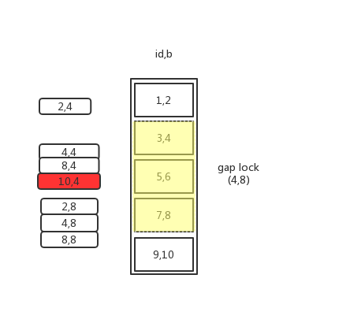

# 说明
mysql的innodb引擎中有七种锁：

1. S锁（Share Lock）共享锁，所有类似于`select * from t where  id = 1 lock in share mode`或者`update t set c = c+1 where id = 1`的形式，行级锁；
2. X锁（Exclusive Lock）排他锁,所有`select * from t where id = 1 for update`的形式。行级锁；
3. IS锁，意向共享锁，在获取S锁之前加的锁，表级锁；
4. IX锁，意向排他锁，在获取X锁之前加的锁，表级锁；
5. Record Lock记录锁，行级锁的真正实现；
6. Gap Lock间隙锁，锁住一个范围；
7. Next-key Lock临键锁，Gap Lock+Record Lock的组合；

笔记记载的内容是在版本5.7.24和8.0.13验证通过，以后其他版本的MySql的加锁策略可能会变化。“临键锁”称呼来源于“架构之路”公众号。
<!--more-->
# 加锁策略
加锁锁住的是什么？
**索引**

> 注意：MySql只有在RR的隔离级别下才有gap lock和next-key lock。

* 原则1：加锁的基本单位是Next-key Lock（左开右闭区间）；
* 原则2：查找到的对象才会加锁；
* 优化1：索引上的**等值查询**，给唯一索引加锁的时候，会退化为行锁；
* 优化2：索引上的**等值查询**，向右遍历最后一个值不满足等值条件时，next-key lock会退化为间隙锁。
* 一个不合理的地方：唯一索引上的**范围查询**会访问到不满足条件的第一个值为止。

# 案例分析
建表语句：

```sql
CREATE TABLE `t` (
  `id` int(11) NOT NULL,
  `c` int(11) DEFAULT NULL,
  `d` int(11) DEFAULT NULL,
  PRIMARY KEY (`id`),
  KEY `c` (`c`)
) ENGINE=InnoDB;

insert into t values(0,0,0),(5,5,5),
(10,10,10),(15,15,15),(20,20,20),(25,25,25);
```
|id|c|d
|---|---|
|0|0|0|
|5|5|5|
|10|10|10|
|15|15|15|
|20|20|20|
|25|25|25|

## 案例一：唯一索引等值查询
```sql
--session A
begin;
update t set d = d + 1 where id = 7;

--session B
insert into t values (8,8,8);

--session C
insert t set d =  d + 1 where id = 10;
```
上面开启了三个会话分别执行了三个动作。

分析：

1. 原则1：加锁区间为：(5,10]；
2. 原则2：id=7的不存在，所以这一行没有锁；
3. 优化1：id=7的行没有锁，不满足优化1；
4. 优化2：id=7，与(5,10]的最后一个条件不相等，退化为gap lock。

综上：所以session A加了gap lock(5,10)，session B会阻塞，C会成功。

## 案例二：非唯一索引等值查询
```sql
--session A
begin;
select id from t where c = 5 lock in share mode;

--session B
update t set d = d + 1 where id = 5;

--session C
insert into t values (7,7,7);
```
分析：

1. 原则1：索引C加了next-key lock(0,5];
2. 原则2:c=5存在，所以索引c=5加锁；
3. 优化1：由于索引覆盖（不访问id索引就可以拿到id的值），虽然C=5索引加锁，但是id=5的索引实际并没有加锁，不满足优化1；
4. 优化2：非唯一索引需要向右继续查找，直到10，所以加上next-key lock(5,10],由于10不满足c=5的条件，所以next-key lock退化为gap lock(5,10)。

所以session B的操作会成功，C会失败。

如果想避开索引优化，可以使用`select id from t where c = 5 for update`，在加锁时会直接锁住主键索引，或者查询一些其他字段。

## 案例三：唯一索引范围查询
```sql
--session A
begin;
select * from t where id>=10 and id<11 for update;

--session B
insert into t values (8,8,8);
insert into t values (13,13,13);

--session C
update t set d = d + 1 where id = 15;
```
分析：

1. 原则1：next-key lock(5,10]和(10,15];
2. 原则2：查找过程中找到了id为10这一行，加了行锁；
3. 优化1：由于给唯一索引加锁，所以next-key lock(5,10]退化为id=10的行锁;
4. 优化2：不满足等值查询的条件；

所以上面操作的结果是session B的第一个插入操作会成功，第二个插入操作会阻塞；

session C的操作会阻塞。

## 案例四：非唯一索引范围查询
```sql
--session a
begin;
select * from t where c >= 10 and c < 11 for update;

--session b
insert into t values (8,8,8);

--session c
update t set d = d + 1 where c = 15;
```
分析：

1. 原则1：next-key lock(5,10]和(10,15]；
2. 原则2：由于查找到10，所以对10加锁；
3. 优化1：由于不是唯一索引，因此(5,10]不会退化；
4. 优化2：由于不是等值查询，所以(10,15]不会退化；

所以上面的操作是session b阻塞，session c也阻塞。

## 案例五：唯一索引范围锁bug
对应上面加锁策略中的不合理之处。

```sql
--session a
begin;
select * from t where id > 10 and id <= 15 for update;

--session b
update t set d = d + 1 where id = 20;

--session c
insert into t values (16,16,16);
```
分析：

1. 原则1：范围查询next-key lock(10,15];
2. 原则2：搜索到id=15这一行，所以这一行数据要加锁；
3. 优化1：id=15满足等主键索引值查询，所以next-key lock(10,15]退化为行锁；
4. 优化2：满足等值查询，所以不会退化为gap lock；
5. 由于id是唯一索引，所以理论来说没必要再往后搜索，但是实际上还有一个next-key lock(15,20];

所以session b会锁住，session c也会锁住。

## 案例六：非唯一索引存在”相等值“
首先插入一条数据：

```sql
mysql> insert into t values(30,10,30);
```
数据库测试有两条c=10的数据了。即：

|id|c|d
|---|---|
|0|0|0|
|5|5|5|
|10|10|10|
|15|15|15|
|20|20|20|
|25|25|25|
|30|10|30|

此时索引C的状态是：
{5-5}-{10-10}-{10-30}-{15,15}-......

执行SQL如下：

```sql
--session a
begin;
-- delete的加锁规则和for update是一样的
delete from t where c = 10;

--session b
insert into t values (12,12,12)

--session c
udpate t set d = d + 1 where c = 15;
```
分析：

1. next-key lock(5,10];
2. c=10这一行加锁；
3. 非唯一索引，不满足退化条件；
4. 满足条件，向右查询第一个不等的值即c=15，加上next-key lock(10,15]，由于15!=10，所以退化为gap lock(10,15);

所以上述操作是session b阻塞，c成功。

## 案例七：limit加锁
```sql
--session a
begin;
delete from t where c = 10 limit 2;

--session b
insert into t values(12,12,12);
```
分析：

同案例六，但是在优化2的时候，由于limit 2的存在，所以在遍历到(30,10,30)这一行的时候就停止遍历了，所以session b的结果是成功。

## 案例八：死锁
```sql
--session a
begin;
select id from t where c = 10 lock in share mode;

--session b
update t set d = d + 1 where c = 10;

--session a
insert into t values(8,8,8);

--session b
ERROR 1213(40001);
Deadlock found and tring  to get lock ; try restarting transaction;
```
分析：
session a:

1. next-key lock(5,10];
2. c = 10加锁；
3. 不满足优化1；
4. 满足优化2，加上next-key lock(10,15]并退化为gap lock(10,15)。

session b:

1. 获取gap lock(5,10)成功，再获取c = 10的record lock时进入等待；

session a:
插入c = 8的行被死锁，a b进入互相等待。

这个案例说明：**next-key lock是由gap lock和record lock组成的，而且是分两部分获取的。**

## 案例九：排序对锁的影响
```sql
--session a
begin;
select * from t where c >= 15 and c <= 20 order by c desc lock in share mode;

--session b
insert into values (6,6,6);
```
分析：

由于是order by c desc，所以遍历时第一个是c=20以及最右边的行:

1. next-key(15,20](20,25]，其中(20,25]会退化为(20,25)gap lock；
2. c=15,c=20，c=25加锁；
3. 由于不是唯一索引，所以不满足优化1；
4. 在索引c上向左遍历，知道c=10才会停止，所以next-key lock还包括(5,10]。

## 案例十：多索引等值查询
首先创建表：
```sql
CREATE TABLE z (
  id INT PRIMARY KEY AUTO_INCREMENT,
  b  INT,
  KEY b(b)
)
  ENGINE = InnoDB
  DEFAULT CHARSET = utf8;

INSERT INTO z (id, b)
VALUES (1, 2),
  (3, 4),
  (5, 6),
  (7, 8),
  (9, 10);
```

```sql
----session a
BEGIN;
SELECT *
FROM z
WHERE b = 6 FOR UPDATE;

--session b
INSERT INTO z VALUES (2, 4);
INSERT INTO z VALUES (2, 8);
INSERT INTO z VALUES (4, 4);
INSERT INTO z VALUES (4, 8);
INSERT INTO z VALUES (8, 4);
INSERT INTO z VALUES (8, 8);
INSERT INTO z VALUES (0, 4);
INSERT INTO z VALUES (-1, 4);
```
分析：

1. next-key lock(4,6];
2. b=6这一行加锁；
3. 不满足；
4. 满足，加gap lock(6,8);
5. 
需要牢记的是：这个锁是加在b索引上的，而索引都是有序的，所以我们很轻易得到下图：



所以session b的结果是：

```sql
INSERT INTO z VALUES (2, 4);--success
INSERT INTO z VALUES (2, 8);--blocked
INSERT INTO z VALUES (4, 4);--blocked
INSERT INTO z VALUES (4, 8);--blocked
INSERT INTO z VALUES (8, 4);--blocked
INSERT INTO z VALUES (8, 8);--success
INSERT INTO z VALUES (0, 4);--自增主键如果为0会自动替换为表里最大id的下一位,所以这里实际是(10,4)，blocked
INSERT INTO z VALUES (-1, 4);--success
```
# 参考
架构师之路：

[https://mp.weixin.qq.com/s/y_f2qrZvZe_F4_HPnwVjOw](https://mp.weixin.qq.com/s/y_f2qrZvZe_F4_HPnwVjOw)

案例十详解参见其他博客：

[https://helloworlde.github.io/blog/blog/MySQL/MySQL-%E4%B8%AD%E5%85%B3%E4%BA%8Egap-lock-next-key-lock-%E7%9A%84%E4%B8%80%E4%B8%AA%E9%97%AE%E9%A2%98.html](https://helloworlde.github.io/blog/blog/MySQL/MySQL-%E4%B8%AD%E5%85%B3%E4%BA%8Egap-lock-next-key-lock-%E7%9A%84%E4%B8%80%E4%B8%AA%E9%97%AE%E9%A2%98.html)