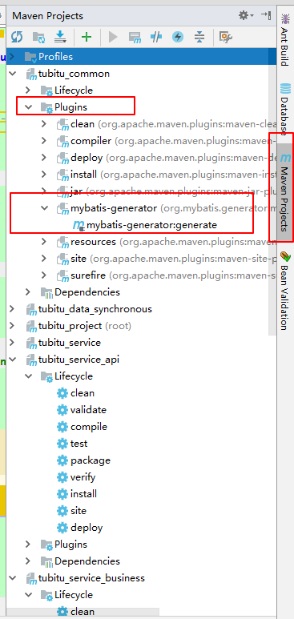
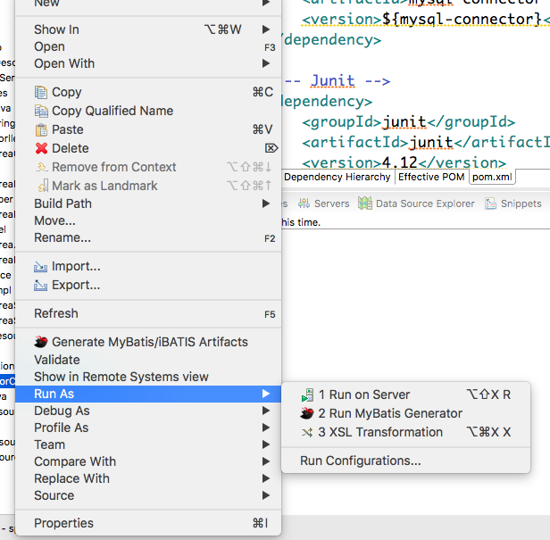

# 描述
 MBG是mybatis官方提供的代码生成工具，官网：[http://www.mybatis.org/generator/index.html](http://www.mybatis.org/generator/index.html)。这篇文章主要记录了自己使用MBG的过程，同时还会使用通用mapper-tk.mapper来简化mybatis的dao层接口的初始化过程，提高工作中的开发效率。
 <!--more-->
 每使用一个产品或者工具，我认为读一读官方文档去了解它设计出来的目的，以及核心思想或者简介都是一个学习的过程。
> MyBatis Generator (MBG) is a code generator for MyBatis MyBatis and iBATIS. It will generate code for all versions of MyBatis, and versions of iBATIS after version 2.2.0. It will introspect a database table (or many tables) and will generate artifacts that can be used to access the table(s). This lessens the initial nuisance of setting up objects and configuration files to interact with database tables. MBG seeks to make a major impact on the large percentage of database operations that are simple CRUD (Create, Retrieve, Update, Delete). You will still need to hand code SQL and objects for join queries, or stored procedures.
 
翻译过来大概的意思就是：MBG是一个Mybatis和iBatis的代码生成工具。它能够为几乎所有版本的Mybatis或者2.2.0版本以后的iBatis生成代码，它将读取（introspect内置的意思，理解为读取不知道可对）一个数据库表（或者很多的表）并且将会创建一个可以读取这些表的实体。这样就可以减轻初始化时令人厌烦的设置对象和与数据库表交互的的配置文件。MBG致力于对简单的CRUD数据库操作产生重大影响。但是你依然需要对一些join查询和存储过程手动编写sql语句。

# 使用
我们项目中常使用的有三种方式，分别是：maven集成（兼容性和通用性最好，推荐），与IDE集成，命令行。
## maven集成
首先引入maven plugin：

```xml
<plugin>
                <groupId>org.mybatis.generator</groupId>
                <artifactId>mybatis-generator-maven-plugin</artifactId>
                <version>1.3.2</version>
                <dependencies>
                    <dependency>
                        <groupId>mysql</groupId>
                        <artifactId>mysql-connector-java</artifactId>
                        <version>5.1.38</version>
                    </dependency>
                </dependencies>
                <configuration>
                    <!--配置文件的路径-->
                    <configurationFile>${basedir}/src/main/resources/MBG/GeneratorConfig.xml</configurationFile>
                    <overwrite>true</overwrite>
                </configuration>
            </plugin>
```
配置文件GeneratorConfig.xml：

```xml
<?xml version="1.0" encoding="UTF-8"?>
<!DOCTYPE generatorConfiguration
        PUBLIC "-//mybatis.org//DTD MyBatis Generator Configuration 1.0//EN"
        "http://mybatis.org/dtd/mybatis-generator-config_1_0.dtd">
<generatorConfiguration>
    <context id="test" targetRuntime="MyBatis3">
        <property name="javaFileEncoding" value="UTF-8"/>
        <plugin type="org.mybatis.generator.plugins.EqualsHashCodePlugin"></plugin>
        <plugin type="org.mybatis.generator.plugins.SerializablePlugin"></plugin>
        <plugin type="org.mybatis.generator.plugins.ToStringPlugin"></plugin>
        <commentGenerator>
            <!-- 这个元素用来去除指定生成的注释中是否包含生成的日期 false:表示保护 -->
            <!-- 如果生成日期，会造成即使修改一个字段，整个实体类所有属性都会发生变化，不利于版本控制，所以设置为true -->
            <property name="suppressDate" value="true" />
            <!-- 是否去除自动生成的注释 true：是 ： false:否 -->
            <property name="suppressAllComments" value="true" />
        </commentGenerator>
        <!--数据库链接URL，用户名、密码 -->
        <jdbcConnection driverClass="com.mysql.jdbc.Driver"
                        connectionURL="jdbc:mysql://localhost:3306/tubitu?useSSL=false" userId="" password="^88*">
        </jdbcConnection>
        <javaTypeResolver>
            <!-- This property is used to specify whether MyBatis Generator should
                force the use of java.math.BigDecimal for DECIMAL and NUMERIC fields, -->
            <property name="forceBigDecimals" value="false" />
        </javaTypeResolver>
        <!-- 生成模型的包名和项目中路径-->
        <javaModelGenerator targetPackage="com.tubitu.model"
                            targetProject="src\main\java">
            <property name="enableSubPackages" value="true" />
            <property name="trimStrings" value="true" />
        </javaModelGenerator>
        <!-- 生成映射文件的目录名和项目中路径 -->
        <sqlMapGenerator targetPackage="mapper"
                         targetProject="src\main\resources\">
            <property name="enableSubPackages" value="true" />
        </sqlMapGenerator>
        <!-- 生成DAO interface的包名和项目中路径 -->
        <javaClientGenerator type="XMLMAPPER"
                             targetPackage="com.tubitu.mapper"   targetProject="src\main\java">
            <property name="enableSubPackages" value="true" />
        </javaClientGenerator>

        <!-- 要生成哪些表 -->
        <table tableName="test" domainObjectName="testttt"
               enableCountByExample="false" enableUpdateByExample="false"
               enableDeleteByExample="false" enableSelectByExample="false"
               selectByExampleQueryId="false"></table>
    </context>
</generatorConfiguration>
```
使用方法：
IDEA：点开IDEA的Maven Projects的panel，展开plugins，运行MBG插件即可



Eclipse：
右击项目 --> run as --> maven build--> Goals中写入命令 "mybatis-generator:generate"--> apply --> run 
## IDE集成
Eclipse：在Eclipse marketplace里搜索"MyBatis Generator"，或者 `https://dl.bintray.com/mybatis/mybatis-generator`直接下载二进制安装压缩包，在Eclipse里安装即可，配置文件与上面的几乎一致，不过需要注意的是要自己指定数据库驱动包的位置，即在配置文件<generatorConfiguration>标签内第一行加入如下配置：

```xml
<classPathEntry
		location="D:\Applications\ProgrammingTools\maven\MavenRepository\mysql\mysql-connector-java\5.1.36\mysql-connector-java-5.1.36.jar" />
```
然后在配置上右击，运行即可：


IDEA：目前官方并没有IDEA插件，但是有第三方作者上传了插件，在plugin repository搜索即可。

## 命令行
创建一个文件夹，将需要的mysql驱动、oracle驱动以及MBG的jar包放入，并在当前目录下新建配置文件，文件如第二种方式，需要指定数据库驱动位置，然后打开命令行，输入以下：

```java
java -jar mybatis-generator-core-x.x.x.jar -configfile generatorConfig.xml -overwrite 
```

overwrite表示重名文件会覆盖，如果觉得这样麻烦，可以新建两个脚本，windows下的命名xx.bat，Linux/Mac下命名为xx.sh，把上面命令复制进去，使用的时候双击即可。
> 注意：配置文件generatorConfig.xml里的targetProject里的第一级目录如果不存在，是会报错的，所以需要提前创建目录。

# 扩展
如果觉得这么做还是麻烦，还是很low，还有更便捷的方式，那就是使用mybatis的官方推荐通用mapper，作者是刘增辉大神（也是pagehelper作者）。


用法还是比较简单的，引入依赖：

```xml
<!-- 通用Mapper -->
<dependency>
    <groupId>tk.mybatis</groupId>
    <artifactId>mapper</artifactId>
    <version>3.3.9</version>
</dependency> 
```
然后配置Mybatis的mapper，xml文件配置方式：

```xml
<!-- 通用 Mapper -->
<bean class="tk.mybatis.spring.mapper.MapperScannerConfigurer">
    <property name="basePackage" value="cn.com.test.dao"/>
    <property name="properties">
        <value>
            mappers=tk.mybatis.mapper.common.Mapper
        </value>
    </property>
</bean> 
```
而对于Spring Boot的自动配置，可以引入如下依赖(本文spring boot版本号为2.1.0.RELEASE)：

```xml
<dependency>
	<groupId>tk.mybatis</groupId>
	<artifactId>mapper-spring-boot-starter</artifactId>
	<version>2.0.2</version>
</dependency>
```
在yml配置文件加入通用配置和数据库类型：

```yaml
mapper:
  mappers: tk.mybatis.mapper.common.Mapper
  identity: mysql
```
在启动类加上注解，扫描数据dao层接口:

```java
package com.blog;

import org.springframework.boot.SpringApplication;
import org.springframework.boot.autoconfigure.SpringBootApplication;
import tk.mybatis.spring.annotation.MapperScan;

@SpringBootApplication
@MapperScan("com.blog.mapper")
public class MyBlogApplication {


	public static void main(String[] args) {
		SpringApplication.run(MyBlogApplication.class, args);
	}
}
```
需要注意的是，这里的MapperScan()使用的是tk.mapper的注解。

实体类加上@Table注解，并写上name表示映射的表名，如果不写，表名默认为类名转下划线，如类名：UserInfo 对应表名user_info；


成员变量加上@Column注解，不写name属性默认也是变量名驼峰转下划线的形式；


如果实体类的变量多于数据库表里的字段，可以加上@Transient表示不作为表字段使用，一般推荐实体类与数据库对应，多余的字段使用dto继承扩展。

建议一定是要有一个@Id注解表示主键，可以有多个表示联合主键，如果是Mysql的自增字段，加上@GeneratedValue(generator="JDBC")即可。例如：

```java
@Table(name = "pv_log")
public class PvLog implements Serializable {

    @Id
    @GeneratedValue(generator = "JDBC")
    private Integer id;

    @Column
    private String ip;

    @Column
    private Integer visitTime;

    @Column
    private String referer;

    @Column
    private Date updateTime;

    @Column
    private String type;

    //省略get/set方法
}
```

而mybatis接口只需继承Mapper<T>接口并指定泛型即可，泛型必须明确指定，这样继承的mapper就有了通用Mapper的所有方法。例如：

```java
public interface PvLogMapper extends Mapper<PvLog> {


    public List<Integer> getIndexCount();

}
```

通用mapper包含的方法说明：


	Select
	方法：List<T> select(T record);
	说明：根据实体中的属性值进行查询，查询条件使用等号
	方法：T selectByPrimaryKey(Object key);
	说明：根据主键字段进行查询，方法参数必须包含完整的主键属性，查询条件使用等号
	方法：List<T> selectAll();
	说明：查询全部结果，select(null)方法能达到同样的效果
	方法：T selectOne(T record);
	说明：根据实体中的属性进行查询，只能有一个返回值，有多个结果是抛出异常，查询条件使用等号
	方法：int selectCount(T record);
	说明：根据实体中的属性查询总数，查询条件使用等号
	Insert
	方法：int insert(T record);
	说明：保存一个实体，null的属性也会保存，不会使用数据库默认值
	方法：int insertSelective(T record);
	说明：保存一个实体，null的属性不会保存，会使用数据库默认值
	Update
	方法：int updateByPrimaryKey(T record);
	说明：根据主键更新实体全部字段，null值会被更新
	方法：int updateByPrimaryKeySelective(T record);
	说明：根据主键更新属性不为null的值
	Delete
	方法：int delete(T record);
	说明：根据实体属性作为条件进行删除，查询条件使用等号
	方法：int deleteByPrimaryKey(Object key);
	说明：根据主键字段进行删除，方法参数必须包含完整的主键属性
	Example方法
	方法：List<T> selectByExample(Object example);
	说明：根据Example条件进行查询
	重点：这个查询支持通过Example类指定查询列，通过selectProperties方法指定查询列
	方法：int selectCountByExample(Object example);
	说明：根据Example条件进行查询总数
	方法：int updateByExample(@Param("record") T record, @Param("example") Object example);
	说明：根据Example条件更新实体record包含的全部属性，null值会被更新
	方法：int updateByExampleSelective(@Param("record") T record, @Param("example") Object example);
	说明：根据Example条件更新实体record包含的不是null的属性值
	方法：int deleteByExample(Object example);
	说明：根据Example条件删除数据