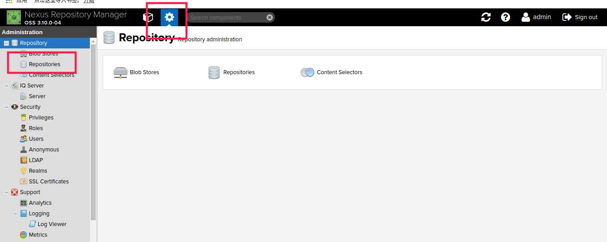
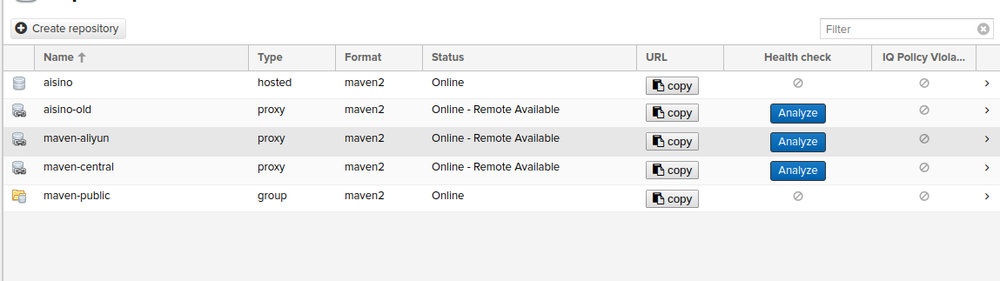
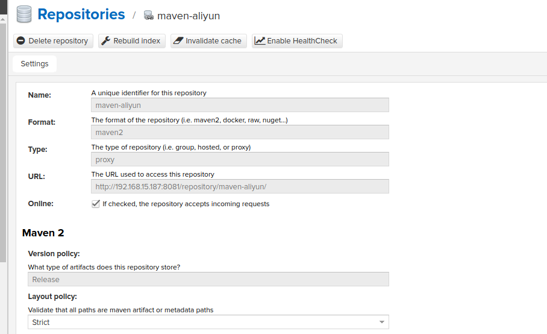
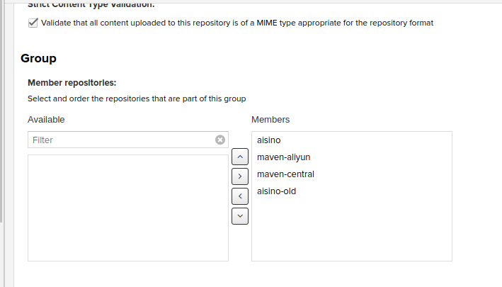

# 简述
Nexus['neksəs]是一个依赖管理的仓库，用于提供Maven和Gradle等构建工具的依赖源，它可以整合本地和远程的所有仓库并按照指定顺序寻找依赖，这里随手记载一下搭建过程。

<!--more-->

# 下载安装
官网：[https://www.sonatype.com/download-oss-sonatype](https://www.sonatype.com/download-oss-sonatype)。
根据系统版本下载，本文使用的版本是3.10.0，Linux可以下载OS-X版本或者Unix版本，差别不大。
上传到服务器，执行以下命令，（假设现在具有root权限，解压到的目标目录可以随意选择）。

```bash
mkdir /home/nexus
tar -xzvf nexus-3.10.0-04-unix.tar.gz -C /home/nexus
useradd nexus
chown -R nexus /home/nexus
cd /home/nexus
./nexus-3.10-04/bin/nexus start
```
命令解释：nexus不推荐使用root执行启动脚本，所以这里我们自己新增了一个用户，并且修改了nexus目录的所属用户为nexus，当然，也可以不用修改所属用户，只需要给nexus用户增加一个写入权限即可：`chmod -R +w /home/nexus`，或者写入777权限`chmod -R 777 /home/nexus`。

启动可能需要5-10s，启动完成以后可以通过IP:8081端口进行访问，

# 仓库配置
登录进nexus的管理页面，用户名/密码默认为admin/admin123，然后依次点击下方图片中标出来的部分：



可以看到这里的仓库有三种类型：

1. hosted：这种类型的仓库表示的是本地服务器的仓库，也是公司自己开发的Jar包上传的地方；
2. proxy：该类型表示远程仓库代理，即它本身是用来缓存远程仓库的；
3. group：该类型表示是一组仓库，它可以包含hosted、proxy、group三种类型的仓库。

这里我新建了三个仓库aisino，aisino-old，maven-aliyun，并且删除了原来自带的一些很多没用的仓库，只留下了maven-public(对外提供仓库)，maven-central(中央仓库)。

1. aisino：hosted类型，用于上传公司开发的jar包的位置；
2. aisino-old：proxy类型，用于代理原公司老私服的位置，老私服里有以前的很多元原来开发过的jar包；
3. maven-aliyun：proxy类型，用于代理国内的阿里云仓库位置，下载速度更快。



hosted类型的仓库新建即可，无特殊配置。

这里提一下proxy类型的仓库，例如我配置的maven-aliyun仓库如下：



在下方的Proxy配置项的remote storage一栏里填上阿里云的仓库位置：[http://maven.aliyun.com/nexus/content/groups/public](http://maven.aliyun.com/nexus/content/groups/public)

其他的保持默认即可。

然后进入maven-public的配置，以后公司的私服都使用的该仓库，group里加入刚刚新建的几个仓库，我们的项目就可以使用自己私服的地址了：



在项目或者系统的maven的安装或解压路径下的conf/settings.xml里，添加如下几行(url为maven-public里的URL):

```xml
<mirrors>
    <mirror>
        <id>nexus-aisino</id>
        <mirrorOf>*</mirrorOf>
        <name>Nexus</name>
        <url>http://192.168.15.187:8081/repository/maven-public/</url>
    </mirror>
</mirrors>
```

将来需要引入jar包的时候就会按照我们定义的顺序依次去仓库里寻找jar包并缓存到本地。

> 要注意的是，health check这个选项可以关闭，在3.10的版本下开启health check进行analyze出现了insufficient trend data的问题，这个并不是报错，依然可以正常下载jar包，所以搭建好可以直接尝试一下新建一个maven项目。


