# 描述
Nginx官网：[http://nginx.org/en/](http://nginx.org/en/)

Nginx是一个高性能的代理服务器，其使用c语言编写，依赖pcre，zlib和openSSL第三方库，因其性能高，占用内存低，bug少并且稳定性高而被很多大公司亲睐，作者是一名俄罗斯人。
本笔记会从安装到配置，最后会介绍一些nginx的实践应用。
<!--more-->

# 安装
首先上传nginx的tar.gz包至服务器，将nginx解压至/usr/local目录下，local目录常用来放置用户安装的软件。

```bash
tar -xzvf nginx-1.12.2.tar.gz -C /usr/local
cd /usr/local
ls
cd nginx-1.14.0
./configure --with-debug
##./configure [--prefix=/usr/local/nginx] --with-debug其中中括号里的内容表示安装目录，默认就是/usr/local/nginx
```
执行配置脚本，并打开调试模式

如果报错如下：


表示需要gcc-c++编译器，所以我们需要联网安装。

```bash
##ubuntu
apt-get install build-essential
apt-get install libtool
##centos
yum install gcc-c++
```
nginx依赖于PCRE和zlib的库，所以看到类似于requires the PCRE library或者zlib library的报错，在centos下直接安装即可：

```bash
yum install pcre-devel
yum install zlib-devel
```
出现以下提示即为成功：
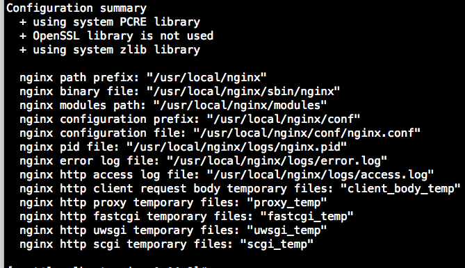
此时出现Makefile文件，输入：

```bash
make
make install
或者make && make install
```
此时出现如下提示即为成功：
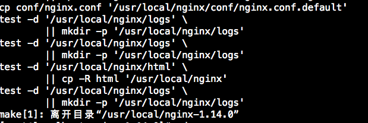
此时在configure步骤指定的目录中(本文为/usr/local/)，即出现了nginx目录。带版本号的是解压后的源码，nginx目录是编译好的软件。

# 卸载
首先在/usr/local/下删除nginx目录：
`rm -rf nginx`
然后进入源码目录，输入：
`make clean `

# 启停

```bash
##启动
./nginx
##停止
./nginx -s stop
##重启
./nginx -s reload
##测试
./nginx -t
```

没有结果即是最好的结果.........实际上启动后nginx/logs目录里会出现nginx.pid的文件，记录了nginx的进程号，停止以后就没了。
 或者启动以后访问nginx所在域名以及监听端口：
 
 
#  配置
文件位于nginx/conf目录下
`vim nginx.conf`
启用调试日志：

主要分两大块模块，events模块和http模块，常用到的就是http模块下的server模块，server模块里可以指定nginx监听的IP地址或者域名，端口等等，端口默认80.
location匹配的是uri，其匹配规则如下(来源于网络)：
 
# 语法


location  [=|~|~\*|^~] /uri/  {...}


规则:


= ： 表示精确的URI匹配(有兴趣的同学可以看一下url和uri的区别)


～： 表示区分大小写的正则匹配


～\*：表示不区分大小写的正则匹配


!~ && !~*：表示区分大小写不匹配的正则和不区分大小写的不匹配的正则


/：通用匹配，任何请求都会匹配到


location匹配目标


location匹配测试只使用请求URI的部分，而不使用参数部分。（原因：参数的写法太多，无法精确匹配）


location匹配顺序


多个location配置的前提下，location的匹配顺序（未验证，嘿嘿，google上搜的）


1. 首先匹配=
1. 其次匹配^~
1. 再其次按照配置文件的顺序进行正则匹配
1. 最后是交给/进行通用匹配
注意：
当有匹配成功时，立刻停止匹配，按照当前匹配规则处理请求
演示实例
nginx 配置文件，自下到上分为三种层次分明的结构：


 |    http block        the protocol level


 |    server block        the server level


 V    location block        the requested URI


Nginx 允许用户定义 Location block ，并指定一个匹配模式（pattern）匹配特定的 URI。除了简单的字符串（比如文件系统路径），还允许使用更为复杂的匹配模式（pattern）。
Location block 的基本语法形式是：
location [=|~|~*|^~|@] pattern { ... }
[=|~|~*|^~|@] 被称作 location modifier ，这会定义 Nginx 如何去匹配其后的 pattern ，以及该 pattern 的最基本的属性（简单字符串或正则表达式）。
关于 location modifier
## 1. =
这会完全匹配指定的 pattern ，且这里的 pattern 被限制成简单的字符串，也就是说这里不能使用正则表达式。


```vim
server {
  server_name jb51.net;
  location = /abcd {
  […]
  }
}
```
匹配情况：


    http://jb51.net/abcd        # 正好完全匹配
    http://jb51.net/ABCD        # 如果运行 Nginx server 
	的系统本身对大小写不敏感，比如 Windows ，那么也匹配
    http://jb51.net/abcd?param1?m2    # 忽略查询串参数（query string arguments），这里就是 /abcd 后面的 ?param1?m2
    http://jb51.net/abcd/    # 不匹配，因为末尾存在反斜杠（trailing slash），Nginx 不认为这种情况是完全匹配
    http://jb51.net/abcde    # 不匹配，因为不是完全匹配


## (None)
可以不写 location modifier ，Nginx 仍然能去匹配 pattern 。这种情况下，匹配那些以指定的 patern 开头的 URI，注意这里的 URI 只能是普通字符串，不能使用正则表达式。

```vim
server {
  server_name website.com;
  location /abcd {
  […]
  }
}
```
匹配情况：

    http://jb51.net/abcd        # 正好完全匹配
    http://jb51.net/ABCD        # 如果运行 Nginx server的系统本身对大小写不敏感，比如 Windows ，那么也匹配
    http://jb51.net/abcd?param1?m2    # 忽略查询串参数（query string arguments），这里就是 /abcd 后面的 ?param1?m2
    http://jb51.net/abcd/    # 末尾存在反斜杠（trailing slash）也属于匹配范围内
    http://jb51.net/abcde    # 仍然匹配，因为 URI 是以 pattern 开头的
 
定义location时需要注意的是proxy_pass里转发的服务器：


请求地址：http://192.168.1.4/proxy/test.html


配置一：


	location  /proxy/ {
	proxy_pass http://127.0.0.1:81/;
	}
会被代理到http://127.0.0.1:81/test.html 这个url


配置二：

	location  /proxy/ {
	proxy_pass http://127.0.0.1:81;
	}
会被代理到http://127.0.0.1:81/proxy/test.html 这个url


注意：该情况只在没有location modifier的情况下才有，对于~或者~*等正则匹配，是不能在proxy_pass里最后配置/的。


## ~
这个 location modifier 对大小写敏感，且 pattern 须是正则表达式

	server {
	  server_name jb51.net;
	  location ~ ^/abcd$ {
	  […]
	  }
	}
匹配情况：


    http://jb51.net/abcd        # 完全匹配
    http://jb51.net/ABCD        # 不匹配，~ 对大小写是敏感的
    http://jb51.net/abcd?param1?m2    # 忽略查询串参数（query string arguments），这里就是 /abcd 后面的 ?param1?m2
    http://jb51.net/abcd/    # 不匹配，因为末尾存在反斜杠（trailing slash），并不匹配正则表达式 ^/abcd$
    http://jb51.net/abcde    # 不匹配正则表达式 ^/abcd$


注意：对于一些对大小写不敏感的系统，比如 Windows ，~ 和 ~* 都是不起作用的，这主要是操作系统的原因。


## ~*
与 ~ 类似，但这个 location modifier 不区分大小写，pattern 须是正则表达式


	server {
	  server_name website.com;
	  location ~* ^/abcd$ {
	  […]
	  }
	}

匹配情况：


    http://jb51.net/abcd        # 完全匹配
    http://jb51.net/ABCD        # 匹配，这就是它不区分大小写的特性
    http://jb51.net/abcd?param1?m2    # 忽略查询串参数（query string arguments），这里就是 /abcd 后面的 ?param1?m2
    http://jb51.net/abcd/    # 不匹配，因为末尾存在反斜杠（trailing slash），并不匹配正则表达式 ^/abcd$
    http://jb51.net/abcde    # 不匹配正则表达式 ^/abcd$
## ^~
匹配情况类似 (None) 的情况，以指定匹配模式开头的 URI 被匹配，不同的是，一旦匹配成功，那么 Nginx 就停止去寻找其他的 Location 块进行匹配了（与 Location 匹配顺序有关）
## @
用于定义一个 Location 块，且该块不能被外部 Client 所访问，只能被 Nginx 内部配置指令所访问，比如 try_files or error_page
## 常见问题
### 504 gate-way timeout

服务端如果使用的是PHP，server块可以调整如下配置：

```vim
fastcgi_connect_timeout 1000;
fastcgi_send_timeout 1000;
fastcgi_read_timeout 1000;
fastcgi_buffer_size 64k;
fastcgi_buffers 8 128k;
fastcgi_busy_buffers_size 128k;
fastcgi_temp_file_write_size 128k;
fastcgi_intercept_errors on;
```
如果使用的tomcat,

```vim
proxy_connect_timeout 1000;
proxy_send_timeout 1000;
proxy_read_timeout 1000;
proxy_buffer_size 64k;
proxy_buffers 8 128k;
proxy_busy_buffers_size 128k;
proxy_temp_file_write_size 128k;
```

### 413 Request Entity Too Large

请求体过大,server块调整以下配置：
`client_max_body_size 50m;
`
 
# 实践
## 静态资源
将请求m.tubitu.cn/mtpic/1.jpg的图片请求转发到nginx/mtpic图片目录下。
```vim
server{
        listen 80;
        server_name  m.tubtu.cn;
        client_max_body_size 10m;

         location /  {
          proxy_set_header Host $host;
        proxy_set_header X-Real-IP $remote_addr;
        proxy_set_header X-Real-Port $remote_port;
        proxy_set_header X-Forwarded-For $proxy_add_x_forwarded_for;
        proxy_pass http://localhost:8084/;
        }
        
        #第一种配置
        location ~ ^/mtpic/ {
           root /usr/local/nginx;
        }
        
        #第二种配置
        location ~* \.(jpg|png|jpeg){
            root mtpic;
        }

}
```
## 负载均衡+反向代理

```vim

upstream test_server{
        server 192.168.1.63:8082;
        server 192.168.1.64:8082;
    }
    
    server {
        listen       80;
        server_name  localhost;

        #charset koi8-r;

        #access_log  logs/host.access.log  main;
        
        location / {
            root   html;
            index  index.html index.htm;
        }
        
        location ~ ^/test {
            proxy_pass http://test_server;
        }
        
    }
```
请求会分配给test_server里的两个服务。
也可以指定ip_hash的算法，即同一ip地址算出来的hash值一致，发出来的请求都会交由同一台服务器执行，这也可以作为session一致性的解决方案之一。
还可以在upstream给每一台服务器分配权重。如：server 192.168.1.63:8082 weight=10。
在更新被代理的后端服务器时，还可以将某几台服务器临时标记为宕机，nginx就不会将请求转发到该服务器，方便进行灰度发布，如：server 192.168.1.63:8082 down。

## HTTPS服务配置
需要在./configure这一步开启ssl_module:
`./configure --with-http_ssl_module`

```
server {
        listen 443;
        server_name test.com;
        ssl on;
        #以下两行为证书所在位置 本文位于/usr/local/nginx/conf/cert 下
        ssl_certificate   cert/123456.pem;
        ssl_certificate_key  cert/123456.key;
        ssl_session_timeout 5m;
        ssl_ciphers ECDHE-RSA-AES128-GCM-SHA256:ECDHE:ECDH:AES:HIGH:!NULL:!aNULL:!MD5:!ADH:!RC4;
        ssl_protocols TLSv1 TLSv1.1 TLSv1.2;
        ssl_prefer_server_ciphers on;
        

        location ~ ^/test {
        proxy_set_header Host $host;
        proxy_set_header X-Real-IP $remote_addr;
        proxy_set_header X-Forwarded-For $proxy_add_x_forwarded_for;
        proxy_set_header X-Forwarded-Proto  $scheme;
        proxy_pass http://localhost:9000;
        }
        
    }
```

还可以重写url，使得客户端发过来的HTTP请求全部变为HTTPS请求：
在需要重写的server模块加上：`rewrite ^(.*)$ https://$host$1 permanent;
`

## Nginx HA(Hign-Availability) 主从

### 原理
两台nginx共用一个virtual IP，当其中一台服务器的nginx宕机后，keepalived会通过用户在配置文件里指定的检测脚本检测到nginx挂掉以后，同时停止keepalived，并发出多播消息，另一台服务器中运行的keepalived进程收到多播消息以后即会持有virtual IP，保证nginx的高可用。

### keepalived安装
[http://www.keepalived.org/](http://www.keepalived.org/)
下载后上传到服务器，安装步骤和Nginx基本一致，就不细说了，其依赖于openssl。

```bash
tar -xzvf keepalived-2.0.7.tar.gz -C /usr/local/
yum install openssl
yum install openssl-devel
cd /usr/local/keepalived-2.0.7
./configure --prefix=/usr/local/keepalived/
make && make install
```

没有结果就是最好的结果,暂时无需管ipv6的支持性警告。

接下来将keepalived作为系统服务启动：

```bash
#将keepalived可执行文件复制到系统路径下
cp /usr/local/keepalived/sbin/keepalived /usr/sbin/
#创建keepalived配置文件目录并复制配置文件，/etc目录常用于Linux软件配置
mkdir /etc/keepalived
cp /usr/local/keepalived/etc/keepalived/keepalived.conf /etc/keepalived/
#将软件目录下的系统配置文件复制到系统目录下
cp /usr/local/keepalived/etc/sysconfig/keepalived /etc/sysconfig/
#将源码目录下的开机启动脚本复制到系统开机启动脚本目录中
cp /usr/local/keepalived-2.0.7/keepalived/etc/init.d/keepalived /etc/init.d
#启动
systemctl start keepalived
systemctl status keepalived
#停止
systemctl stop keepalived
```
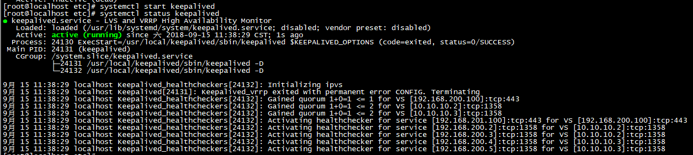
验证通过。ps : systemctl是centos 7后加入的一个系统服务管理指令，速度更快，推荐使用。原来的service不推荐使用。
### 主从配置

虚拟机描述：

```bash
#查看系统版本
cat /etc/centos-release
#查看内核发行号
uname --r
```

配置描述：

	服务器1:192.168.1.63
	服务器2:192.168.1.64
	虚拟IP:192.168.1.100

然后进行配置：

```bash
##备份官方配置文件
cd /etc/keepalived
cp keepalived.conf keepalived.conf.bak 
vim keepalived.conf

```
删除其他所有配置，只需要以下配置：

		! Configuration File for keepalived
		## keepalived会定时执行脚本并对脚本执行的结果进行分析,动态调整vrrp_instance的优先级。
		##如果脚本执行结果为0,并且weight配置的值大于0,则优先级相应的增加。如果脚本执行结果非0,
		##并且weight配置的值小于 0,则优先级相应的减少。其他情况,维持原本配置的优先级,即配置文件中priority对应的值
		global_defs {
		   router_id LVS_DEVEL_01  #标识本节点的名称，通常为hostname
		}
		
		vrrp_script check_nginx{
		   script "/etc/keepalived/check_nginx.sh"
		   interval 2   #每2秒检测一次nginx的运行状态
		   weight -2    #失败一次，将自己的优先级-20
		}
		
		vrrp_instance VI_1 {
		    state MASTER    # 状态，主节点为MASTER，备份节点为BACKUP
		    interface ens33 # 绑定VIP的网络接口，通过ifconfig查看自己的网络接口
		    virtual_router_id 51    # 虚拟路由的ID号,两个节点设置必须一样,可选IP最后一段使用,相同的VRID为一个组,他将决定多播的MAC地址
		   #mcat_src_ip 192.168.1.63    # 本机IP地址
		    priority 100    # 节点优先级，值范围0～254，MASTER要比BACKUP高
		    advert_int 1    # 组播信息发送时间间隔，两个节点必须设置一样，默认为1秒
		     # 设置验证信息，两个节点必须一致
		    authentication {
		        auth_type PASS
		        auth_pass 1111
		    }
		    # 虚拟IP，两个节点设置必须一样。可以设置多个，一行写一个
		    virtual_ipaddress {
		        192.168.1.100
		    }
		    track_script{
		        check_nginx # nginx存活状态检测脚本
		  }
		 } 
	
从节点配置：
	
	! Configuration File for keepalived
	
	global_defs {
	   router_id LVS_DEVEoL_02
	}
	
	vrrp_script check_nginx{
	   script "/etc/keepalived/check_nginx.sh"
	   interval 2
	   weight -2
	}
	
	vrrp_instance VI_1 {
	    state BACKUP
	    interface ens33
	    virtual_router_id 51
	   #mcast_src_ip 192.168.1.64
	    priority 99
	    advert_int 1
	    authentication {
	        auth_type PASS
	        auth_pass 1111
	    }
	    virtual_ipaddress {
	        192.168.1.100
	    }
	    track_script{
	        check_nginx
	    }
	  }

检测脚本check_nginx.sh（主备机都要有该脚本）：

```bash
#!/bin/bash
counter=$(ps -C nginx --no-heading|wc -l)
if [ $counter -eq 0 ]; then
  /usr/local/nginx/sbin/nginx
  sleep 2
  counter=$(ps -C nginx --no-heading|wc -l)
  if [ $counter -eq 0 ];then
  systemctl stop keepalived
 fi
fi
```

需要注意的是：if 后中括号里第一个字符和最后一个字符必须是空格，否则脚本语法错误，编辑完可以使用sh check_nginx.sh运行检测一下。
分别启动两台服务器的nginx和keepalived，访问虚拟IP即可访问到nginx主页。

master机输入命令：
`ip addr #或者ip add`

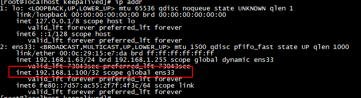

可以看到虚拟ip 已经绑定到 ens33网卡上，此时停止主机keepalived，在备机输入相同指令：
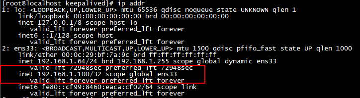
此时virtual IP漂移到了从机，访问虚拟ip，nginx依然正常。
以上配置每次主机启动都会抢占master，可以配置非抢占式，其配置方法是在vrrp_instance VI_1 模块中加入nopreempt参数，并将两台机器都作为从机，如图：
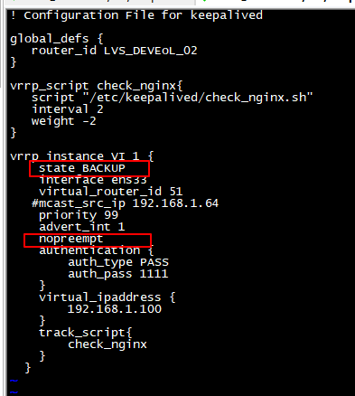
两个keepalived节点都启动后，默认都是BACKUP状态，双方在发送组播信息后，会根据优先级来选举一个MASTER出来。由于两者都配置了nopreempt，所以MASTER从故障中恢复后，不会抢占virtual IP。这样会避免VIP切换可能造成的服务延迟。
### Nginx HA主主
其原理就是两台机器互为master和backup。系统信息与主从部分基本保持一致。对于Virtual IP，由于两台机器互为主备，因此一个Virtual IP 肯定不能满足要求了，角色关系如下：

	服务器1:192.168.1.63
	服务器2:192.168.1.64
	虚拟IP1:192.168.1.100（主-服务器1，备-服务器2）
	虚拟IP2:192.168.1.101（主-服务器2，备-服务器1）

同样还是编辑keepalived.conf文件，输入英文冒号进入末行模式，在末行模式下输入set nu然后按enter，显示行号：
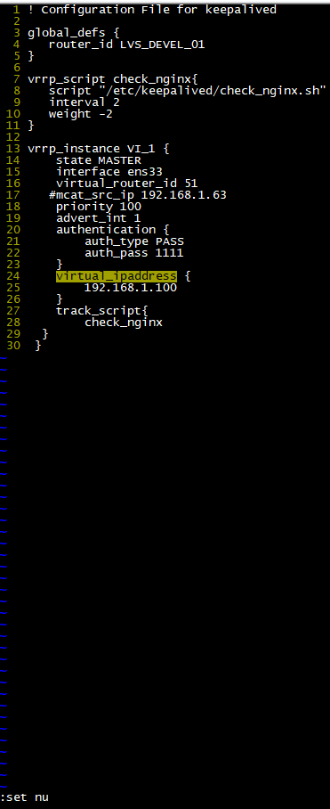

将光标移到第13行，按esc键再次进入命令模式，输入18yy，该命令不会显示出过程只有结果：复制了18行

然后进入末行模式，输入30，按enter跳转到第30行，然后按p，粘贴刚刚复制的18行内容。
末行模式下，跳转到31行，需要修改的地方有六处，vrrp instance名，主备状态，虚拟路由id，优先级，虚拟ip地址等，虚拟ip 101备机配置如下：


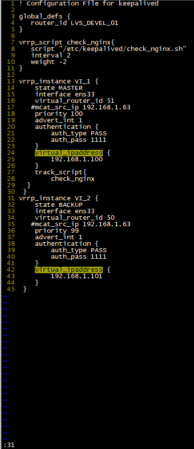

主机配置：


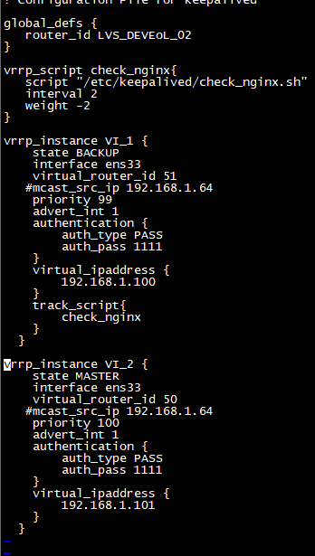


分别启动nginx和keepalived，在两台机器上输入`ip addr`，结果如下：

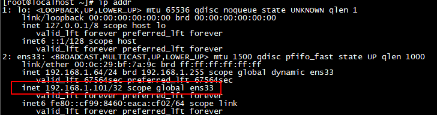

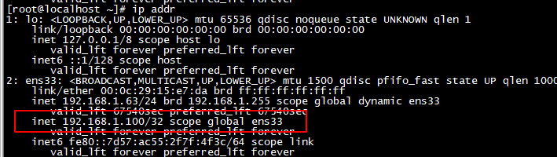

192.168.1.64是虚拟ip 192.168.1.101的master，192.168.1.63是虚拟ip 192.168.1.100的master。关闭64的keepalived，虚拟地址101开始漂移：

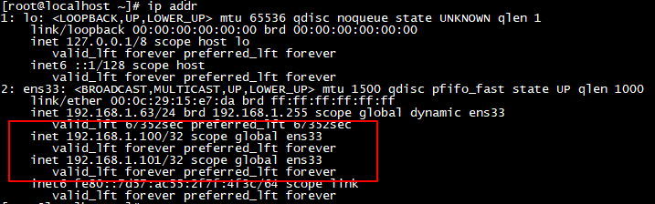

