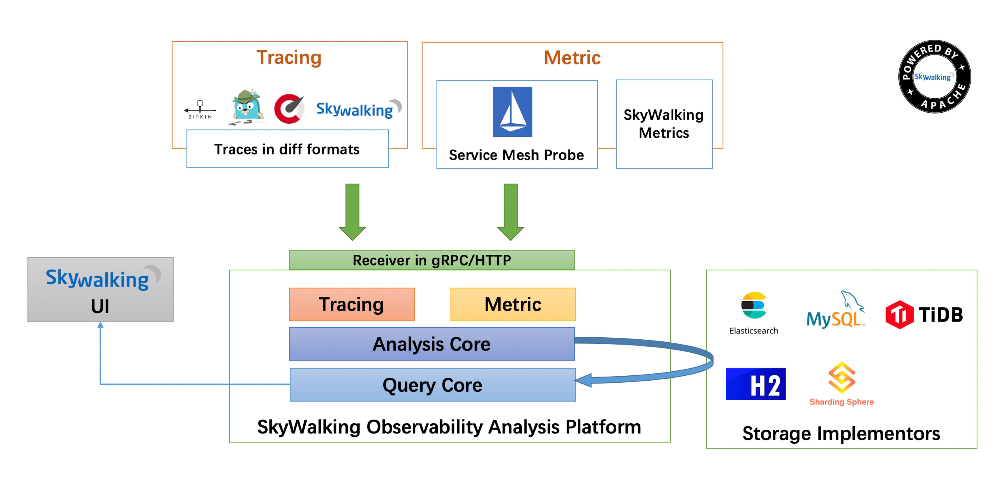
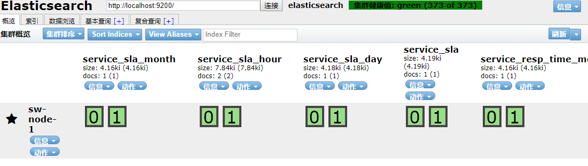
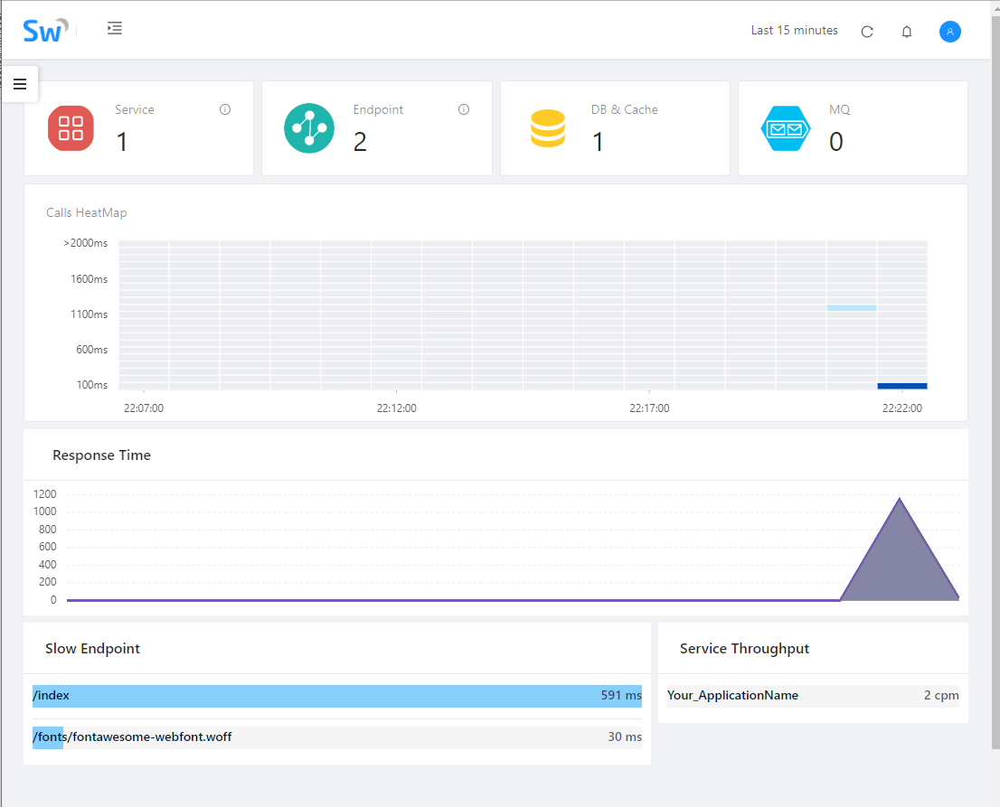
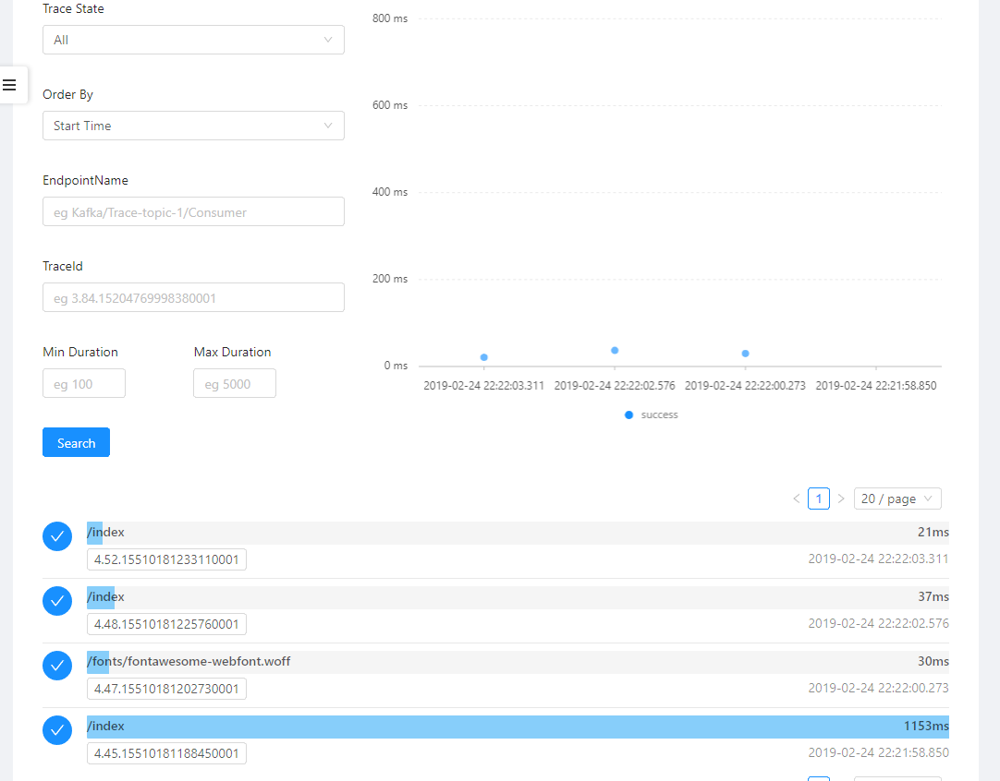

# 简述 #
在应用服务化大行其道的今天，分布式系统的全局监控和链路追踪变得及其重要。分布式系统由于其架构本身的复杂性，人为追踪调试的难度也比较高。Spring Cloud中的Sleuth+Zipkin就是一个链路追踪+系统监控的典型代表，但是本身功能较为简单，相比之下APM(Application Performance Manager)的兼容性和功能都更多一些的，SkyWalking和PinPoint就是其中的两个较为Java程序员所熟悉的。

<!--more-->

SkyWalking的发起人是中国人吴晟，现已进入Apache孵化(incubator)。官网传送门：[http://skywalking.apache.org/zh/](http://skywalking.apache.org/zh/ "http://skywalking.apache.org/zh/")。

# Skywalking介绍 #
SW提供了一个收集、分析、聚合和可视化来自服务和应用数据的观察平台，通过图形化的界面让开发人员认识应用程序的运行情况。
主要特性：


1. 服务(Service)，实例(Instance)和端点(Endpoint)的metrics分析；
2. 根因分析；
3. 服务拓扑图分析；
4. 服务，实例和端点的依赖分析；
5. 慢服务和接口探测；
6. 性能优化；
7. 分布式追踪以及上下文广播(Trace)；
8. 告警(Alarm)；

SW架构图如下：



由图可知，skywalking支持es，mysql, TiDB, H2, ShardingSphere这些存储方式，用户可以根据自己的能力选择适合自己的存储（其中，H2仅限调研阶段使用，禁止使用在生产环境）。同时存储是开放的，用户可以自定义实现，例如使用HBase作为底层存储。skywalking通过探针收集tracing和metrics数据并格式化，然后通过协议（gRPC或者HTTP）发送给skywalking核心部分即OAP观察分析平台。
架构图中间部分就是skywalking的核心，称为skywalking可观测分析平台。并且由图可知，skywalking支持通过gRPC和http两种协议接收数据。且收集的数据主要分为两部分：tracing和metrics。

## 安装Elasticsearch ##
Elasticsearch：[https://www.elastic.co/cn/downloads/past-releases](https://www.elastic.co/cn/downloads/past-releases "https://www.elastic.co/cn/downloads/past-releases")

根据系统平台下载对应的版本，本文下载的是6.6.1版本的es，安装于CentOS 7.2的系统上。

出于安全考虑，es不能用root用户启动，所以需要先新增一个用户：

```bash
#新增一个用户，用于启动es
useradd es
#切换回root用户，解压开下载的压缩文件，新增两个目录交由es存储数据和启动日志
su
mkdir -p /data/es && mkdir -p /logs/es
tar -xzvf elasticsearch-6.6.1.tar.gz -C /usr/local/elasticsearch
#将elasticsearch目录的所属用户变为es用户，以及上一步创建的数据目录和日志目录都交给es用户
chown -R es /usr/local/elasticsearch /data/es /logs/es
#切换回es用户
su es
#启动es，-d表示后台启动
./elasticsearch -d
#使用curl探测一下是否启动成功
curl http://localhost:9200/
```
此处的es配置如下，配置文件为config/elasticsearch.yml:

	cluster.name: es-sw-1
	node.name: es-sw-1
	path.data: /data/es
	path.logs: /logs/es
	bootstrap.memory_lock: false
	bootstrap.system_call_filter: false
	network.host: 127.0.0.2
	http.port: 9200
	http.cors.enabled: true
	http.cors.allow-origin: "*"

可以看到返回结果：

	[root@izm5edc07yhw50o7ku5zh3z ~]# curl http://localhost:9200/
	{
	  "name" : "es-sw-1",
	  "cluster_name" : "elasticsearch",
	  "cluster_uuid" : "bYc9kzvTTfGBx5LgKro6KQ",
	  "version" : {
	    "number" : "6.6.1",
	    "build_flavor" : "default",
	    "build_type" : "tar",
	    "build_hash" : "1fd8f69",
	    "build_date" : "2019-02-13T17:10:04.160291Z",
	    "build_snapshot" : false,
	    "lucene_version" : "7.6.0",
	    "minimum_wire_compatibility_version" : "5.6.0",
	    "minimum_index_compatibility_version" : "5.0.0"
	  },
	  "tagline" : "You Know, for Search"
	}

## 安装elsaticsearch-head ##
es-head是一个小型的es监控平台，通过es的9200端口的rest Api，图形化展示es存储的数据。安装方式如下：

1. git clone https://github.com/mobz/elasticsearch-head.git
2. cd elasticsearch-head
3. npm install
4. npm run start
5. 访问主机的9100端口：http://localhost:9100/

界面如图，输入es的端口url，点击连接：


集群健康值为green表示正常，图中service_sla_month等都是sw连接es自动创建的。

## 安装SkyWalking ##
下载地址：
[http://skywalking.apache.org/zh/downloads/](http://skywalking.apache.org/zh/downloads/ "http://skywalking.apache.org/zh/downloads/")

如果skywalking的默认端口（有4个端口：8080、10800、11800和12800）有被占用，那么需要处理：修改skywalking的配置或者修改占用端口进程的配置。其中，8080在配置文件webapp/webapp.yml中，10800、11800和12800都在配置文件config/application.yml中。

注释掉H2的存储方式，开启elasticsearch的存储方式：

```yaml
storage:
#  h2:
#    driver: ${SW_STORAGE_H2_DRIVER:org.h2.jdbcx.JdbcDataSource}
#    url: ${SW_STORAGE_H2_URL:jdbc:h2:mem:skywalking-oap-db}
#    user: ${SW_STORAGE_H2_USER:sa}
  elasticsearch:
    # nameSpace: ${SW_NAMESPACE:""}
    clusterNodes: ${SW_STORAGE_ES_CLUSTER_NODES:localhost:9200}
    indexShardsNumber: ${SW_STORAGE_ES_INDEX_SHARDS_NUMBER:2}
    indexReplicasNumber: ${SW_STORAGE_ES_INDEX_REPLICAS_NUMBER:0}
```
执行命令bin/startup.sh即可启动sw主程序。

> 说明：skywalking6.x版本运行startup.sh会启动两个服务，强烈建议查看logs目录下的日志文件中是否有error信息。

将skywalking解压文件夹中的agent文件夹拷贝到需要监控的应用所在的服务器，更改agent/config目录下的配置文件，重点修改如下配置，其中localhost是skywalking主程序中配置的地址：

	agent.service_name=${SW_AGENT_NAME:yyfax-fs}
	collector.backend_service=${SW_AGENT_COLLECTOR_BACKEND_SERVICES:localhost:11800}

正常启动java应用时，只需要带上如下参数即可，例如：`java -javaagent:/usr/local/skywalking-agent/skywalking-agent.jar  -jar Myblog.jar`,其中-javaagent的内容就是上面拷贝的sw agent所在的位置。

## 查看结果 ##
访问8080端口，再多次访问我的博客项目的/index接口：



点击左侧导航栏的trace菜单,即可看到index接口的的响应情况：


# 建议 #

- 请保证被监控服务的系统时间和skywalking OAP服务的系统时间是一致的；
- config/agent.config中的agent.service_name请使用英文；
- jvm参数添加的-javaagent:/agent/skywalking-agent.jar请放在-jar前面（即使skywalking6.x放在-jar后面也能正常运行），比如：java -javaagent:/agent/skywalking-agent.jar -jar skywalking-demo.jar。

# 参考 #
阿飞的博客：
https://mp.weixin.qq.com/s/MZ9PsFlOaGYMwioQ9FX_8Q

