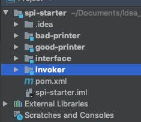
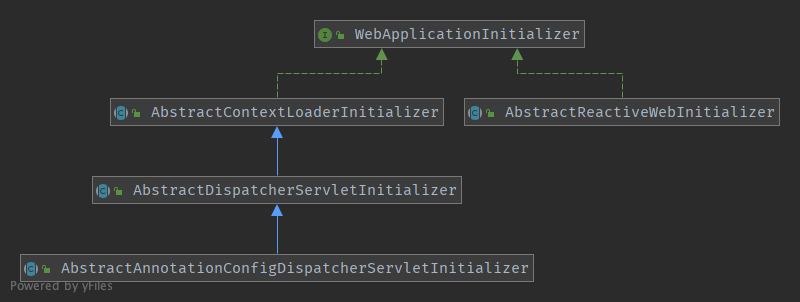
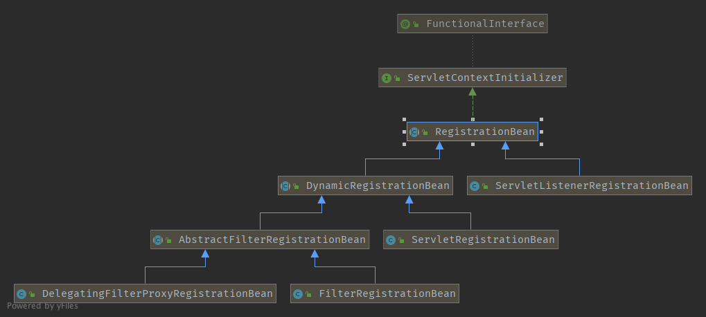
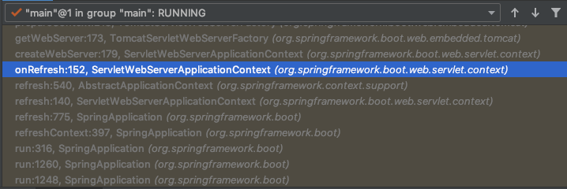
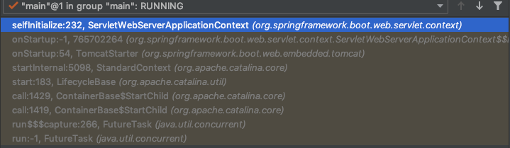
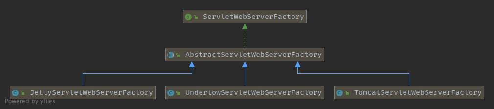
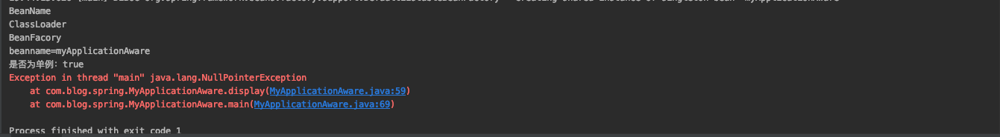

# 简述

这篇笔记主要记录一些比较重要，但是上一篇又没有提到的内容。其中，Spring MVC对Servlet 3.0的实现是重中之重。

<!--more-->

# JAVA SPI

动态替换服务实现的机制，目前Dubbo就是基于SPI提供扩展机制。

## Demo

写一个小demo感受一下：



* bad-printer：某家厂商
* good-printer：另一家厂商
* interface：规范制定者
* invoker：main方法入口

<!--more-->

## interface

一个只包含一个Java类文件的项目，制定了一个接口：

```java
package com.joy.api;

public interface Printer {
    public void print();
}
```

## bad-printer

pom.xml：

```xml
<dependencies>
        <dependency>
            <groupId>com.joy</groupId>
            <artifactId>interface</artifactId>
            <version>1.0-SNAPSHOT</version>
        </dependency>
    </dependencies>
```

实现interface里的接口：

```java
public class BadPrinter implements Printer {
    @Override
    public void print() {
        System.out.println("I am a bad man");
    }
}
```

同时，在`resources/`下创建`META-INF/services`文件夹，将interface里接口的完整包名+类名的路径作为文件名`com.joy.api.Printer`，文件内容是实现类完整包名+类名：

```
com.joy.service.BadPrinter
```

## good-printer

操作同上。

## invoker

pom.xml:

```xml
				<dependency>
            <groupId>com.joy</groupId>
            <artifactId>interface</artifactId>
            <version>1.0-SNAPSHOT</version>
        </dependency>

        <dependency>
            <groupId>com.joy</groupId>
            <artifactId>bad-printer</artifactId>
            <version>1.0-SNAPSHOT</version>
        </dependency>
```

main：

```java
public class MainApp {
    public static void main(String[] args) {
        ServiceLoader<Printer> printLoader = ServiceLoader.load(Printer.class);
        for (Printer printer : printLoader) {
            printer.print();
        }
    }
}
```

## 结果

依赖为bad-printer时，控制台输出：

```
I am a bad man
```

不改变代码，将依赖替换为good-printer，执行main方法：

```
I am a good man
```

这也是设计模式总纲-开闭原则的一种实现。

## 总结

在经典的日志框架`jcl-over-slf4j-xxxx.jar`中，就有SPI的运用：

```
META-INF\services\org.apache.commons.logging.LogFactory:
org.apache.commons.logging.impl.SLF4JLogFactory
```

来到最新的`DriverManager`，有这么一个静态代码块：

```java
/**
     * Load the initial JDBC drivers by checking the System property
     * jdbc.properties and then use the {@code ServiceLoader} mechanism
     */
    static {
        loadInitialDrivers();
        println("JDBC DriverManager initialized");
    }
```

这是一个根据`jdbc.drivers`这个系统参数来加载驱动的方法，接着往下走，重头戏来了：

```
ServiceLoader<Driver> loadedDrivers = ServiceLoader.load(Driver.class);
                Iterator<Driver> driversIterator = loadedDrivers.iterator();
```

注释就说了：如果有Driver类通过SPI的方式实现，就加载它。

再结合类的生命周期：`加载--->连接(验证-准备-解析)--->初始化--->使用--->卸载`，我们不难猜到，下一步就是要准备初始化了：

```java
for (String aDriver : driversList) {
            try {
                println("DriverManager.Initialize: loading " + aDriver);
                Class.forName(aDriver, true,
                        ClassLoader.getSystemClassLoader());
            } catch (Exception ex) {
                println("DriverManager.Initialize: load failed: " + ex);
            }
        }
```

这就变回了我们当初刚开始学Java+数据库时，手动使用`Class.forName("com.mysql.jdbc.Driver")`的方式加载驱动并初始化。

再到一个jdbc实现类中看一眼，以mysql的为例，最新的mysql驱动为：`com.mysql.cj.jdbc.Driver`，有一个静态代码块：

```java
static {
        try {
            java.sql.DriverManager.registerDriver(new Driver());
        } catch (SQLException E) {
            throw new RuntimeException("Can't register driver!");
        }
    }
```

可以看到，它会向java的驱动管理类注册自身，同时也保证了旧的	`Class.forName()`的正常使用。

顺带提一句，即使配置了原来的类名`com.mysql.jdbc.Driver`，也是可以使用的，打开类看一下：

```java
public class Driver extends com.mysql.cj.jdbc.Driver {
    public Driver() throws SQLException {
        super();
    }

    static {
        System.err.println("Loading class `com.mysql.jdbc.Driver'. This is deprecated. The new driver class is `com.mysql.cj.jdbc.Driver'. "
                + "The driver is automatically registered via the SPI and manual loading of the driver class is generally unnecessary.");
    }
}
```

但是会提示这个类被废弃了。

# Servlet 3.0

3.0以前的Filter、Listener、Servlet：在`web.xml`中一一配置

3.0以后:提供了`@WebServlet`、`@WebListener`等注解

同时提供了：

- `ServletRegistration.Dynamic addServlet(String servletName,Class<? extends Servlet> servletClass)`
- `ServletRegistration.Dynamic addServlet(String servletName, Servlet servlet)`
- `ServletRegistration.Dynamic addServlet(String servletName, String className)`
- `T createServlet(Class clazz)`
- `ServletRegistration getServletRegistration(String servletName)`
- `Map<String,? extends ServletRegistration> getServletRegistrations()`：增加动态映射

等方法，这些方法，在`ServletContextListener`的`#contextInitialized()`方法中调用，或者`ServletContainerInitializer`的`#onStartup`方法中调用，`ServletcontainerInitializer`也是3.0新增的一个类，容器启动时会通过这个方法处理`WEB/INF/lib`下的jar包，使用注解`@HandlersTypes`可以过滤需要处理的类型。

最后，在我们自己实现的`ServletcontainerInitializer`的项目路径下创建`META-INF/services/javax.servlet.ServletContainerInitializer`，即可实现彻底摆脱web.xml而创建servlet了。

## Spring中的Servlet 3.0

```java
org.springframework.web.SpringServletContainerInitializer
```

其子类继承结构图如下：



* `AbstractContextLoaderInitializer`：创建Root wac，添加contextLoadListener
* `AbstractDispatcherServletInitializer`：创建Servlet wac，注册DispactcherServlet

```java
public void onStartup(ServletContext servletContext) throws ServletException {
		super.onStartup(servletContext);
		registerDispatcherServlet(servletContext);
	}
	protected void registerDispatcherServlet(ServletContext servletContext) {
		String servletName = getServletName();
		Assert.hasLength(servletName, "getServletName() must not return null or empty");

		WebApplicationContext servletAppContext = createServletApplicationContext();
		Assert.notNull(servletAppContext, "createServletApplicationContext() must not return null");

		FrameworkServlet dispatcherServlet = createDispatcherServlet(servletAppContext);
		Assert.notNull(dispatcherServlet, "createDispatcherServlet(WebApplicationContext) must not return null");
		dispatcherServlet.setContextInitializers(getServletApplicationContextInitializers());

		ServletRegistration.Dynamic registration = servletContext.addServlet(servletName, dispatcherServlet);
	...
	}
```

而在spring-web的`META-INF/services/javax.servlet.ServletContainerInitializer`中，就是指定了SPI的实现类。

## Spring Boot 中的Servlet 3.0

Spring Boot依旧支持上一节中提到的几个注解，但是需要使用`@ServletComponentScan`来支持。也可以通过声明bean的方式来指定：

```java
@Bean
public ServletRegistrationBean helloWorldServlet() {
    ServletRegistrationBean helloWorldServlet = new ServletRegistrationBean();
    myServlet.addUrlMappings("/hello");
    myServlet.setServlet(new HelloWorldServlet());
    return helloWorldServlet;
}

@Bean
public FilterRegistrationBean helloWorldFilter() {
    FilterRegistrationBean helloWorldFilter = new FilterRegistrationBean();
    myFilter.addUrlPatterns("/hello/*");
    myFilter.setFilter(new HelloWorldFilter());
    return helloWorldFilter;
}
```

打开`FilterRegistrationBean`看一眼继承结构(spring boot 2.1.0.RELEASE)：



这几个类都是`RegistrationBean`的子类，其核心就是对`ServletContextInitializer`的实现了。

**我们都知道，spring boot既可以使用Jar包来运行，也可以打成war包使用外部容器来运行，而ServletContainerInitializer是在当使用war包在外部运行时的策略，在Jar包中，这种算法策略会出现问题。**所以，spring boot使用了自己的一个`org.springframework.boot.web.embedded.tomcat.TomcatStarter`来初始化，虽然，它继承了`ServletContainerInitializer`，但是，并没有在`META-INF/services`里创建文件。

看一眼Spring Boot使用内置Tomcat启动的一个调用栈(部分)：





在图一，可以很明显看到，它创建了一个`TomcatServletWebFactory`，来看看是怎么创建的：

```java
protected ServletWebServerFactory getWebServerFactory() {
		// Use bean names so that we don't consider the hierarchy
		String[] beanNames = getBeanFactory()
				.getBeanNamesForType(ServletWebServerFactory.class);
		if (beanNames.length == 0) {
			throw new ApplicationContextException(
					"Unable to start ServletWebServerApplicationContext due to missing "
							+ "ServletWebServerFactory bean.");
		}
		if (beanNames.length > 1) {
			throw new ApplicationContextException(
					"Unable to start ServletWebServerApplicationContext due to multiple "
							+ "ServletWebServerFactory beans : "
							+ StringUtils.arrayToCommaDelimitedString(beanNames));
		}
		return getBeanFactory().getBean(beanNames[0], ServletWebServerFactory.class);
	}
```

可以看到这里获取了`BeanFactory`，并且通过类型获得了beanname数组，如果有多个，只会按照数组的第一个返回实际的Bean，而`ServletWebServerFactory`的实现类，可以通过类图看到：



获得`TomcatServletWebFactory`以后，又调用了`#getWebServer()`方法，进入一看，方法比较简单，new了Tomcat、Connector，配置connector、engine、host等，然后开始#prepareContext()，这个方法还没细看，应该都是设置一些`server.xml`中，`<Host>`标签所涉及到的一些配置，继续往下，重点来了，`#configureContext(context, initializersToUse)`这个方法中，有如下代码：

```java
......
TomcatStarter starter = new TomcatStarter(initializers);
if (context instanceof TomcatEmbeddedContext) {
			TomcatEmbeddedContext embeddedContext = (TomcatEmbeddedContext) context;
			embeddedContext.setStarter(starter);
			embeddedContext.setFailCtxIfServletStartFails(true);
		}
......
```

手动new了`org.springframework.boot.web.embedded.tomcat.TomcatStarter`类，然后放到了上下文中。

回到`#getWebServer()`方法，这个方法还传入了一个参数，开起来是一个lambda表达式的极度简写，返回了一个`ServletContextInitializer`的匿名实现类，该实现类采用了方法引用的形式，引用的方法就是下面的方法：

```java
private org.springframework.boot.web.servlet.ServletContextInitializer getSelfInitializer() {
		return this::selfInitialize;
	}

	private void selfInitialize(ServletContext servletContext) throws ServletException {
		prepareWebApplicationContext(servletContext);
		ConfigurableListableBeanFactory beanFactory = getBeanFactory();
		ExistingWebApplicationScopes existingScopes = new ExistingWebApplicationScopes(
				beanFactory);
		WebApplicationContextUtils.registerWebApplicationScopes(beanFactory,
				getServletContext());
		existingScopes.restore();
		WebApplicationContextUtils.registerEnvironmentBeans(beanFactory,
				getServletContext());
		for (ServletContextInitializer beans : getServletContextInitializerBeans()) {
			beans.onStartup(servletContext);
		}
	}
```

这种异步回调的形式，会产生什么结果呢？

在该方法最后一行是`getTomcatWebServer(tomcat);`，这个方法会传入上面new的Tomcat对象，同时，如果端口号>0，就会自动启动。

剩下的步骤在上图debug2中就简单明了了，进入到Tomcat的启动周期了：

`tomcat.start()---> LifecycleBase #start()--->StandardContext #startInternal()`

这里的`StandardContext`实际上就是`#prepareContext()`方法中new Tomcat以后创建的上下文。

在`StandardContext`的`startInternal()`方法中，有如下代码：

```java
......
  // Call ServletContainerInitializers
            for (Map.Entry<ServletContainerInitializer, Set<Class<?>>> entry :
                initializers.entrySet()) {
                try {
                    entry.getKey().onStartup(entry.getValue(),
                            getServletContext());
                } catch (ServletException e) {
                    log.error(sm.getString("standardContext.sciFail"), e);
                    ok = false;
                    break;
                }
            }
......
```

没错，注释都告诉了我们调用`ServletContainerInitializers`的`onStartup()`方法，而上文也说了，这个`ServletContainerInitializers`就是`TomcatStarter`，最终执行的就是下面这个代码，从而也就就执行了匿名类中的`#selfInitialize()`：

```
try {
   for (ServletContextInitializer initializer : this.initializers) {
      initializer.onStartup(servletContext);
   }
}
```

这个方法，实际上就是执行spring boot中那些自定义的`RegistrationBean`的`#onStartup()`方法，利用上文提到的Servlet 3.0动态添加Servlet的特性，动态创建Servlet，彻底摆脱了`web.xml`。

```java

public class ServletRegistrationBean<T extends Servlet>
		extends DynamicRegistrationBean<ServletRegistration.Dynamic> {
		//......onStartup()会调用configure()
  protected void configure(ServletRegistration.Dynamic registration) {
      super.configure(registration);
      String[] urlMapping = StringUtils.toStringArray(this.urlMappings);
      if (urlMapping.length == 0 && this.alwaysMapUrl) {
        urlMapping = DEFAULT_MAPPINGS;
      }
      if (!ObjectUtils.isEmpty(urlMapping)) {
        registration.addMapping(urlMapping);
      }
      registration.setLoadOnStartup(this.loadOnStartup);
      if (this.multipartConfig != null) {
        registration.setMultipartConfig(this.multipartConfig);
      }
    }
   // ...... 省略其他
}
```

spring boot没有完全遵守Servlet 3.0，没有使用SPI，但是在灵活性和可扩展性上更胜一筹，这就是spring boot的终极魅力所在啊！

# Spring Aware

这本来应该是Spring中的内容，但是由于Spring MVC略有涉及，因此小记一下。

What？Spring中的Aware本质是一个标记interface，也是容器的核心接口之一，实现了该接口的bean具有被Spring容器通知的能力；

How？采用回调的方式通知，该接口是一个空接口，实际方法签名由子接口确定，并且该接口通常只有一个接受但参数的set方法，方法命名为set+去掉Aware后缀的接口名；

When？

在`AbstractAutowireCapableBeanFactory.java`中，可以略见一二：

```java
private void invokeAwareMethods(final String beanName, final Object bean) {
	if (bean instanceof Aware) {
	    // BeanNameAware
		if (bean instanceof BeanNameAware) {
			((BeanNameAware) bean).setBeanName(beanName);
		}
		// BeanClassLoaderAware
		if (bean instanceof BeanClassLoaderAware) {
			ClassLoader bcl = getBeanClassLoader();
			if (bcl != null) {
				((BeanClassLoaderAware) bean).setBeanClassLoader(bcl);
			}
		}
		// BeanFactoryAware
		if (bean instanceof BeanFactoryAware) {
			((BeanFactoryAware) bean).setBeanFactory(AbstractAutowireCapableBeanFactory.this);
		}
	}
}
```

Spring提供了大量Aware接口，但是先来个小例子感受一下：

普通maven项目，首先在resources目录下创建一个空的`spring.xml`文件(idea 专业版可以自动生成)，然后代码如下：

```java
public class MyApplicationAware implements BeanNameAware, BeanFactoryAware, BeanClassLoaderAware, ApplicationContextAware {

    private String beanNam;

    private BeanFactory beanFactory;

    private ClassLoader classLoader;

    private ApplicationContext applicationContext;

    @Override
    public void setBeanClassLoader(ClassLoader classLoader) {
        System.out.println("ClassLoader");
        this.classLoader = classLoader;
    }

    @Override
    public void setBeanFactory(BeanFactory beanFactory) throws BeansException {
        System.out.println("BeanFacory");
        this.beanFactory = beanFactory;
    }

    @Override
    public void setBeanName(String name) {
        System.out.println("BeanName");
        this.beanNam = name;
    }

    @Override
    public void setApplicationContext(ApplicationContext applicationContext) throws BeansException {
        System.out.println("ApplicationContext");
        this.applicationContext = applicationContext;
    }

    public void display() {
        System.out.println("beanname=" + beanNam);
        System.out.println("是否为单例：" + beanFactory.isSingleton(beanNam));
        System.out.println("系统环境" + applicationContext.getEnvironment());
    }

    public static void main(String[] args) {
        ClassPathResource classPathResource = new ClassPathResource("spring.xml");
        DefaultListableBeanFactory factory = new DefaultListableBeanFactory();
        XmlBeanDefinitionReader reader = new XmlBeanDefinitionReader(factory);
        reader.loadBeanDefinitions(classPathResource);

        MyApplicationAware applicationAware = (MyApplicationAware) factory.getBean("myApplicationAware");
        applicationAware.display();

        //上面只运行了三个 aware接口的方法，最后打印系统环境时空指针     
    }
```



 如果main换成以下：

```java
public static void main(String[] args) {
        ApplicationContext applicationContext = new ClassPathXmlApplicationContext("spring.xml");
        MyApplicationAware myApplicationAware = (MyApplicationAware) applicationContext.getBean("myApplicationAware");
        myApplicationAware.display();
        //上面的运行了四个aware接口的方法
    }
```


原因：通过`BeanFactory.getBean()`获取bean时，只检测了`BeanNameAware, BeanFactoryAware, BeanClassLoaderAware`三个接口的实现(参见上文)。但是Root wac会检测所有实现的子Aware。

部分常用的Aware如下：

- `LoadTimeWeaverAware`：加载Spring Bean时织入第三方模块，如AspectJ
- `BeanClassLoaderAware`：加载Spring Bean的类加载器
- `BootstrapContextAware`：资源适配器BootstrapContext，如JCA,CCI
- `ResourceLoaderAware`：底层访问资源的加载器
- `BeanFactoryAware`：声明BeanFactory
- `PortletConfigAware`：PortletConfig
- `PortletContextAware`：PortletContext
- ServletConfigAware`：ServletConfig
- `ServletContextAware`：ServletContext
- `MessageSourceAware`：国际化
- `ApplicationEventPublisherAware`：应用事件
- `NotificationPublisherAware`：JMX通知
- `BeanNameAware`：声明Spring Bean的名字。

# 总结

这一篇主要是对基础知识的补足，下一节开始学习HandlerMapping组件。

# 参考

芋艿的源码解析，以及徐妈的博客：

[http://svip.iocoder.cn/Spring-MVC/context-init-integration-with-Servlet-3.0/](http://svip.iocoder.cn/Spring-MVC/context-init-integration-with-Servlet-3.0/)

[http://svip.iocoder.cn/Spring-MVC/context-init-integration-with-SpringBoot/](http://svip.iocoder.cn/Spring-MVC/context-init-integration-with-SpringBoot/)

[[https://www.cnkirito.moe](https://www.cnkirito.moe/)]([https://www.cnkirito.moe](https://www.cnkirito.moe/))