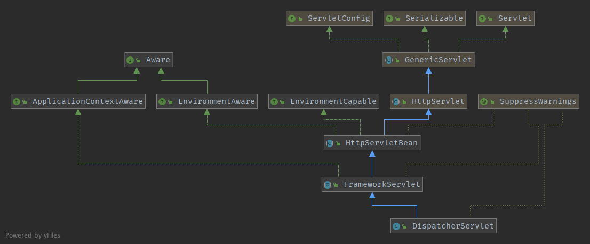

# 准备工作

* Git
* Gradle
* IDEA 2018以上版本
* JDK 1.8+

从[https://github.com/spring-projects/spring-framework](https://github.com/spring-projects/spring-framework)fork出一份源代码到自己的仓库，方便自己能写注释，以及运行test等。

当前使用的是Spring 5.1.3.BUILD-SNAPSHOT的版本

spring框架里的web模块包括webmvc、websocket、webflux，其中，web模块是另外三个模块的父模块。

代码拉下来以后，执行`./gradlew :spring-oxm:compileTestJava`出现success即为成功。

<!--more-->

# 容器

在Spring MVC初始化时，总共涉及到两个容器，一个是Root WebApplicationContext，还有一个是Servlet WebApplicationContext。

看一下常用的web.xml的配置：

```xml
<!-- 省略非关键的配置 -->

<!-- [1] Spring配置 -->
<listener>
    <listener-class>org.springframework.web.context.ContextLoaderListener</listener-class>
</listener>
<!-- 指定Spring Bean的配置文件所在目录。默认配置在WEB-INF目录下 -->
<context-param>
    <param-name>contextConfigLocation</param-name>
    <param-value>classpath:config/applicationContext.xml</param-value>
</context-param>

<!-- ====================================== -->

<!-- [2] Spring MVC配置 -->
<servlet>
    <servlet-name>spring</servlet-name>
    <servlet-class>org.springframework.web.servlet.DispatcherServlet</servlet-class>
    <!-- 可以自定义servlet.xml配置文件的位置和名称，默认为WEB-INF目录下，名称为[<servlet-name>]-servlet.xml，如spring-servlet.xml
    <init-param>
        <param-name>contextConfigLocation</param-name>
        <param-value>/WEB-INF/spring-servlet.xml</param-value> // 默认
    </init-param>
    -->
    <load-on-startup>1</load-on-startup>
</servlet>
<servlet-mapping>
    <servlet-name>spring</servlet-name>
    <url-pattern>*.do</url-pattern>
</servlet-mapping>
```

## Root WebApplication

首先进入的就是`ContextLoaderListener#contextInitialized`方法，这个监听实现了`ServletContextListener`，是一个servlet与容器进行通信的接口，所以如果在web.xml中配置了`<Listener>`标签以后，容器启动时就会启动该监听，并执行`contextInitialized`方法，这个方法继承自`contextLoader`，所以直接会调用`ContextLoader#initWebApplicationContext`方法，顾名思义，这个方法就是用来初始化Root wac(Web Application Context简称)。


这里主要是调用了`createWebApplicationContext`创建容器，和`configureAndRefreshWebApplicationContext`配置和刷新容器。

创建wac：`createWebApplicationContext`--->`determineContextClass`，这个方法决定了要使用什么类型的wac，默认情况下，`defaultStrategies`就是读取了`ContextLoader.properties`的Properties，它指定了默认的wac类型是`XmlWebApplicationContext`，源码如下：

```java
protected Class<?> determineContextClass(ServletContext servletContext) {
  	//获取sc里的初始化参数
		String contextClassName = servletContext.getInitParameter(CONTEXT_CLASS_PARAM);
		if (contextClassName != null) {
			try {
				return ClassUtils.forName(contextClassName, ClassUtils.getDefaultClassLoader());
			}
			catch (ClassNotFoundException ex) {
				throw new ApplicationContextException(
						"Failed to load custom context class [" + contextClassName + "]", ex);
			}
		}
		else {
      //默认策略，这里会使用Class.forName()反射创建类类型并返回
			contextClassName = defaultStrategies.getProperty(WebApplicationContext.class.getName());
			try {
				return ClassUtils.forName(contextClassName, ContextLoader.class.getClassLoader());
			}
			catch (ClassNotFoundException ex) {
				throw new ApplicationContextException(
						"Failed to load default context class [" + contextClassName + "]", ex);
			}
		}
	}
```

返回一个类类型以后，在`createWebApplicationContext`方法中，通过反射技术会创建该类类型的一个实例对象出来。接着会设置父容器，配置和刷新当前容器，但是在刚创建容器的时候，由于并没有显示指定容器中active这个AtomicBooleanl的值，所以默认为false，这时候会进入设置父容器和配置wac的步骤。

如果wac的父容器为空，会设置wac的父容器。当前这个已经是Root wac了，所以其实`loadParentContext`这个方法返回为空，并且没有任何一个子类去重写，**由此得知，Root wac的父容器通常始终为空**。


接下来会将wac放到`ServletContext`(以下简称sc)的attribute里，由对应的Web容器放到自己的容器上下文里，在Tomcat里就是`ApplicationContext`，该类里保存了一个`ConcurrentHashMap`类型的成员变量，保存所有attributes，Spring的Root wac也放在这里。


配置wac：设置`contextId`等属性---> 将sc设置到wac里--->获取`web.xml`里的`contextConfigLocation`配置路径--->初始化内容资源以初始化和`refresh`--->扫描用户配置的`globalInitializerClasses`和`contextInitializerClasses`--->初始化这些类--->刷新`context`--->设置active、closed，进入到Spring Ioc容器的初始化。


在这里，Spring为了适应不同的Web容器打破双亲委派机制的情况，有如下代码：

```java
ClassLoader ccl = Thread.currentThread().getContextClassLoader();
if (ccl == ContextLoader.class.getClassLoader()) {
   //如果当前类的类加载器和当前线程的上下文加载器是一样的，则将context赋值给当前类全局变量
   currentContext = this.context;
}
else if (ccl != null) {
   //将上下文放入到map中
   currentContextPerThread.put(ccl, this.context);
}
```

拿Tomcat举例来说，Tomcat打破了JVM的双亲委派机制：

`CommonClassLoader`：加载那些能在Web应用和Tomcat之间共享的类；

`SharedClassLoader`：Web应用之间能够共享的类，比如Spring；

`CatalinaClassLoader`：加载Tomcat自身需要的类；

`WebAppClassLoader`：每一个Web应用都有自己的`WebAppClassLoader`，打破了双亲委派，它会首先从本地缓存查找是否加载过，然后再去使用父加载器去查找，如果没有接着会使用`ExtClassLoader`（也可以说会使用`BootstrapClassLoader`，避免Web应用的类覆盖JRE类），然后会在本地文件系统中查找，最后会交由系统类加载器（因为**Class.forName默认使用的就是AppClassLoader**）。

使用WebAppClassLoader加载的业务类可以通过`Thread.currentThread().getContextClassLoader()`来获得类加载器；

使用`ContextLoader.class.getClassLoader()`获得的是ContextLoader类加载器，如果两个类加载器是一致的，就可以将wac作为全局的静态变量`currentContext`的值，如果不是一致的，就需要用一个线程安全的`ConcurrentHashMap`来保存当前创建的wac，通过这种方式来保证线程间wac的私有。

## Servlet WebApplication

第二个Servlet WebApplication容器，是在`DispatcherServlet`初始化的过程中进行创建的。其实本质而言，这就是一个最正常的Servlet，和平时常见的的那种执行doGet，doPost的servlet没有任何区别，使用IDEA生成类图（`command+alt+u`）如下：



* `HttpServletBean`：将`ServletConfig`设置到Servlet对象中
* `FrameworkServlet`：初始化ServletBean，创建Servlet wac
* `DispatcherServlet`：初始化Spring MVC中的九个组件

### HttpServletBean

这个类实现了`EnvironmentCapable`, `EnvironmentAware`接口，通过Spring的*Aware这类接口的感知能力，将environment注入进来。

在init这个方法中遍历所有的`<init-param>`标签中配置的参数，封装成`PropertyValues`，实现类是继承了`MutablePropertyValues`的`ServletConfigPropertyValues`，并将当前的Servlet对象转化成一个`BeanWrapper`对象，同时将pvs放到这个bw里。

在`ServletConfigPropertyValues`


这个类的构造函数里，通过构造一个set集合来判断属性是否齐全：

```java
public ServletConfigPropertyValues(ServletConfig config, Set<String> requiredProperties)
				throws ServletException {

			//将必须的配置转换成一个set集合，当web.xml中配置了一个，就从set中移除一个，直到所有缺失的都移除
			Set<String> missingProps = (!CollectionUtils.isEmpty(requiredProperties) ?
					new HashSet<>(requiredProperties) : null);

			Enumeration<String> paramNames = config.getInitParameterNames();
			while (paramNames.hasMoreElements()) {
				String property = paramNames.nextElement();
				Object value = config.getInitParameter(property);
				addPropertyValue(new PropertyValue(property, value));
				if (missingProps != null) {
					missingProps.remove(property);
				}
			}

			// Fail if we are still missing properties.
			if (!CollectionUtils.isEmpty(missingProps)) {
				throw new ServletException(
						"Initialization from ServletConfig for servlet '" + config.getServletName() +
						"' failed; the following required properties were missing: " +
						StringUtils.collectionToDelimitedString(missingProps, ", "));
			}
		}
```

以上代码非常值得学习。

