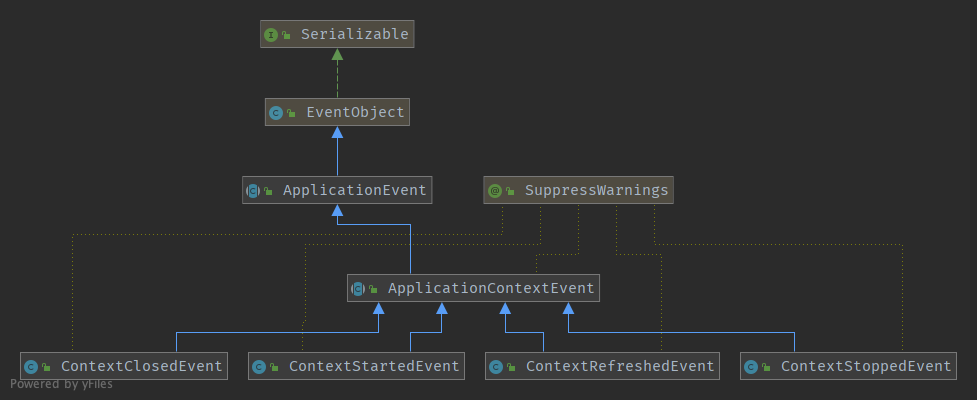
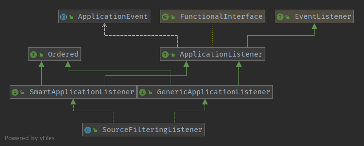

# 准备工作

* Git
* Gradle
* IDEA 2018以上版本
* JDK 1.8+

从[https://github.com/spring-projects/spring-framework](https://github.com/spring-projects/spring-framework)fork出一份源代码到自己的仓库，方便自己能写注释，以及运行test等。

当前使用的是Spring 5.1.3.BUILD-SNAPSHOT的版本

spring框架里的web模块包括webmvc、websocket、webflux，其中，web模块是另外三个模块的父模块。

代码拉下来以后，执行`./gradlew :spring-oxm:compileTestJava`出现success即为成功。

<!--more-->

# 容器

在Spring MVC初始化时，总共涉及到两个容器，一个是Root WebApplicationContext，还有一个是Servlet WebApplicationContext。

看一下常用的web.xml的配置：

```xml
<!-- 省略非关键的配置 -->

<!-- [1] Spring配置 -->
<listener>
    <listener-class>org.springframework.web.context.ContextLoaderListener</listener-class>
</listener>
<!-- 指定Spring Bean的配置文件所在目录。默认配置在WEB-INF目录下 -->
<context-param>
    <param-name>contextConfigLocation</param-name>
    <param-value>classpath:config/applicationContext.xml</param-value>
</context-param>

<!-- ====================================== -->

<!-- [2] Spring MVC配置 -->
<servlet>
    <servlet-name>spring</servlet-name>
    <servlet-class>org.springframework.web.servlet.DispatcherServlet</servlet-class>
    <!-- 可以自定义servlet.xml配置文件的位置和名称，默认为WEB-INF目录下，名称为[<servlet-name>]-servlet.xml，如spring-servlet.xml
    <init-param>
        <param-name>contextConfigLocation</param-name>
        <param-value>/WEB-INF/spring-servlet.xml</param-value> // 默认
    </init-param>
    -->
    <load-on-startup>1</load-on-startup>
</servlet>
<servlet-mapping>
    <servlet-name>spring</servlet-name>
    <url-pattern>*.do</url-pattern>
</servlet-mapping>
```

## Root WebApplication

首先进入的就是`ContextLoaderListener#contextInitialized`方法，这个监听实现了`ServletContextListener`，是一个servlet与容器进行通信的接口，所以如果在web.xml中配置了`<Listener>`标签以后，容器启动时就会启动该监听，并执行`contextInitialized`方法，这个方法继承自`contextLoader`，所以直接会调用`ContextLoader#initWebApplicationContext`方法，顾名思义，这个方法就是用来初始化Root wac(Web Application Context简称)。


这里主要是调用了`createWebApplicationContext`创建容器，和`configureAndRefreshWebApplicationContext`配置和刷新容器。

创建wac：`createWebApplicationContext`--->`determineContextClass`，这个方法决定了要使用什么类型的wac，默认情况下，`defaultStrategies`就是读取了`ContextLoader.properties`的Properties，它指定了默认的wac类型是`XmlWebApplicationContext`，源码如下：

```java
protected Class<?> determineContextClass(ServletContext servletContext) {
  	//获取sc里的初始化参数
		String contextClassName = servletContext.getInitParameter(CONTEXT_CLASS_PARAM);
		if (contextClassName != null) {
			try {
				return ClassUtils.forName(contextClassName, ClassUtils.getDefaultClassLoader());
			}
			catch (ClassNotFoundException ex) {
				throw new ApplicationContextException(
						"Failed to load custom context class [" + contextClassName + "]", ex);
			}
		}
		else {
      //默认策略，这里会使用Class.forName()反射创建类类型并返回
			contextClassName = defaultStrategies.getProperty(WebApplicationContext.class.getName());
			try {
				return ClassUtils.forName(contextClassName, ContextLoader.class.getClassLoader());
			}
			catch (ClassNotFoundException ex) {
				throw new ApplicationContextException(
						"Failed to load default context class [" + contextClassName + "]", ex);
			}
		}
	}
```

返回一个类类型以后，在`createWebApplicationContext`方法中，通过反射技术会创建该类类型的一个实例对象出来。接着会设置父容器，配置和刷新当前容器，但是在刚创建容器的时候，由于并没有显示指定容器中active这个AtomicBoolean的值，所以默认为false，这时候会进入设置父容器和配置wac的步骤。

如果wac的父容器为空，会设置wac的父容器。当前这个已经是Root wac了，所以其实`loadParentContext`这个方法返回为空，并且没有任何一个子类去重写，**由此得知，Root wac的父容器通常始终为空**。


接下来会将wac放到`ServletContext`(以下简称sc)的attribute里，由对应的Web容器放到自己的容器上下文里，在Tomcat里就是`ApplicationContext`，该类里保存了一个`ConcurrentHashMap`类型的成员变量attributes，保存所有属性，Spring的Root wac也放在这里。


配置wac：设置`contextId`等属性---> 将sc设置到wac里--->获取`web.xml`里的`contextConfigLocation`配置路径--->初始化内容资源--->扫描用户配置的`globalInitializerClasses`和`contextInitializerClasses`--->初始化这些类--->刷新`context`--->设置Root wac的active、closed的值，进入到Spring Ioc容器的初始化。


在这里，Spring为了适应不同的Web容器打破双亲委派机制的情况，有如下代码：

```java
ClassLoader ccl = Thread.currentThread().getContextClassLoader();
if (ccl == ContextLoader.class.getClassLoader()) {
   //如果当前类的类加载器和当前线程的上下文加载器是一样的，则将context赋值给当前类全局变量
   currentContext = this.context;
}
else if (ccl != null) {
   //将上下文放入到map中
   currentContextPerThread.put(ccl, this.context);
}
```

拿Tomcat举例来说，Tomcat打破了JVM的双亲委派机制：

`CommonClassLoader`：加载那些能在Web应用和Tomcat之间共享的类；

`SharedClassLoader`：Web应用之间能够共享的类，比如Spring；

`CatalinaClassLoader`：加载Tomcat自身需要的类；

`WebAppClassLoader`：每一个Web应用都有自己的`WebAppClassLoader`，打破了双亲委派，它会首先从本地缓存查找是否加载过，然后再去使用父加载器去查找，如果没有接着会使用`ExtClassLoader`（也可以说会使用`BootstrapClassLoader`，避免Web应用的类覆盖JRE类），然后会在本地文件系统中查找，最后会交由系统类加载器（因为**Class.forName默认使用的就是AppClassLoader**）。

使用WebAppClassLoader加载的业务类可以通过`Thread.currentThread().getContextClassLoader()`来获得类加载器；

使用`ContextLoader.class.getClassLoader()`获得的是ContextLoader类加载器，如果两个类加载器是一致的，就可以将wac作为全局的静态变量`currentContext`的值，如果不是一致的，就需要用一个线程安全的`ConcurrentHashMap`来保存当前创建的wac，通过这种方式来保证线程间wac的私有。

## Servlet WebApplication

第二个Servlet WebApplication容器，是在`DispatcherServlet`初始化的过程中进行创建的。其实本质而言，这就是一个最正常的Servlet，和平时常见的的那种执行doGet，doPost的servlet没有任何区别，使用IDEA生成类图（`command+alt+u`）如下：


* `HttpServletBean`：将`ServletConfig`设置到Servlet对象中
* `FrameworkServlet`：初始化ServletBean，创建Servlet wac
* `DispatcherServlet`：初始化Spring MVC中的九个组件

### HttpServletBean

这个类实现了`EnvironmentCapable`, `EnvironmentAware`接口，通过Spring的*Aware这类接口的感知能力，将environment注入进来。

在init这个方法中遍历所有的`<init-param>`标签中配置的参数，封装成`PropertyValues`，实现类是继承了`MutablePropertyValues`的`ServletConfigPropertyValues`，并将当前的Servlet对象转化成一个`BeanWrapper`对象，同时将pvs放到这个bw里。

```java
@Override
	public final void init() throws ServletException {

		// Set bean properties from init parameters.
		//解析web.xml中的init-param标签，封装到pvs中，这个构造函数中有一个所有initParams的遍历
		PropertyValues pvs = new ServletConfigPropertyValues(getServletConfig(), this.requiredProperties);
		if (!pvs.isEmpty()) {
			try {
				//将当前这个Servlet对象转化成一个BeanWrapper对象
				BeanWrapper bw = PropertyAccessorFactory.forBeanPropertyAccess(this);
				ResourceLoader resourceLoader = new ServletContextResourceLoader(getServletContext());
				//注册自定义的属性编辑器，碰到Resource类型的属性，就会使用自定义的属性加载器进行处理
				bw.registerCustomEditor(Resource.class, new ResourceEditor(resourceLoader, getEnvironment()));
				//留给子类实现的初始化bw对象
				initBeanWrapper(bw);
				//TODO Joy 将属性值pvs设置到bw里,需要好好研究一下是怎么将contextConfigLocation反射赋值到FrameworkServlet里的
				bw.setPropertyValues(pvs, true);
			}
			catch (BeansException ex) {
				if (logger.isErrorEnabled()) {
					logger.error("Failed to set bean properties on servlet '" + getServletName() + "'", ex);
				}
				throw ex;
			}
		}

		// Let subclasses do whatever initialization they like.
		//交给FrameworkServlet来实现
		initServletBean();
	}
```

在`ServletConfigPropertyValues`这个类的构造函数里，通过构造一个set集合来判断属性是否齐全：

```java
public ServletConfigPropertyValues(ServletConfig config, Set<String> requiredProperties)
				throws ServletException {

			//将必须的配置转换成一个set集合，当web.xml中配置了一个，就从set中移除一个，直到所有缺失的都移除
			Set<String> missingProps = (!CollectionUtils.isEmpty(requiredProperties) ?
					new HashSet<>(requiredProperties) : null);

			Enumeration<String> paramNames = config.getInitParameterNames();
			while (paramNames.hasMoreElements()) {
				String property = paramNames.nextElement();
				Object value = config.getInitParameter(property);
				addPropertyValue(new PropertyValue(property, value));
				if (missingProps != null) {
					missingProps.remove(property);
				}
			}

			// Fail if we are still missing properties.
			if (!CollectionUtils.isEmpty(missingProps)) {
				throw new ServletException(
						"Initialization from ServletConfig for servlet '" + config.getServletName() +
						"' failed; the following required properties were missing: " +
						StringUtils.collectionToDelimitedString(missingProps, ", "));
			}
		}
```

以上代码非常值得学习。

### FrameWork Servlet

该类中有一个非常重要的参数：WebApplicationContext。对于这个servlet wac的赋值，可以有四种方式：

1. `FrameWork Servlet`的构造函数
2. 实现了`ApplicationContextAware`接口，可以使用Spring的注入从而调用`#setApplicationContext`
3. `#findWebApplicationContext`方法
4. `#createWebApplicationContext`方法

在父类`HttpServletBean`的`#init`方法里，最后一行就是调用本类中的`#initServletBean`方法，这个方法的重点是`#initWebApplicationContext`方法，而`#initFrameworkServlet`方法由于没有任何实现，所以暂时不管。

```java
protected WebApplicationContext initWebApplicationContext() {
		//获取ContextLoader初始化的 ROOT WebApplicationContext
		WebApplicationContext rootContext =
				WebApplicationContextUtils.getWebApplicationContext(getServletContext());
		//这个是方法中用于操作的引用，避免直接操作全局变量
		WebApplicationContext wac = null;

		//如果此时不为空，可能来自于构造函数传入，或者Srping Aware接口注入
		if (this.webApplicationContext != null) {
			// A context instance was injected at construction time -> use it
			wac = this.webApplicationContext;
			if (wac instanceof ConfigurableWebApplicationContext) {
				ConfigurableWebApplicationContext cwac = (ConfigurableWebApplicationContext) wac;
				if (!cwac.isActive()) {
					//还没有激活时，开始进行配置和刷新，configureAndRefreshWebApplicationContext中会注册独有的监听
					// The context has not yet been refreshed -> provide services such as
					// setting the parent context, setting the application context id, etc
					if (cwac.getParent() == null) {
						// The context instance was injected without an explicit parent -> set
						// the root application context (if any; may be null) as the parent
						cwac.setParent(rootContext);
					}
					configureAndRefreshWebApplicationContext(cwac);
				}
			}
		}
		if (wac == null) {
			// No context instance was injected at construction time -> see if one
			// has been registered in the servlet context. If one exists, it is assumed
			// that the parent context (if any) has already been set and that the
			// user has performed any initialization such as setting the context id
			// 主动寻找wac，这种场景是因为用户自己在web.xml中定义了`ContextAttribute`，但是一般我们都不会配置
			wac = findWebApplicationContext();
		}
		if (wac == null) {
			// No context instance is defined for this servlet -> create a local one
			//最后会主动创建，并且执行configureAndRefreshWebApplicationContext
			wac = createWebApplicationContext(rootContext);
		}
		//这个参数参数表示是否已经接收到刷新，如果没有就要立即执行onRefresh
		if (!this.refreshEventReceived) {
			// Either the context is not a ConfigurableApplicationContext with refresh
			// support or the context injected at construction time had already been
			// refreshed -> trigger initial onRefresh manually here.
			//即使这个wac不是支持刷新的cac，或者在构造时已经刷新过，这里也要执行onRefresh
			synchronized (this.onRefreshMonitor) {
				//最最最最核心的方法来了！！！九大组件～
				onRefresh(wac);
			}
		}
		//将创建的servlet wac放到ServletContext中
		//每个servlet都有自己的ServletConfig，用当前类的类名+".CONTEXT."+servlet名字的方式
		if (this.publishContext) {
			// Publish the context as a servlet context attribute.
			String attrName = getServletContextAttributeName();
			getServletContext().setAttribute(attrName, wac);
		}

		return wac;
	}
```

过程比较复杂的是创建Servlet WebApplicationContext的过程，在`#createWebApplicationContext`这个方法里，还是采用的和Root wac一样的创建方式，也就是默认`XmlWebApplciationContext`的类型反射创建wac，然后设置父容器，设置contextConfigLocation参数，这个参数就是上一节中说过通过反射赋值到FrameworkServlet中的，随后在`#configureAndRefreshWebApplicationContext`方法中，设置了ServletContext，ServletConfig，NameSpace，基本和`ContextLoader`类里Root wac的创建方式类似。但是---这里随后又注册了一个`ApplicationEventListener`，简单提一下Spring中的事件机制：

* 事件-`ApplicationEvent extends EventObject`
* 发布方-`ApplicationEventPublisher`
* 消费方-`ApplicationListener<E extends ApplicationEvent> extends EventListener`

和容器相关的事件的又分为：



跟监听有关的类图如下：



`#configureAndRefreshWebApplicationContext`注册了一个`SourceFilteringListener`，这个listener专门用来监听和传入的wac有关的事件，当产生容器刷新事件时，实际上是执行refresh方法以后，会发送对应的事件类型，这里就是`ContextRefreshedEvent`类型的事件，被`SourceFilteringListener`监听到以后，在`#onApplicationEvent`方法中判断事件源是否是传入的wac，如果是，交由代理`ContextRefreshListener`的实例去执行对应的`#onApplicationEvent`方法，而`ContextRefreshListener`实际上是`FrameworkServlet`的私有内部类，重写了`#onApplicationEvent`方法，那么这个方法的作用其实很简单---调用外部类FrameworkServlet的**onRefresh方法，初始化9大组件。**


最后，将新创建的这个Servlet wac放到Servlet Context的attribute中。

**总结：**

1. 在FrameworkServlet中，如果Servlet wac还没有激活，就会去配置，并且执行Spring Ioc容器的刷新，然后监听事件，触发类中的onRefresh

2. 如果Servlet wac没有找到或者为空，则执行创建，同样执行Spring Ioc的刷新，触发onRefresh
3. 如果Servlet wac已经激活，需要判断是否已经收到过Ioc容器的容器刷新事件，如果没有，同样要触发onRefresh

### Dispatcher Servlet

这个类是核心调度类，但是其调用逻辑相对来说并不算复杂，只是代码量不小，其核心方法如下：

```java
protected void initStrategies(ApplicationContext context) {
		//文件上传解析器
		initMultipartResolver(context);
		//本地化资源/国际化资源解析器
		initLocaleResolver(context);
		//主题解析器：根据请求头判断使用PC主题还是移动主题
		initThemeResolver(context);
		//uri映射解析器：根据uri匹配合适的handler
		initHandlerMappings(context);
		//uri处理解析器：根据匹配到到的hadler处理请求
		initHandlerAdapters(context);
		//异常解析器：根据请求处理异常请求
		initHandlerExceptionResolvers(context);
		//请求到视图解析器：根据请求获得视图名
		initRequestToViewNameTranslator(context);
		//最终视图解析器：视图最终解析
		initViewResolvers(context);
		//FlashMap解析器：重定向参数临时保存
		initFlashMapManager(context);
	}
```

另外配一幅网上找的图：


其具体的工作流程，留待后面请求处理详解里在细细梳理。

# 总结

至此，Spring MVC容器初始化部分的内容到此结束，下一节开始学习Spring MVC对于Servlet 3.0的支持、SPI机制、以及Spring Aware的动态感知。

# 参考

芋艿的源码解析博客：[http://www.iocoder.cn/](http://www.iocoder.cn/)