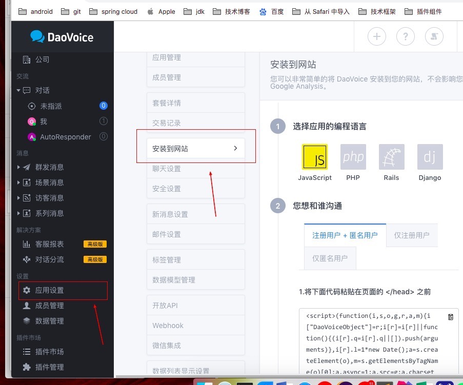
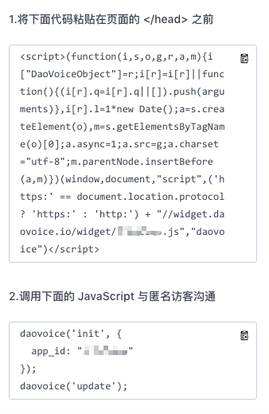

# 简述

给hexo接入看起来很高大上的在线聊天daovoice，详情请看本博客右下角的气泡标志。

<!-- more -->

# 接入daovoice

[官网传送门](http://www.daovoice.io/)

注册完成以后会进入到daovoice的控制面板页，选择应用设置，安装到网站：

看情况而定，通常这种个人博客不需要注册，因此，直接可以选择匿名用户沟通，然后复制daovoice提供的代码：

将这两份代码复制到一起，放到`themes/next/layout/_partials/head.swig`中，位置随意，保证是在

    

后面即可，注册用户的使用方式类似。
然后到主题配置文件里，加入如下两行：

    daovoice: true
    daovoice_app_id: your appid

最后使用`hexo s`即可查看到效果。
