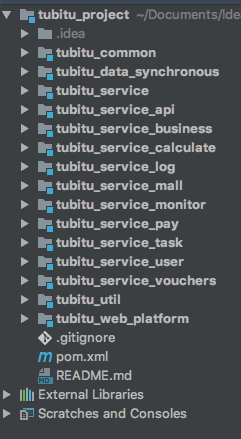

# 简述
dubbo 是目前国内最广泛的rpc框架，官网见 [http://dubbo.apache.org/zh-cn/index.html](http://dubbo.apache.org/zh-cn/index.html)，建议直接对着官网开发文档配置较为可靠。
dubbo常用于soa架构，soa架构和微服务架构均是分布式系统的两种实践，从某种程度而言，soa架构是微服务架构的超集，或者说微服务是soa的一个变种。
<!--more-->

|SOA|微服务|
|---|---|
|应用程序服务的可重用性的最大化|专注于解耦|
|系统性的改变需要修改整体|系统性的改变是创建一个新的服务|
|DevOps和持续交付正在变得流行，但还不是主流|强烈关注DevOps和持续交付
|专注于业务功能重用|更重视“上下文边界，服务粒度”的概念
|支持多种消息协议|使用轻量级协议，例如HTTP，REST或Thrift API
|对部署到它的所有服务使用通用平台|应用程序服务器不是真的被使用，通常使用云平台
|容器（如Docker）的使用不太受欢迎|容器在微服务方面效果很好
|SOA服务共享数据存储|每个微服务可以有一个独立的数据存储
|共同的治理和标准|轻松的治理，更加关注团队协作和选择自由
图表资料来源于网上：[资深架构师](https://blog.csdn.net/chszs/article/details/78515231)

# dubbo+spring xml方式
## pom文件

```xml
<dependency>
        <groupId>com.alibaba</groupId>
        <artifactId>dubbo</artifactId>
        <version>2.5.3</version>
        <exclusions>
            <exclusion>
                <groupId>org.springframework</groupId>
                <artifactId>spring</artifactId>
            </exclusion>
        </exclusions>
    </dependency>
    <dependency>
        <groupId>org.apache.zookeeper</groupId>
        <artifactId>zookeeper</artifactId>
        <version>3.4.8</version>
    </dependency>
    <dependency>
        <groupId>com.github.sgroschupf</groupId>
        <artifactId>zkclient</artifactId>
        <version>0.1</version>
    </dependency>
```
## 服务发布方
dubbo-provider.xml:

```xml
<!-- dubbo配置 -->
<!-- 服务提供者的名字，随意定义，只要不重复即可 -->
<dubbo:application name="user_provider"/>
<!-- 配置zookeeper注册中心的地址 -->
<dubbo:registry address="zookeeper://localhost:2181"/>
<!-- 配置dubbo暴露服务时所使用的端口号 -->
<dubbo:protocol name="dubbo" port="20880"/>
<!--暴露的接口完整限定名，也可以用@Service注解配合dubbo:annotation的标签暴露服务接口-->
<dubbo:service interface="com.tubitu.service.user.UserInfoService" ref="userInfoServiceImpl"/>
```
## 服务消费方
dubbo-consumer.xml:

```xml
<!-- 服务调用者的应用名字，随便定义，只要不重复即可，不需要跟服务提供者的名字对应 -->
<dubbo:application name="platform_consumer"/>

<!-- 配置zookeeper地址，用于订阅（发现）服务 -->
<dubbo:registry address="${dubbo.address}"/>

<!-- 配置需要调用哪一个服务接口 -->
<!--
     一个标签只能调用一个服务接口
     如果需要调用多个服务接口，需要配置多个标签
     会将该接口的实例，存入spring容器
     id属性：该实例在容器中的id，值是自定义的
     interface属性：服务接口对应的完全限定名
 -->
 <!--此处的配置是当spring里的远程service为空时打开，因为springmvc扫描时可能dubbo还未扫描导致未初始化，所以下面的注解就是在装载spring bean前初始化dubbo的远程服务-->
<!--<dubbo:annotation package=""/>-->
<dubbo:reference id="userInfoServiceImpl" interface="com.tubitu.service.user.UserInfoService"/>
```
## 调用

service的调用可以直接使用spring的@Autowired注解，就和spring扫描的服务一样，version和timeout，由于这个版本的dubbo不支持全局超时配置，因此需要在调用方指定超时时间。

# zookeeper

官网下载zookeeper的压缩包，解压后即可打开，linux和windows通用，首先需要进入config目录将其中的zoo-sample.cfg 改名为zoo.cfg因为zookeeper是默认读取的zoo.cfg文件的。然后进入bin目录，双击zkServer.bat文件即可运行。
linux下需要进入zookeeper里的bin目录下，执行zkServer start命令启动，执行zkServer stop停止zk。

# dubbo+spring boot方式
## 搭建父项目
新建项目，类型选择maven，然后勾选Create from archetype，选择maven-archetype-quickstart，生成一个普通的maven项目，填写maven仓库坐标即可一路点击完成，如果有src目录，可以直接删除，然后修改pom文件的packaging标签的值为pom，表示父项目只提供pom依赖。
 
## 搭建子模块
对于普通子模块：在父项目的基础上new -> module，然后操作与第一步大致一致，需要注意的是groupId要和父项目的保持一致，artifactId可以自定义。
 
对于spring boot子木块：在父项目的基础上new -> module，选择spring initializer，在new module窗口上，填写group与父项目的groupId保持一致，artifact为项目名，并填写好name和package，packaging根据需要可以填写jar、war等包类型，本文推荐使用jar包，注意右上角小的下拉框，本文所使用的配置无法保证在spring boot 1.5.X以外的版本使用。
 
## 父子关联
重复第二步，创建自己所需各个模块以后，其结构基本如下：



将父pom文件里增加modules标签，并与子module的artifactId一一关联上：

```xml
<modules>
        <module>tubitu_service_user</module>
        <module>tubitu_service_api</module>
        <module>tubitu_common</module>
        <module>tubitu_util</module>
        <module>tubitu_service</module>
        <module>tubitu_service_business</module>
        <module>tubitu_service_mall</module>
        <module>tubitu_service_pay</module>
        <module>tubitu_service_log</module>
        <module>tubitu_service_monitor</module>
        <module>tubitu_service_calculate</module>
        <module>tubitu_service_task</module>
        <module>tubitu_web_platform</module>
        <module>tubitu_data_synchronous</module>
        <module>tubitu_service_vouchers</module>
    </modules>
```

同理，每一子module的pom文件也要与父项目进行关联：

```xml
<parent>
        <groupId>tubitu_project</groupId>
        <artifactId>tubitu_project</artifactId>
        <version>1.0</version>
    </parent>
```

此时会发现，原本spring boot项目的父依赖不再是spring boot的pom文件了，而是我们自己的父项目pom文件，有如下两种解决方案：
在每个spring boot项目里的pom文件里，加上如下代码：

```xml
<dependencyManagement>
        <!--定义全局公用的一些依赖，此处只定义依赖而不引入-->
        <dependencies>
            <dependency>
                <groupId>org.springframework.boot</groupId>
                <artifactId>spring-boot-dependencies</artifactId>
                <version>1.5.10.RELEASE</version>
                <type>pom</type>
                <scope>import</scope>
            </dependency>
</dependencyManagement>
```

或者在父项目的pom文件里，加上该代码。
本文为方便起见，直接在父项目pom文件里加入该依赖声明。

## 打包配置

对于tubitu\_common、tubitu\_util和tubitu\_service这几个项目，第一个和第二个分别为实体类以及工具类所在项目，而tubitu_service是作为dubbo提供父和调用方的一个公共接口。这三个项目均可以打成单独的jar包作为其他项目依赖而存在，所以可以指定maven编译插件和源码版本。


```xml
<build>
        <plugins>
            <plugin>
                <groupId>org.apache.maven.plugins</groupId>
                <artifactId>maven-compiler-plugin</artifactId>
                <version>${maven-compiler-plugin.version}</version>
                <configuration>
                    <source>${maven.compile.source}</source>
                    <target>${maven.compile.target}</target>
                    <encoding>${project.build.sourceEncoding}</encoding>
                    <skip>true</skip>
                </configuration>
            </plugin>
            <plugin>
                <!--boot需要配置这个否则会提示找不到主类-->
                <groupId>org.springframework.boot</groupId>
                <artifactId>spring-boot-maven-plugin</artifactId>
                <executions>
                    <execution>
                        <goals>
                            <goal>repackage</goal>
                        </goals>
                    </execution>
                </executions>
            </plugin>
        </plugins>
    </build>
```

如此最后才能打出完整的包。

## 依赖统一管理
在父pom文件里定义公共jar包或框架的统一版本，只定义而不引入，在子模块中直接引入。
例如：
在父pom文件里配置了统一属性:

```xml
<properties>
        <tubitu.version>1.0</tubitu.version>
        <project.build.sourceEncoding>UTF-8</project.build.sourceEncoding>
        <project.reporting.outputEncoding>UTF-8</project.reporting.outputEncoding>
        <java.version>1.8</java.version>
        <mybatis.version>3.4.6</mybatis.version>
        <spring.version>4.3.14.RELEASE</spring.version>
        <!--项目基本依赖-->
        <slf4j.version>1.7.7</slf4j.version>
        <log4j.version>1.2.12</log4j.version>
        <aspectj.version>1.7.2</aspectj.version>
        <mysql-connector-java.version>5.1.38</mysql-connector-java.version>
        <rocketmq.version>4.3.0</rocketmq.version>
        <fasterxml.jackson.version>2.5.0</fasterxml.jackson.version>
        <javax.servlet.version>3.1.0</javax.servlet.version>
        <!--分布式配置中心-->
        <apollo.client.version>1.0.0</apollo.client.version>
        <!--dubbo依赖-->
        <curator.version>2.12.0</curator.version>
        <zookeeper.version>3.4.10</zookeeper.version>
        <dubbo.version>2.6.2</dubbo.version>
        <!--spring boot所需依赖-->
        <mybatis.starter.version>1.3.2</mybatis.starter.version>
        <pagehelper.starter.version>1.2.3</pagehelper.starter.version>
        <druid.starter.version>1.1.0</druid.starter.version>
        <spring.data.version>1.8.10.RELEASE</spring.data.version>
    </properties>
```

并定义依赖：

```xml
<dependencyManagement>
        <!--定义全局公用的一些依赖，此处只定义依赖而不引入-->
        <dependencies>
            <dependency>
                <groupId>org.springframework.boot</groupId>
                <artifactId>spring-boot-dependencies</artifactId>
                <version>1.5.10.RELEASE</version>
                <type>pom</type>
                <scope>import</scope>
       </dependency>
		<dependency>
                <groupId>org.mybatis.spring.boot</groupId>
                <artifactId>mybatis-spring-boot-starter</artifactId>
                <version>${mybatis.starter.version}</version>
        </dependency>
<dependencyManagement>
```
则在子模块中，可以直接引入，无需定义依赖：

```xml
<dependency>
            <groupId>org.mybatis.spring.boot</groupId>
            <artifactId>mybatis-spring-boot-starter</artifactId>
        </dependency>
```

## dubbo引入

```xml

<dependency>
            <groupId>com.alibaba.boot</groupId>
            <artifactId>dubbo-spring-boot-starter</artifactId>
            <version>0.1.1</version>
        </dependency>
```
注意的是：只有0.1.x的版本是支持spring boot 1.5.x，0.2.x用于spring boot 2.x。

## dubbo生产者配置

```properties
dubbo.application.id = provider_pay
dubbo.application.name = provider_pay
dubbo.application.qos.port=22232
dubbo.application.qos.enable=true

dubbo.protocol.id = dubbo
dubbo.protocol.name = dubbo
dubbo.protocol.port = 20882
dubbo.protocol.status = server
//注册中心地址
dubbo.registry.address = zookeeper://127.0.0.1:2181
//dubbo扫描的包含@Reference注解或者@Service的包
dubbo.scan.basePackages  = com.tubitu.service
dubbo.provider.version=1.0.0
```
业务类代码编写方式与使用spring一致，区别在于@Service注解是由Dubbo提供。

启动类：


```java
@MapperScan("com.tubitu.mapper")
@SpringBootApplication
@EnableTransactionManagement
@EnableAspectJAutoProxy
public class ProviderUserApplication {
	public static void main(String[] args) {
		new SpringApplicationBuilder(ProviderUserApplication.class).web(false).run(args);
	}
}
```

## dubbo消费者配置

```properties
## Dubbo 服务消费者配置
dubbo.application.id = consumer_platform
dubbo.application.name = consumer_platform
dubbo.application.qos.port=22234
dubbo.application.qos.enable=true
dubbo.protocol.id = dubbo
dubbo.protocol.name = dubbo
dubbo.protocol.port = 20880
dubbo.consumer.version=1.0.0
//调用方全局定义超市时间
dubbo.consumer.timeout=60000
dubbo.registry.address = zookeeper://127.0.0.1:2181
## 启动时检测提供者是否存在
dubbo.consumer.check=false
dubbo.registry.check=false
```

## 事务配置

启用事务需要使用cglib的方式实现aop代理：
`spring.aop.proxy-target-class=true`
并在启动类上加上如下两个注解：


`@EnableTransactionManagement`
`@EnableAspectJAutoProxy`

在实现类上加上注解：

`@Transactional(rollbackFor = Exception.class)`

## 调用方式

使用dubbo的@Reference注解，可以对某个Reference
配置版本号和超时时间，来达到灰度发布的效果。
# 一点补充

## 启动脚本

```bash
//1、启动脚本
vim start.sh:
nohup java -jar app.jar >> logs/tubitu.out &
//或者
touch start.sh
echo "nohup java -jar app.jar >> logs/tubitu.out &" >> start.sh

//2、停止脚本
vim stop.sh;
PID=$(ps -ef | grep app.jar | grep -v grep | awk '{print $2}')
if [ -z "$PID"]
then
echo Application has already stopped
else
echo kill $PID
kill -9 $PID
fi

//3、自动化脚本
echo stop application
source stop.sh
echo start application
source start.sh
```

## 项目目录下出现重复jar包的解决

问题：
`Multiple bindings were found on the class path`

解决：

```xml
<dependency>
                <groupId>tubitu_project</groupId>
                <artifactId>tubitu_util</artifactId>
                <version>${tubitu.version}</version>
                <exclusions>
                    <exclusion>
                        <groupId>org.slf4j</groupId>
                        <artifactId>slf4j-log4j12</artifactId>
                    </exclusion>
                    <exclusion>
                        <groupId>log4j</groupId>
                        <artifactId>log4j</artifactId>
                    </exclusion>
                    <exclusion>
                        <groupId>org.slf4j</groupId>
                        <artifactId>slf4j-simple</artifactId>
                    </exclusion>
                </exclusions>
            </dependency>

```

哪个jar包有多个，就将jar包的groupID和artifactID填入exclusion标签即可。