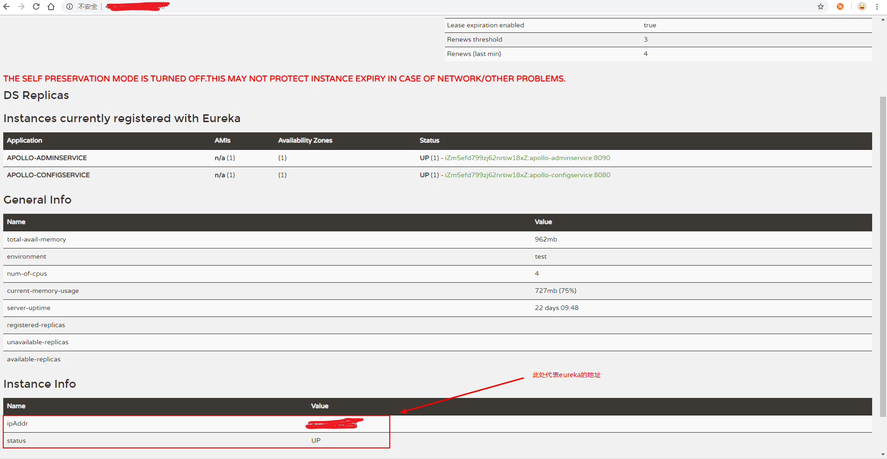
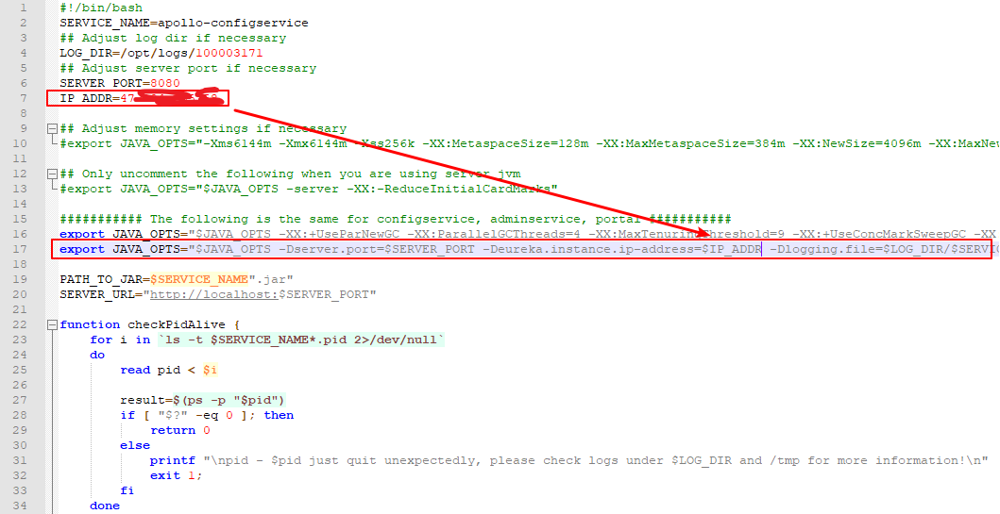

# 描述
Apollo（阿波罗）是携程框架部门研发的分布式配置中心，能够集中化管理应用不同环境、不同集群的配置，配置修改后能够实时推送到应用端，并且具备规范的权限、流程治理等特性，适用于微服务配置管理场景。官网传送门：[apollo.github](https://github.com/ctripcorp/apollo)。
<!--more-->

# 安装实践
当前版本apollo(包括config server、admin server、portal server)是基于spring boot 1.3.x所开发，因此无需依赖tomcat容器，可以直接通过java -jar 启动。meta是注册中心地址，以eureka为注册中心，默认情况下，config server自己本身就是一个eureka服务，所以config server和admin server都会注册到config server的eureka上。aopllo官方有两种配置方案：一、Quick start，这种方案是将三个server整合到了一起，名为apollo_all_in_one.jar，启动方式为通过官方提供的demo.sh来进行脚本启动，这种方式只能管理单个环境，但部署方便。 二、分布式部署方案，这种方案是在每一套环境中各部署一套apollo，但是他们都共用一个portal数据库。

## Quick start
官方的介绍和安装步骤非常详细，请自行查阅: [https://github.com/ctripcorp/apollo/wiki/Quick-Start](https://github.com/ctripcorp/apollo/wiki/Quick-Start)。需要注意的是，官方的一段关于异常的说明：
如果启动遇到了异常，可以分别查看service和portal目录下的log文件排查问题。

> 注：在启动apollo-configservice的过程中会在日志中输出eureka注册失败的信息，如com.sun.jersey.api.client.ClientHandlerException: java.net.ConnectException: Connection refused。需要注意的是，这个是预期的情况，因为apollo-configservice需要向Meta Server（它自己）注册服务，但是因为在启动过程中，自己还没起来，所以会报这个错。后面会进行重试的动作，所以等自己服务起来后就会注册正常了。

## 分布式部署
参阅官方教程进行部署：[https://github.com/ctripcorp/apollo/wiki/%E5%88%86%E5%B8%83%E5%BC%8F%E9%83%A8%E7%BD%B2%E6%8C%87%E5%8D%97](https://github.com/ctripcorp/apollo/wiki/%E5%88%86%E5%B8%83%E5%BC%8F%E9%83%A8%E7%BD%B2%E6%8C%87%E5%8D%97)
其部署图如下：

解释一下该图，portal为管理中心，adminservice和configservice共同组成配置服务器，所以可以理解为portal可以只用安装一台，adminservice和confingservice需要在每一个环境中安装一份，同理，potaldb只需要部署一个，而configdb在每一个环境的数据库都需要部署一份，由于成本限制，公司只有A、B两个环境，其中A为开发/测试环境，B为预发布/生产环境。


> 注：如果公司服务器环境为阿里云，在获取配置服务器IP地址时，client获取到的可能是服务器内网地址，查看eureka的图形化界面信息，如图：

这是由于注册到eureka服务器（即configservice）时，eureka获取到的是其他网卡上的内网地址，导致client一直在超时重试。解决这个的办法有三个：

一：下载一份源码，clone或者下载zip，在configservice或者adminservice的bootstrap.yml文件里加入以下配置：

```yaml
eureka:
  instance:
    ip-address: ${指定的IP}
```

然后运行scripts里的build脚本，即可获得重新编译打包后的configservice，adminservice，portal三个项目的zip文件，这种方式的不便之处在于每一种环境都要改一次配置然后build。

二：直接指定要注册的IP，可以修改startup.sh，通过JVM System Property在运行时传入-Deureka.instance.ip-address=${指定的IP}。下载官方的configservice，adminservice，portal三个项目的zip包，在服务器上解压开之后，在configservice项目里的scripts/start.sh文件里，如图：这种方式较为推荐，对源码的入侵性比较小。

三：直接指定要注册的IP+PORT，可以修改startup.sh，通过JVM System Property在运行时传入，如`-Deureka.instance.homePageUrl=http://${指定的IP}:${指定的Port}`，或者也可以修改apollo-adminservice或apollo-configservice 的bootstrap.yml文件，加入以下配置：

```yaml
eureka:
  instance:
    homePageUrl: http://${指定的IP}:${指定的Port}
    preferIpAddress: false
```

做完上述修改并重启后，可以查看Eureka页面（http://${config-service-url:port}）检查注册上来的IP信息是否正确。
需要记住，在scripts/start.sh文件里还需要修改JAVA_OPTS里的jvm参数，如果服务器内存足够（8G以上），那么无需更改，如果不足，请适当按比例缩小,本文机器是4C8G，配置为`export JAVA_OPTS="-Xms1024m -Xmx1024m -Xss256k -XX:MetaspaceSize=128m -XX:MaxMetaspaceSize=384m -XX:NewSize=614m -XX:MaxNewSize=614m -XX:SurvivorRatio=8"`。

# 项目配置
项目概况：spring boot 1.5.10.RELEASE+dubbo 2.6.2
由于dubbo-qos等的启动配置可能早于spring初始化完成，所以推荐使用注解式配置。
## 配置
导入maven依赖:

```xml
<dependency>
    <groupId>com.ctrip.framework.apollo</groupId>
    <artifactId>apollo-client</artifactId>
    <version>1.0.0</version>
</dependency>
```
在resource目录下创建apollo-env.properties文件，内容如下：

	app.id = provider_vouchers
	apollo.bootstrap.enabled = true
	logging.level.com.tubitu=debug
	apollo.bootstrap.namespaces = application,datasource

然后新建一个dubbo配置类：

```java
@Configuration
public class DubboConfig {
	/**这里也可以使用Spring 的@value注解注入属性，然后set到dubbo的applicationConfig、registryConfig、protocolConfig里面*/
    @ApolloConfig
    private Config config;

    /**
     *@Author: 刘会俊
     *@Description: dubbo.application配置
     *@Params []
     *@Return com.alibaba.dubbo.config.ApplicationConfig
     */
    @Bean
    public ApplicationConfig applicationConfig() {
        ApplicationConfig applicationConfig = new ApplicationConfig();
        applicationConfig.setId(config.getProperty("dubbo.application.id","provider_vouchers"));
        applicationConfig.setName(config.getProperty("dubbo.application.name","provider_vouchers"));
        applicationConfig.setQosEnable(config.getBooleanProperty("dubbo.application.qos.enable",false));
        applicationConfig.setQosPort(config.getIntProperty("dubbo.application.qos.port",22222));
        return applicationConfig;

    }

    /**
     *@Author: 刘会俊
     *@Description: dubbo.registry配置
     *@Params []
     *@Return com.alibaba.dubbo.config.RegistryConfig
     */
    @Bean
    public RegistryConfig registryConfig() {
        RegistryConfig registryConfig = new RegistryConfig();
        registryConfig.setAddress(config.getProperty("dubbo.registry.address","zookeeper://127.0.0.1:2181"));
        registryConfig.setCheck(config.getBooleanProperty("dubbo.registry.check",true));
        return registryConfig;
    }

    /**
     *@Author: 刘会俊
     *@Description: dubbo.protocol配置
     *@Params []
     *@Return com.alibaba.dubbo.config.ProtocolConfig
     */
    @Bean
    public ProtocolConfig protocolConfig() {
        ProtocolConfig protocolConfig = new ProtocolConfig();
        protocolConfig.setId(config.getProperty("dubbo.protocol.id","dubbo"));
        protocolConfig.setName(config.getProperty("dubbo.protocol.name","dubbo"));
        protocolConfig.setPort(config.getIntProperty("dubbo.protocol.port",20880));
        return protocolConfig;
    }

    /**
     *@Author: 刘会俊
     *@Description: dubbo.provider配置
     *@Params []
     *@Return com.alibaba.dubbo.config.ProviderConfig
     */
    @Bean
    public ProviderConfig providerConfig(){
        ProviderConfig providerConfig = new ProviderConfig();
        providerConfig.setVersion(config.getProperty("dubbo.provider.version", "1.0.0"));
        return providerConfig;
    }
    
}
```
***2018-10-19日更新：***
配置日志的打印级别动态修改：

```java
/**
 * @Description: 动态日志配置
 * @Author: 刘会俊
 * @Date: 2018-10-18 22:18
 */
@Configuration
public class DynamicLoggersConfig {
    private final static Logger LOGGER = LoggerFactory.getLogger(DynamicLoggersConfig.class);

    @ApolloConfig
    private Config config;

    private final static String LOGGER_TAG = "logging.level.";

    @Autowired
    private LoggingSystem loggingSystem;

    @ApolloConfigChangeListener
    private void configChangeListter(ConfigChangeEvent changeEvent){
        refreshLoggingLevels();
    }

    @PostConstruct
    private void refreshLoggingLevels() {
        Set<String> keyNames = config.getPropertyNames();
        for (String key : keyNames) {
            if (containsIgnoreCase(key, LOGGER_TAG)) {
                String strLevel = config.getProperty(key, "info");
                LogLevel level = LogLevel.valueOf(strLevel.toUpperCase());
                loggingSystem.setLogLevel(key.replace(LOGGER_TAG, ""), level);
                LOGGER.info("{}:{}", key, strLevel);
            }
        }
    }
    
    public static boolean containsIgnoreCase(String str, String searchStr) {
        if (str == null || searchStr == null) {
            return false;
        }
        int len = searchStr.length();
        int max = str.length() - len;
        for (int i = 0; i <= max; i++) {
            if (str.regionMatches(true, i, searchStr, 0, len)) {
                return true;
            }
        }
        return false;
    }
    
}
```