<script type="text/javascript" src="/js/src/baidupush.js"></script>

# 描述
Jenkins是一个开源的自动部署服务器，提供了上百个插件用于自动构建、部署、发布任务项目。本文描述的是Jenkins本地部署以及远程部署等工作实现持续集成功能。[官网传送门](https://jenkins.io/)

<!--more-->

# 安装部署
Jenkins可以在几乎所有的平台（包括docker）上运行，本文采用Java程序员最熟悉的一种方式来进行安装，即将Jenkins运行于Tomcat容器里，使用Tomcat默认的8080端口。无需进行任何配置，直接启动Tomcat。

# Jenkins配置
访问Jenkins地址，初次进入它会让输入一个密码，密码的位置已经在初次进入的页面里显示，一般情况下，Linux服务器上的位置为：/root/.jenkins/secrets/initialAdminPassword，Windows下的位置为：C:\Users\liuhuijun\.jenkins\secrets\initialAdminPassword，找到该文件复制里面的内容，输入到初次页面里，然后Jenkins会提示选择插件进行安装，一般情况下我们选择默认的插件安装：Install suggested plugins就可以了。


进入到Jenkins发现这是一个英文界面（也有可能是一个繁体中文界面），我们可以装一个中文插件来让它显示简体中文。


选择Jenkins配置：

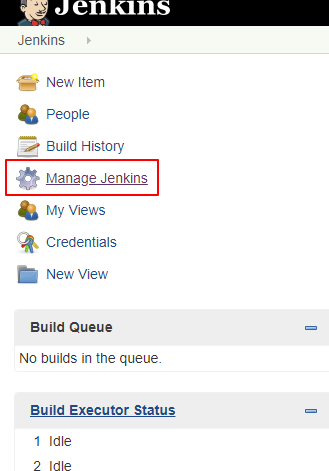

选择管理插件Manage Plugins:

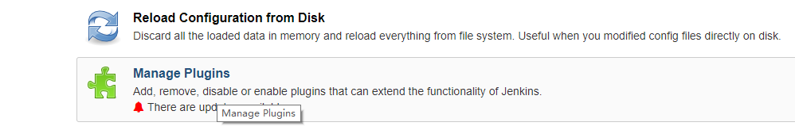

选择可用插件Avaliable，并在右侧Filter框输入插件名：

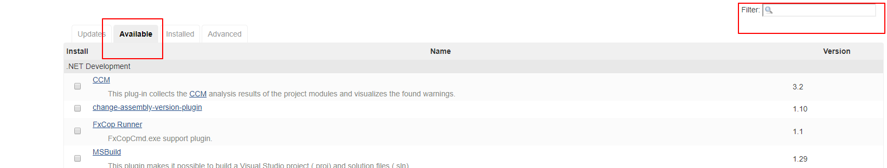

这里我们提前把需要的插件安装好:

1. maven集成插件：Maven Integration plugin;
1. Jenkins语言插件（可选）：Locale plugin;
1. 远程部署插件：Publish Over SSH;


选择Install without restart，表示免重启安装，旁边为重启生效。这里我们直接免重启安装即可。然后点击左上角Jenkins返回到主页，再次进入Jenkins配置界面，选择系统设置Configure System，找到Local配置，输入如下：


简体中文为ZH_cn，英文为EN_us，选择Ignore brower preference and force this language to all users表示忽略浏览器配置并且强制所有用户使用该语言。

# 持续集成配置
首先需要进行一系列环境的安装或配置，例如git/svn，maven，jdk，远程server等。
进入系统配置，选择全局工具配置，本机环境如图，如果本机没有安装可以选择自动安装，推荐提前安装好，并记住安装目录：

jdk：

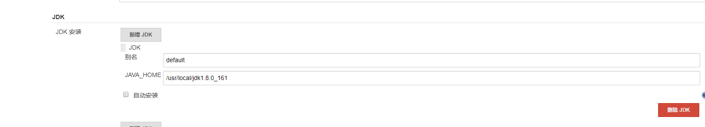

git:

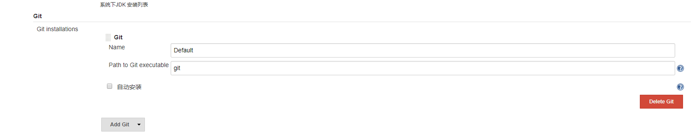

maven:

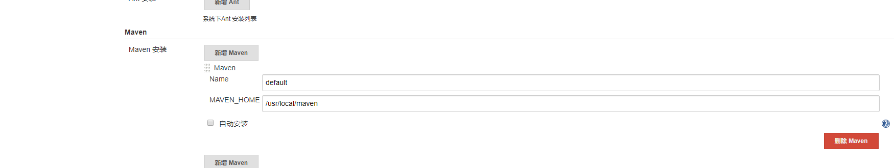

## 本地部署
在Jenkins主页选择新建任务，选择构建一个maven项目。需要说明的是，由于公司项目结构为父子模块项目，每次需要持续部署的都是某一个或者某几个模块。

所有子项目都在tubitu_project一个代码仓库里，如果配置了webhook（作用是收到远程仓库push来的提交信息）的话，任务一个子项目的代码推送，都会导致所有服务的自动重启，而由于公司没有正规的代码提交审计流程，所以一次提交一旦出现导致项目崩溃的代码会导致所有服务一同崩溃，基于此种原因，本文的每一个服务都是一个单独的部署任务，任务开发同学提交了哪个项目的代码只需要对应更新修改的项目即可，最终结果如下：

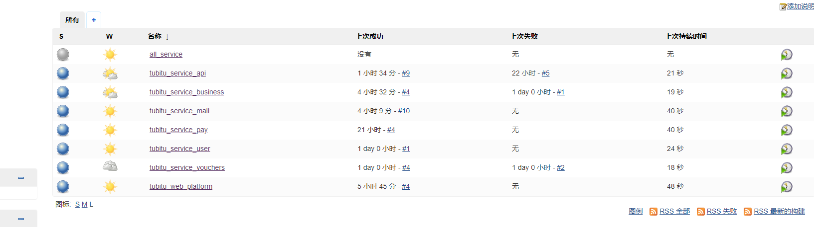

首先新建一个任务，选择构建一个maven项目，输入名称，确定，进入配置页面。
在General里勾选丢弃旧的构建，可以选择保持构建的天数和保持构建的最大个数（如果不选择会造成空间越来越大），避免空间浪费。
源码管理里选择git，选择远程仓库地址，并添加个人远程仓库的账户密码：

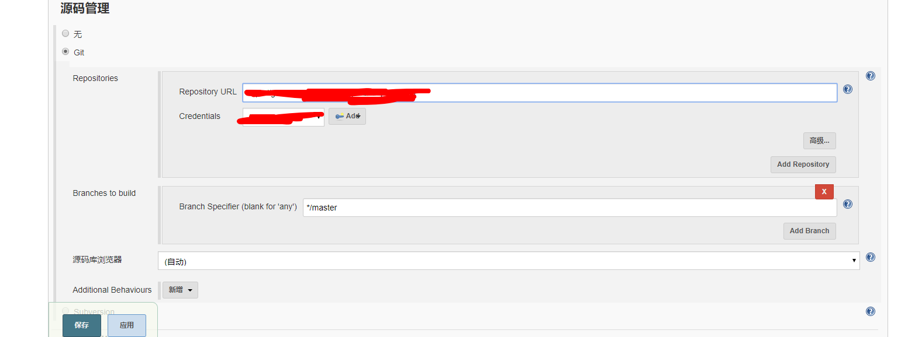

构建触发器里勾选Build whenever a SNAPSHOT dependency is built；
构建环境选择Add timestamps to the Console Output（非必选）；
Build在Goals and options里输入`clean install -pl tubitu_service_api -am`，其中-pl 代表打包指定module，可以`-pl module_name -pl module_name`指定打包多个项目，-am 代表自动打包指定module所依赖的模块。
Post Steps打包完成后勾选Run only if build succeeds，点击Add post-build step选择执行shell，脚本如下：

```bash
#首先停止项目
pid=`ps -ef | grep tubitu_service_api-1.0.0.jar | grep -v grep | awk '{print $2}'`
if [ -n "$pid" ]
then
   kill -9 $pid
fi
#删除旧的项目
rm -rf /usr/local/meilong/api/tubitu_service_api-1.0.0.jar
#复制Jenkins工作空间里的项目到指定目录下
cp $WORKSPACE/tubitu_service_api/target/tubitu_service_api-1.0.0.jar /usr/local/meilong/api/
#授权，该步骤可以省略
chmod u+x /usr/local/meilong/api/tubitu_service_api-1.0.0.jar
BUILD_ID=donKillme nohup java -jar -Dlogging.file=/usr/local/meilong/api/logs/tubitu.log /usr/local/meilong/api/tubitu_service_api-1.0.0.jar &
```

PS：BUILD_ID=dontKillme 指的是不要杀死最后一步启动项目产生的子进程。官网说明如下（[https://wiki.jenkins.io/display/JENKINS/ProcessTreeKiller](https://wiki.jenkins.io/display/JENKINS/ProcessTreeKiller)）：
> To reliably kill processes spawned by a job during a build, Jenkins contains a bit of native code to list up such processes and kill them. This is tested on several platforms and architectures, but if you find a show-stopper problem because of this, you can disable this feature by setting a Java property named "hudson.util.ProcessTree.disable" to the value "true".

> 为了可靠地终止构建过程中滋生出来的进程，Jenkins包含了一系列的本地代码去查出这些子进程并且杀死它们。这个已经在一些平台上进行了测试，如果你发现由此引发的停止显示的问题，你可以设置名为“hudson.util.ProcessTree.disable" 的java property为true来禁止使用ProcessTreeKiller自动杀死。
通常情况下，我们保持官方默认配置，所以推荐使用BUILD_ID=dontKillme 表示该进程不是由Jenkins来生成，也就不会被ProcessTreeKiller杀死。

配置完成以后，返回到Jenkins首页，在刚刚配置的任务点击最后一个按钮，或者点击任务名旁边的倒三角，选择立即构建，构建执行队列即会显示构建进度：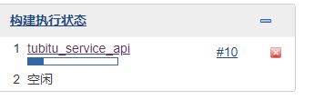

\#10代表第10次构建，鼠标移到10旁边，点击倒三角形，即可选择查看控制台输出构建和启动信息。当显示Finished:SUCCESS时，构建完成。
返回到Jenkins 主页，可以看到S一列下为蓝色，代表上一次构建情况，蓝色为成功，灰色为尚未构建，红色为失败，黄色为构建是不稳定的（即Jenkins不确定状态），W一列下有天气图标，代表近期构建状态，晴天代表近期全部成功，晴转多云代表有少数失败，依次类推。

## 远程部署
远程部署首先需要配置远程服务器的Ip地址和用户凭证。
返回主页，点击系统管理，然后点击系统设置，在Publish over SSH下找到SSH Servers，点击新增，分别配置好IP地址和用户名密码:
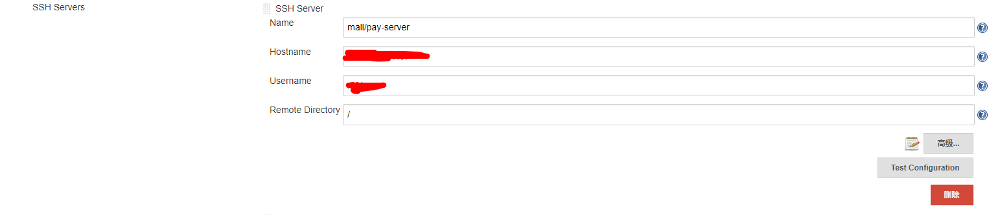

这里Remote Directory为Jenkins默认远程根目录，点击高级，勾选使用用户密码，并输入密码，然后点击Test Configuration测试是否连接成功：


新建一个任务tubitu_service_mall，前面基本保持一致，但是在Post Steps时，不再选择执行脚本，而是选择send files or execute commands over SSH。

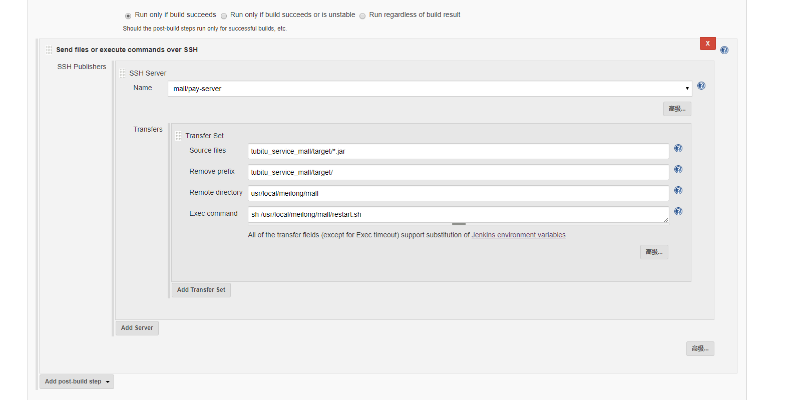

name选择上一步配置好的远程服务器，Source files默认会以本地当前任务的Jenkins工作空间+任务名为根路径，所以Source files只能配置相对路径，而Jenkins每一个任务默认的工作空间为/root/.jenkins/workspace/任务名，所以高i任务在本文中的工作空间全路径即为：/root/.jenkins/workspace/tubitu_service_mall，而由于构建依赖的pom文件又是父项目的pom文件，所以Source files为tubitu_service_mall/target/\*.jar，*代表所有的jar包。


Remove prefix代表传输到远程时需要移除的前缀：即移除到远程时会自动移除tubitu_service_mall/target/，只保留文件名。Remote directory代表传输到的目标路径。注意：这个目标路径也是相对路径，相对的是你在一开始配置SSH server时Remote Directory的目录，由于本文配置的是/，所以实际传输的远程目录为/usr/local/meilong/mall，如果一开始配置的是/usr/local/meilong，那么这里只需要配置Remote directory为mall。 


Exec command执行的脚本内容为：

```bash
#restart.sh
#!/bin/bash
APP_PATH=/usr/local/meilong/mall
APP_NAME=tubitu_service_mall-1.0.0.jar
LOG_FILE=$APP_PATH/logs/tubitu.log
echo "Restarting $APP_NAME SpringBoot Application"
pid=`ps -ef | grep $APP_NAME | grep -v grep | awk '{print $2}'`
source /etc/profile
if [ -n "$pid" ]
then
   kill -9 $pid
   echo "关闭进程："$pid
fi

echo "授予当前用户权限"
chmod u+x $APP_PATH/$APP_NAME
echo "执行....."
nohup java -jar -Dlogging.file=$LOG_FILE $APP_PATH/$APP_NAME >> /dev/null &
respid=`ps -ef | grep $APP_NAME | grep -v grep | awk '{print $2}'`
if [ -n "$respid" ]
then
    echo "启动成功，进程号：$respid" 
    exit 0
else
    echo "启动失败"
    exit 1
fi
done
```
> 注意：第8行，之所以要执行第8行，是因为Jenkins在执行远程脚本时，它是不会携带本机环境变量的，所以执行java会报command not found的错导致构建失败，解决办法有两个：
> 执行java命令时输入java的全路径，本文为/usr/local/jdk1.8.0_161/bin/java;
> 执行该脚本时，脚本内调用source /etc/profile，当然前提是在profile里配置java的环境变量。
> 如果没有遇到command not found的错，那么可以不加第8行。

推荐在Transfers里的高级选项里勾选Flattern files，代表扁平化传输文件，即只传输文件而不建立远程目录，避免创建一堆杂乱目录，前提是远程目录自己已经手动创建。
## 综合部署
本地部署+远程部署，基本步骤与前面两种应用一致，不再赘述，只贴出配置。

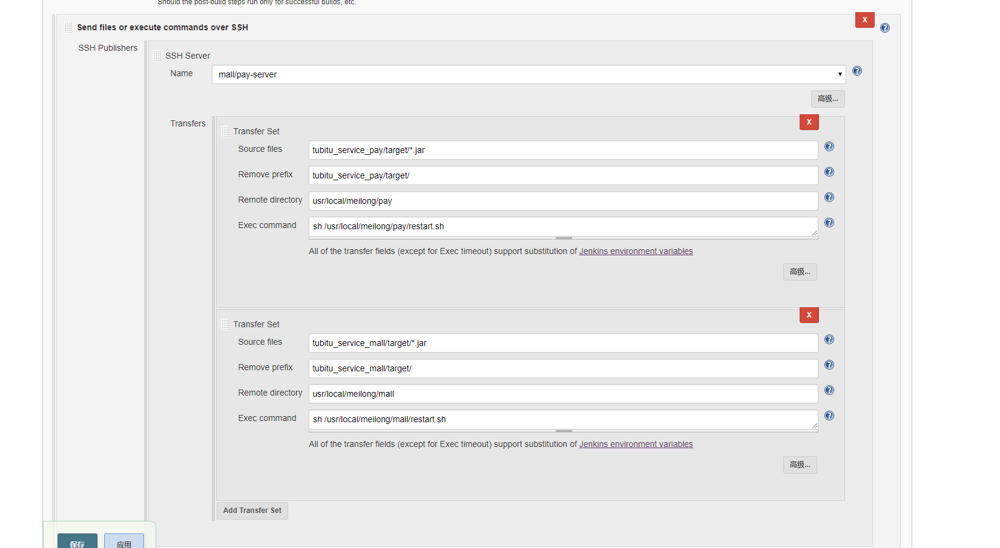

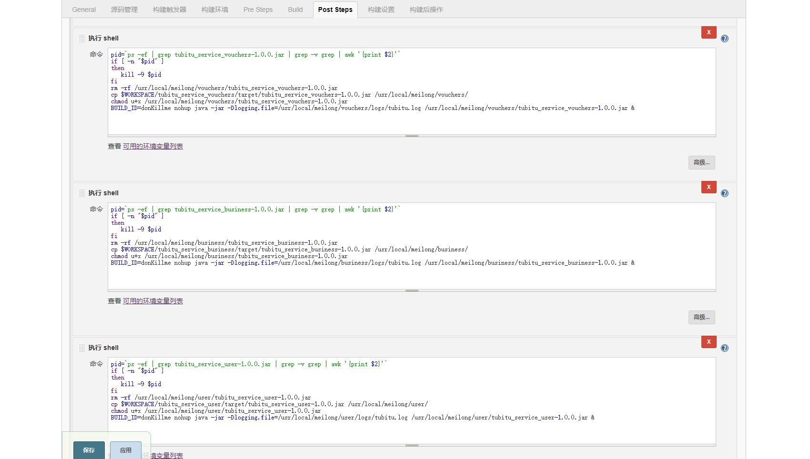
## 权限分配
个人还是习惯基于角色的权限分配方式，需要安装插件：Role-based Authorization Strategy。
进入到全局安全配置，启用该插件：

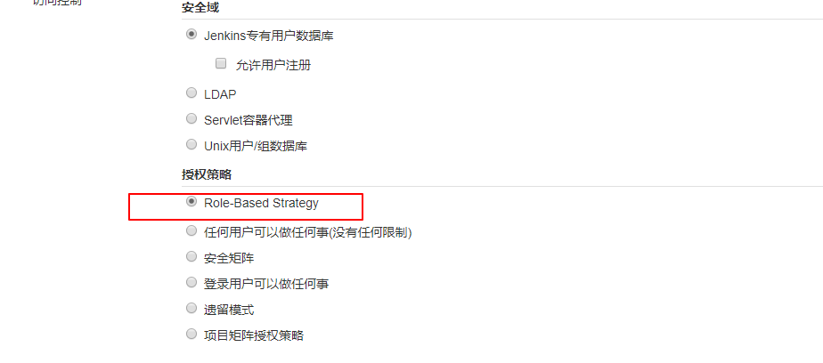

然后进入到系统管理，此时出现了Manage And Assign Roles的选项，首先选择manage roles。比如我想新增一个前端的角色，这个前端角色只能看到前端的构建任务，输入h5，点击新增，然后勾选全部/overall里的Read选项，该选项必选，否则会提示该角色没有所有的读取权限。
然后新增一个项目权限，也命名为h5，Pattern里写正则，h5_.*代表显示所有以h5_开头的构建项目，选择任务里的Build，Configure，Read，启用该角色对于任务的构建，配置和读权限，点击save。
然后在Jenkins的用户管理里新建一个用户，命名为h5，我这里的全名为tubitu_h5：


最后返回到Manage And Assign Roles主界面，选择Assign roles分配角色。

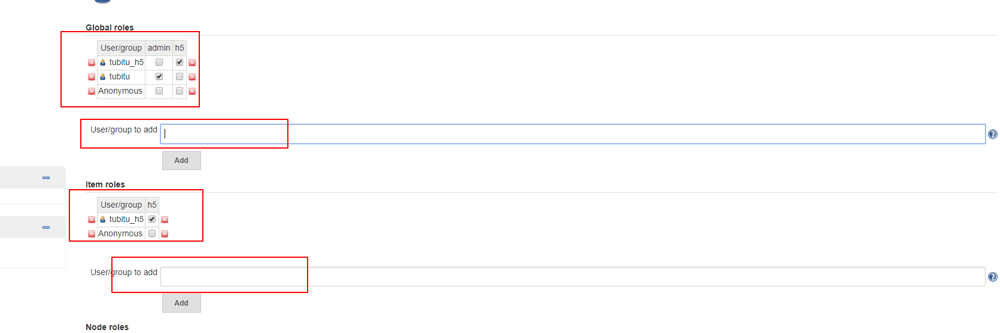

User/group to add框里输入h5（不需要输入全名，Jenkins会根据userId来找，userId=h5），然后点击Add，并勾选刚刚新建的h5的角色。
注销当前用户，使用h5用户登录，只能看到h5_的任务。
如果不小心分配错了权限，可以到jenkins的主目录下，例如Linux上的/root/.jenkins/目录下有一个config.xml文件，修改authorizationStrategy为hudson.security.FullControlOnceLoggedInAuthorizationStrategy，即可禁用基于角色的权限策略：

```xml
<useSecurity>true</useSecurity>
  <authorizationStrategy class="hudson.security.FullControlOnceLoggedInAuthorizationStrategy">
    <denyAnonymousReadAccess>true</denyAnonymousReadAccess>
  </authorizationStrategy>
  <securityRealm class="hudson.security.HudsonPrivateSecurityRealm">
    <disableSignup>true</disableSignup>
    <enableCaptcha>false</enableCaptcha>
  </securityRealm>
```