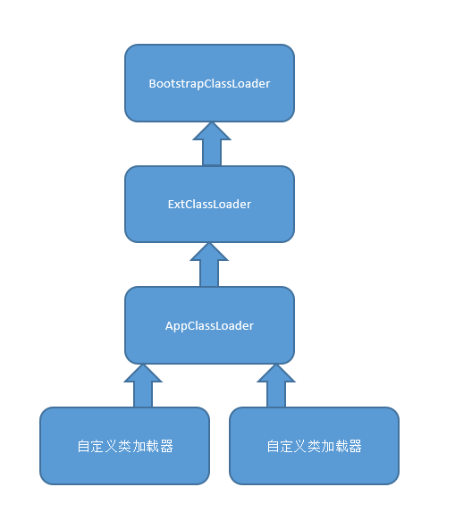
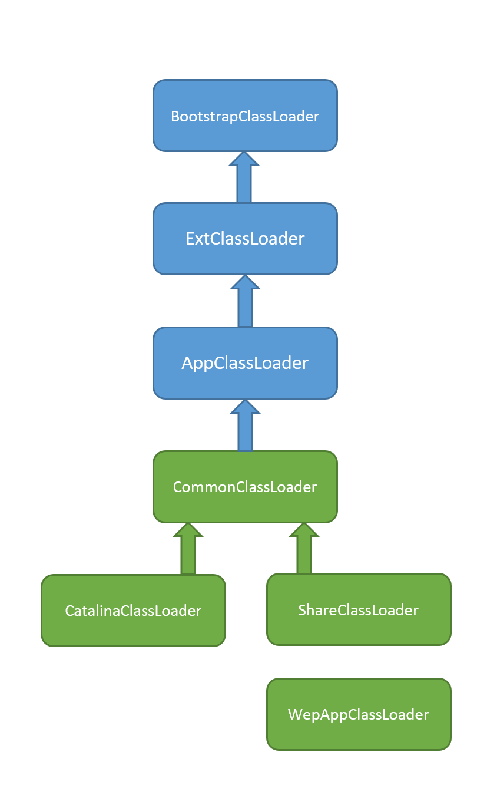

# 类加载

概念：将.class文件加载到JVM**方法区**，并在**堆区**创建一个java.lang.Class的对象实例 ，作为具体业务类对象实例。

时期：需要用到时才加载。

Java实现：`abstract class：ClassLoader`，包含`private final ClassLoader parent`、`public loadClass(String name)`，`protected findClass(String name)`。

步骤：

如果父加载器不为空，委托给父加载器加载（递归），否则查找bootstrap加载器是否加载过，最后才会调用自己的`findClass`方法。

findClass：从本地文件系统或者网络中寻找.class文件读入到内存；将读入内存的字节数组转成Class对象。

JDK类加载器:

- BootstrapClassLoader:启动类加载器，由C语言实现，加载rt.jar，resources.jar等；
- ExtClassLoader:扩展类加载器，加载jre\lib\ext目录下的jar；
- AppClassLoader:系统类加载器，加载classpath下的类，也是默认的应用程序类加载器。
- 自定义：用于加载自定义自定义路径下的类。

这种指向不是继承关系，而是parent指向了另一个ClassLoader，所以如果想打破双亲委派的话，只需要新写一个ClassLoader继承ClassLoader类再重写loadClass和findClass。

# Tomcat类加载器

WebAppClassLoader：打破双亲委派机制（重写loadClass方法），首先尝试自己去加载，然后才会去super.loadClass()。本地Cache-Tomcat类加载器-ExtClassLoader-本地目录搜索-AppClassLoader，使用ExtClassLoader是为了自己的重名类会覆盖JDK原声的类，所有优先使用Ext，Class.forName()默认是AppClassLoader。

原因：Servlet规定：至于这个类不覆盖Jre核心类，那么优先加载Web应用下的类。

结构如下：

CatalinaClassLoader：加载Tomcat自身启动所需要的类；

ShareClassLoader：加载Web应用之间共享的类；

CommonClassLoader：加载Tomcat和Web应用之间都需要用到的类。

# Spring的类加载问题

**JVM隐藏规则：如果一个类由类加载器A加载，那么这个类的依赖类也是由相同的类加载器加载。**

Spring 是通过Class.forName(String name)来加载业务类，可以看到加载业务类也是用的Spring的类加载器。

线程上下文：类加载器传递机制，保存在线程私有数据里，只要是同一个线程，一旦设置了线程上下文，后续执行过程中就可以取出该类加载器，每一个Web应用就是对应一个WebAppClassLoader，这样Spring在启动时就将线程上下文加载器取出来用来加载Bean。