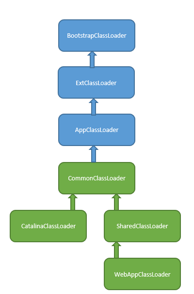

# 类加载

概念：将.class文件加载到JVM**方法区**，并在**堆区**创建一个java.lang.Class的对象实例 ，作为具体业务类对象实例。

时期：需要用到时才加载。

Java实现：`abstract class：ClassLoader`，包含`private final ClassLoader parent`、`public loadClass(String name)`，`protected findClass(String name)`。

步骤：

如果父加载器不为空，委托给父加载器加载（递归），否则查找bootstrap加载器是否加载过，最后才会调用自己的`findClass`方法。

findClass：从本地文件系统或者网络中寻找.class文件读入到内存；将读入内存的字节数组转成Class对象。

JDK类加载器:

- BootstrapClassLoader:启动类加载器，由C语言实现，加载rt.jar，resources.jar等；
- ExtClassLoader:扩展类加载器，加载jre\lib\ext目录下的jar；
- AppClassLoader:系统类加载器，加载classpath下的类，也是默认的应用程序类加载器。
- 自定义：用于加载自定义自定义路径下的类。

这种指向不是继承关系，而是parent指向了另一个ClassLoader，所以如果想打破双亲委派的话，只需要新写一个ClassLoader继承ClassLoader类再重写loadClass和findClass。

# Tomcat类加载器

结构：

CommonClassLoader：加载那些能在Web应用和Tomcat之间共享的类；

SharedClassLoader：Web应用之间能够共享的类，比如Spring；

CatalinaClassLoader：加载Tomcat自身需要的类；

WebAppClassLoader：每一个Web应用都有自己的WebAppClassLoader，打破了双亲委派，它会首先从本地缓存查找是否加载过，然后再去使用父加载器去查找，如果没有接着会使用ExtClassLoader（也可以说会使用BootstrapClassLoader，避免Web应用的类覆盖JRE类），然后会在本地文件系统中查找，最后会交由系统类加载器（因为Class.forName默认使用的就是AppClassLoader）。

> Spring 加载也是通过Class.forName的方式加载的，并且Spring加载Bean也是用的加载Spring的类加载器。

*通常Spring是用SharedClassLoader来加载，但是业务类又应该使用WebAppClassLoader来加载，所以Tomcat在启动的时候会设置线程上下文加载器，Spring在启动时可以通过`Thrad.currentThread().getContextClassLoader()`来获取类加载器来加载业务类。*

# 总结

* 第三方Jar包加载特定Web应用的类，可以通过线程上下文加载器来实现；
* 每个WEB应用自己的Java类文件和JAR包，分别放在WEB-INF/lib和WEB-INF/classes目录中；
* 多个WEB应用共享类，放在Web容器指定的共享目录下。