# CMS 和 G1

CMS将整个堆分成了新生代、老年代两大部分，新生代分为Eden和Survivor，新的对象通常情况下都在Eden区域创建，收集一次以后如果对象还在则会转移到Survivor区域，收集多次达到一定次数对象还在的话就会转移到老年代。**分代收集是为了更好地管理和回收对象**，因为每个代对对象管理的方法不一样。


G1使用非连续空间，所以它能够管理更大的堆，同时能够并发完成大部分GC的工作，这期间不会发生STW；G1管理的每个区域都称之为region，它的固定大小通常为2m。

<!--more-->

# 调优原则

CMS：合理设置新生代和老年代的大小；

G1：设置堆总的大小和GC最大停顿时间：`-XX:MaxGCPauseMillis`;

# JVM调优

## 工具

Apache Jmeter：5.1.1，[https://jmeter.apache.org/download_jmeter.cgi](https://jmeter.apache.org/download_jmeter.cgi)；

GCViewer：JDK 8使用 1.3.5的Release版本即可，如果是JDK 8以上，需要下载1.3.5以上的版本，没有的话可能需要自己下载当前最新代码进行构建，[https://github.com/chewiebug/GCViewer](https://github.com/chewiebug/GCViewer)。

## 代码

创建一个Spring Boot程序（Spring Boot 2.1），只需要mvc依赖即可，测试代码如下：

```java
@RestController
public class GcTestController {
		//公有的全局变量，队列里数量到达200000即进行回收，用来模仿老年代对象
    private Queue<Greeting> objCache = new ConcurrentLinkedQueue<>();

    @GetMapping("/greeting")
    public Greeting greeting(){
        Greeting greeting = new Greeting("Hello World");
        if (objCache.size() > 200000) objCache.clear();
        else objCache.add(greeting);
        return greeting;
    }
}

@Data
@AllArgsConstructor
class Greeting{
    private String message;
}
```

JDK8 下，启动参数如下：

`java -Xmx32m -Xss256k -verbose:gc -Xloggc:gc-pid%p-%t.log -XX:+PrintGCDetails -jar target/tomcat-jetty-test-0.0.1-SNAPSHOT.jar`。

JDK 9以及以上，启动参数如下：

`java -Xmx32m -Xss256k -verbosegc -Xlog:gc*,gc+ref=debug,gc+heap=debug,gc+age=trace:file=gc-%p-%t.log:tags,uptime,time,level:filecount=2,filesize=100m`

32M方便看到Full GC，`-verbose:gc`打印GC日志，`-xloggc:gc`用于生成gc日志文件，后面是文件名格式，`PrintGCDetails`打印日志详情包括停顿时间等。使用Jmeter工具创建一个线程组，并创建一个Http请求，持续时间为15分钟。

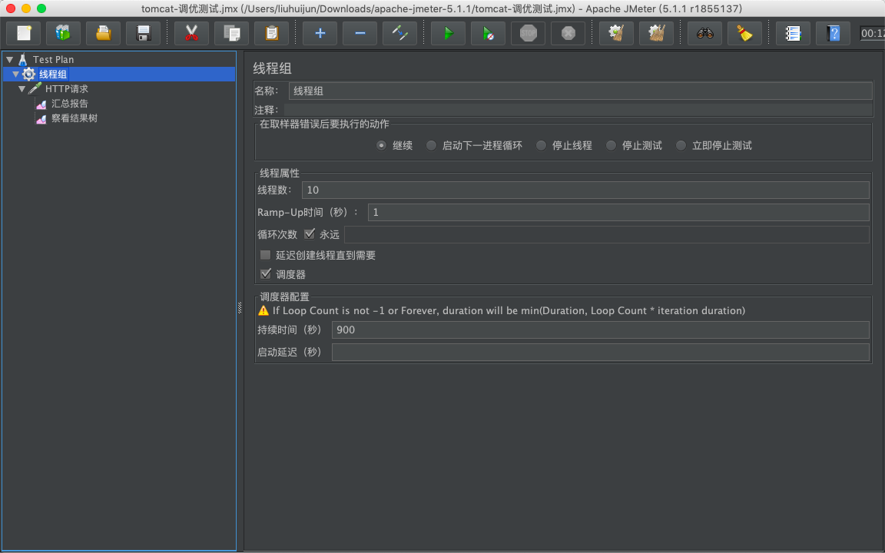

15分钟以后，使用GCviewer打开gc日志，结果如下：

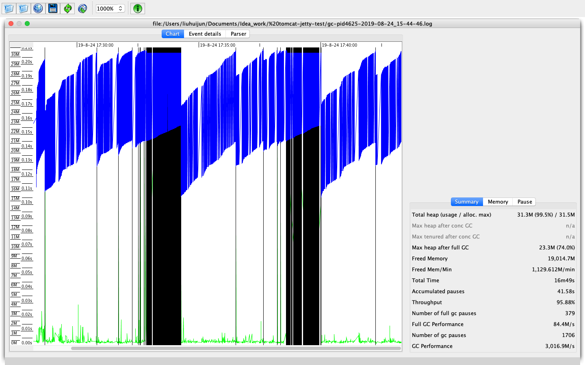

这里只勾选了上面view工具栏中的蓝色、黑色、绿色这三条线，蓝色代表使用的堆，黑色代表进行了full gc，密集绿色代表了总的GC。可以得出结论：

* 堆的使用率提升导致了新生代频繁GC（绿色线）；
* full gc以后堆内存降低，不是内存泄漏。

所以判断出，这是堆内存不够，因为绿色线和黑色线都比较密集。

调大内存，再试一试15分钟Jmeter：

`java -Xmx1024m -Xss256k -verbose:gc -Xloggc:gc-pid%p-%t.log -XX:+PrintGCDetails -jar target/tomcat-jetty-test-0.0.1-SNAPSHOT.jar`

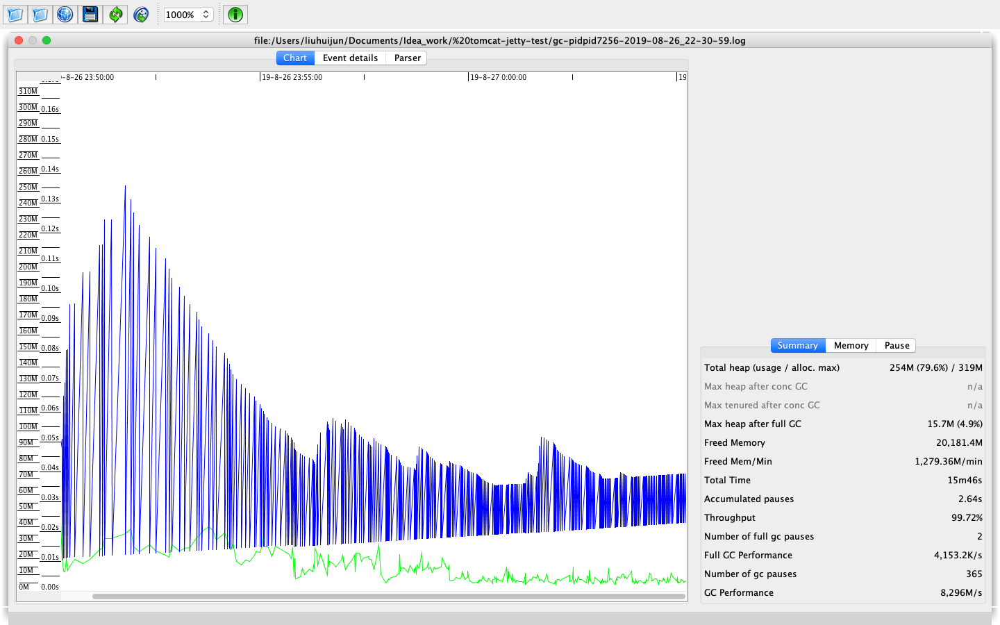

可以看到没有了Full GC，并且新生代GC没有上一幅图那么频繁密集，而GC停顿时间也只有2.6秒，比上图15秒好太多了。

# 监控

为了模拟服务端Tomcat的监控，改造一下上节的spring boot项目，主要是pom文件里的两个依赖：

```xml
		<dependency>
			<groupId>org.springframework.boot</groupId>
			<artifactId>spring-boot-starter-web</artifactId>
			<exclusions>
				<exclusion>
					<artifactId>spring-boot-starter-tomcat</artifactId>
					<groupId>org.springframework.boot</groupId>
				</exclusion>
			</exclusions>
		</dependency>

		<dependency>
			<groupId>org.springframework.boot</groupId>
			<artifactId>spring-boot-starter-tomcat</artifactId>
			<scope>provided</scope>
		</dependency>
```

然后修改启动类中的代码：

```java
@SpringBootApplication
public class Application extends SpringBootServletInitializer {

    @Override
    protected SpringApplicationBuilder configure(SpringApplicationBuilder builder) {
        return builder.sources(Application.class);
    }

    public static void main(String[] args) {
        SpringApplication.run(Application.class, args);
    }

}
```

如果提示缺少javax的jar包，在pom文件中引入并将scope填写为provided即可。

这样就可以放到外置的Tomcat容器中运行了，在启动外置Tomcat之前，还需要编辑一个脚本文件setenv.sh，写入以下脚本：

```sh
export JAVA_OPTS="${JAVA_OPTS} -Dcom.sun.management.jmxremote"
export JAVA_OPTS="${JAVA_OPTS} -Dcom.sun.management.jmxremote.port=9001"
export JAVA_OPTS="${JAVA_OPTS} -Djava.rmi.server.hostname=x.x.x.x"
export JAVA_OPTS="${JAVA_OPTS} -Dcom.sun.management.jmxremote.ssl=false"
export JAVA_OPTS="${JAVA_OPTS} -Dcom.sun.management.jmxremote.authenticate=false"
```

放到tomcat的bin目录下，这样即可设置好环境变量，但是使用bin目录下shutdown.sh关闭时可能会报`address already in use`的错，猜测是在执行该脚本的时候又执行了setenv.sh文件，所以报了地址被占用的错。推荐在bin目录下再写一个脚本：

```sh
#! /bin/sh
source /etc/profile
ps -ef | grep tomcat | grep -v grep | awk '{print $2}'| xargs kill
sh /usr/local/tomcat9/bin/startup.sh 
```

用于重启tomcat。

输入`jconsole x.x.x.x:9001`打开jconsole界面，这里主要记录**吞吐量、响应时间、错误数、线程池、CPU、JVM情况**等。

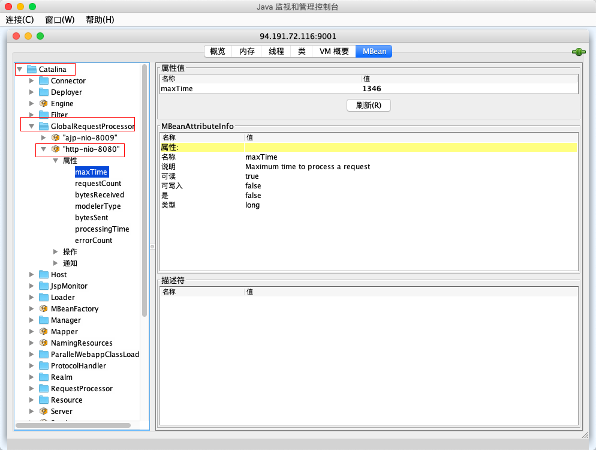

`maxTime:`最长响应时间；

`processTime:`平均响应时间；

`requestCount:`吞吐量；

`errorCount:`错误数。

线程标签可以看到线程的堆栈和等待状态，以及堆栈；内存标签能够看到各个区的空间使用量，VM概要能够看到JVM的基本信息。

命令行可以使用以下方式：

```sh
ps -ef | grep tomcat
cat /proc/30086/status 
```

其中30086就是tomcat的pid，然后使用`top -p 30086`可以看到该进程所占用的系统资源。

## 工具

和上一节一样。

## 实战

在controller添加代码：

```java
		@GetMapping("/greeting/latency/{seconds}")
    public Greeting delayGreeting(@PathVariable Long seconds){
        try {
            TimeUnit.SECONDS.sleep(seconds);
        } catch (InterruptedException e) {
            log.error("睡眠异常", e);
        }
        Greeting greeting = new Greeting("Hello Second");
        return greeting;
    }
```

通过url传入参数来达到睡眠的效果。

使用Jmeter测试，分为三个阶段，即睡眠2s、睡眠4s和睡眠6s来测试，同时设置线程组响应超时为1000ms（这样Jemeter就不会等到请求返回），100个线程。得到如下结果：

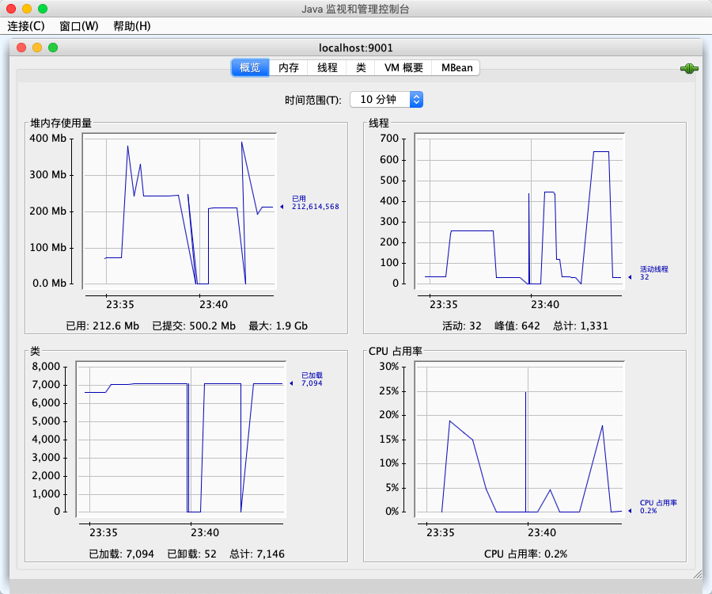

图中有几条不和谐的线是当时由于连接数太多导致Jconsole丢失连接，所以线程数降为0。

首先看线程，一开始压测未开始的时候只有30条线程左右，等到2s睡眠的压测开始以后，由于睡眠2s才会返回数据，所以同时有200条线程在运行，加上一些负责网络通线和后台任务，线程一共差不多250条左右；第一阶段停止后，又下降到40（不是0，为0是因为第二阶段压测开始，丢失连接导致无法正确获取数据），第二阶段需要450条线程，第三阶段需要650条左右线程。

再看内存，基本上随着线程的增加，创建线程导致内存的消耗也会提高。

最后看CPU，基本上CPU的峰值稳定，只要吞吐量一定，CPU的占用率基本保持一定。

# I/O和线程池调优

## I/O选择

 NIO：Tomcat默认的连接器，大多数场景够用；

ARP：适用于 TLS加密传输的场景，通过OpenSSL（C语言实现）实现；

NIO2：用于Windows系统，因为Linux的异步本质上和NIO的底层都是通过epoll实现，相比而言NIO会更简单高效。

## 线程池调优

线程池核心参数：

- threadPriority（优先级，默认是5）；
- daemon（是否后台线程，默认是tue）；
- namePrefix（线程前缀）；
- **maxThreads**（线程池中最大线程数，默认是200）；
- minSpareThreads（最小线程数、线程空闲超过一定时间会回收，默认是25）；
- maxIdleTime（线程最大空闲时间，超过该时间就会回收，默认是一分钟）；
- maxQueueSize（任务队列长度，默认是Integer.MAX_VALUE）;
- prestartminSpareThreads（是否在线程池启动时就创建最小线程数，默认为false）。

重点是最大线程数，如果过小，会产生线程饥饿，大量任务等待；如果过大，会耗费大量的cpu资源和内存资源。

## 利特尔法则（Little`s Law）

`系统中请求数 = 请求到达速率 * 每个请求处理时间`

对应：

`线程池大小 = 每秒请求数 * 平均请求处理时间`

上面是理想公式，不考虑I/O的情况，如果是**I/O密集型**任务，那么需要更多线程。

考虑综合情况：

`线程池大小 = （线程I/O阻塞时间+线程CPU时间） / 线程CPU时间`

其中上面公式中括号里的`I/O阻塞时间 + 线程CPU时间 =  平均处理时间`；

根据上面两个公式，可以得到下面三个结论：

1. 请求处理时间越长，需要的线程数越多；
2. 请求处理过程中，I/O等待时间越长，需要的线程数越多；
3. 请求进来的速率越快，需要的线程数越多。

**实际上，线程池个数是先用上面两个公式算出大概的数字（先用较小的值），然后通过压测调整从而达到最优。**

先设置一个较小的值，通过压测发现错误数增加或者响应时间大幅度增加等情况，就调大线程数，如果发现线程数增大并没有提升TPS甚至下降，那这个值可以认为是最佳线程数。

# OOM分析

***Java heap space***

原因可能有三种：

1. 内存泄漏；
2. 配置过低；
3. finalize方法的过度使用，添加了该方法的对象实例会被添加到"java.lang.ref.Finalizer.ReferenceQueue"的队列中，直到执行了finalize()了以后才会回收。

解决：通过heap dump日志以及stack信息追踪，适当调大配置，不使用finalize方法。

***GC overhead limit exceeded***

垃圾收集器一直在运行，但是效率很低。

解决：查看GC日志或者生成Heap Dump。

***Requested array size exceeds VM limit***

尝试请求了一个超出VM限制的数组。

解决：调大配置，或者是代码计算错误。

***MetaSpace***

元空间耗尽，可能本地空间耗尽或者分配的太小。

***Request size bytes for reason. Out of swap space***

本地堆内存或者本地内存快要耗尽。

解决：需要根据JVM抛出的错误信息来进行诊断，或者使用操作系统的DTrace工具来跟着那个系统调用。

***unable to create native threads***

步骤：

1. 请求新线程；
2. JVM本地native code代理该请求向操作系统申请创建native thread；
3. 操作系统尝试创建native thread，并分配`-Xss`线程栈；
4. 由于各种原因，分配失败，抛出上述异常。

`用户空间内存 = 堆内存 + 元数据空间内存 + 线程数 * 栈空间`，由于内存空间的不足导致了创建线程创建失败。

Linux的系统限制也会导致该情况，执行`ulimit -a`，看到以下结果：

```sh
[root@VM_0_8_centos ~]# ulimit -a
core file size          (blocks, -c) 0
data seg size           (kbytes, -d) unlimited
scheduling priority             (-e) 0
file size               (blocks, -f) unlimited
pending signals                 (-i) 7281
max locked memory       (kbytes, -l) 64
max memory size         (kbytes, -m) unlimited
open files                      (-n) 100001
pipe size            (512 bytes, -p) 8
POSIX message queues     (bytes, -q) 819200
real-time priority              (-r) 0
## 线程栈大小
stack size              (kbytes, -s) 8192
cpu time               (seconds, -t) unlimited
## 用户最大进程限制
max user processes              (-u) 7281
virtual memory          (kbytes, -v) unlimited
file locks                      (-x) unlimited
```

可以使用`ulimit -u 65535`进行修改。

系统中`sys.kernal.threads-max`限制了全局的系统参数：

```sh
[root@VM_0_8_centos ~]# cat /proc/sys/kernel/threads-max 
14563
```

可以在`/etc/sysctl.conf`配置文件中，加入`sys.kernal.threads-max=99999`；

`sys.kernal.pid_max`限制了系统全局的PID号数值的限制，每一个线程都有自己的id，id超过这个值线程就会创建事变。同样可以在`/etc/sysctl.conf`加入`sys.kernal.pid_max=99999`。

## 内存泄漏实战

使用上面的程序，写入代码：

```java
@Slf4j
@Component
public class MemLeader {

    private List<Object> objs = new LinkedList<>();

    @Scheduled(fixedRate = 1000)
    public void run(){
        log.info("scheduler run");
        for (int i = 0; i < 50000 ; i++){
            objs.add(new Object());
        }
    }

}
```

每秒启动一次定时job，记住要在启动类加上`@EnableScheduling`，模拟内存泄漏，然后使用`jps`和`jstat -gc pid 2000 1000`观察内存分配情况。


其中参数简介如下：

- S0C：表示第一个Survivor总大小；
- S1C：第二个Survivor总大小；
- S0U：第一个Survivor已使用的大小；
- S1C：第二个Survivor已使用的大小。

后面的E表示Eden区域，O表示Old区域，M表示Metaspace，CCSC压缩空间，YGC是指YoungGC，FGC是FullGC。使用gcviewer打开gc.log文件，如下：


蓝色的是堆内存，粉红色线是老年代的使用内存，黑色线是full GC，可以看到后期在频繁地进行full gc，但是堆内存和老年代的内存并没有降下来，此时我们需要使用` jmap -dump:live,format=b,file=153232.bin 153232`将堆内存情况转储下来，并借助Eclipse Memory Analyzer（下载地址[https://www.eclipse.org/mat/downloads.php](https://www.eclipse.org/mat/downloads.php)）打开dump文件进行分析。

# 网络优化

***java.net.SocketTimeoutException***

连接超时或者读取超时，即Socket.connect或者Socket.read超时，连接超时通常是由于网络不稳定造成的，但是读取超时可能是由于下游服务响应时间过长造成。

***java.net.BindException:Address already in use:JVM_Bind***

端口被占用，可以用`netstat -an`查看，并换一个端口。

***java.net.ConnectException:Connection refused:connect***

指定IP地址没有找到；或者是指定IP没有开辟指定的端口号。

***java.net.SocketException:Socket is closed***

一方关闭了连接，但是另一方又调用了读写操作。

***java.net.SocketException:Connection reset/Connect reset by peer:Socket write error***

一方在读写数据的时候另一方关闭了连接，或者退出了程序。

tips：网络通信编程要保证程序退出前要关闭所有的网络连接，检测另一方的关闭连接操作，检测到的同时自己也要关闭。

***java.net.SocketException:Too many open files***

进程打开文件句柄数超过限制，`lsof -p pid`可以看到进程打开了哪些文件，是不是又资源泄漏的情况。

## 网络参数

三次握手：客户端向服务端发送SYN，服务端回复SYN+ACK，同时将这个处于SYN_RECV状态的连接保存到半连接队列，客户端返回ACK，同时服务端将处于ESTABLISHED状态的连接放入accept队列，等待应用程序比如tomcat调用accept方法从队列中取走。

半连接队列：保存SYN_RECV状态的连接，由`net.ipv4.tcp_max_syn_backlog`设置；

accept队列：保存ESTABLISHED状态的连接，队列长度为min(net.core.somaxconn,backlog)，backlog是创建ServerSocket时指定的参数，也就是Tomcat的acceptCount参数，默认是100，但是`net.core.somaxconn`（该参数位于`/etc/sysctl.conf`里，修改该文件后需要执行`sysctl -p`）默认是128，所以当高并发请求进入时，会导致accept队列快速积满，然后产生`connection reset`的错误。

`maxConnection`是Tomcat在任意时刻接收和处理的最大线程数，当接受的连接数到达该最大值时，Accept线程不会从accept队列中取走数据，导致数据越积越多。

NIO默认是10000，ARP默认是8192。

# CPU占用

JVM在峰值下的负载常常为40%，如果飙升到80%可以认为不合理。

问题定位：

1. 找到哪些线程在大量消耗CPU资源，通过线程栈；
2. 如果1不存在，猜测是不是大量的线程上下文切换。

实战，新增一个定时任务：

```java
		private ExecutorService executorService = Executors.newFixedThreadPool(4096);
    private int  count;
    @Scheduled(fixedRate = 10)
    public void lockContention(){
        IntStream.range(0,1000000).forEach(i -> executorService.submit(this::increamSync));
    }

    private synchronized void increamSync(){
        count = (count + 1) % 100000;
    }
```

设置栈`-Xss256k`防止出现OOM，然后启动该程序，使用top命令，结果如下：

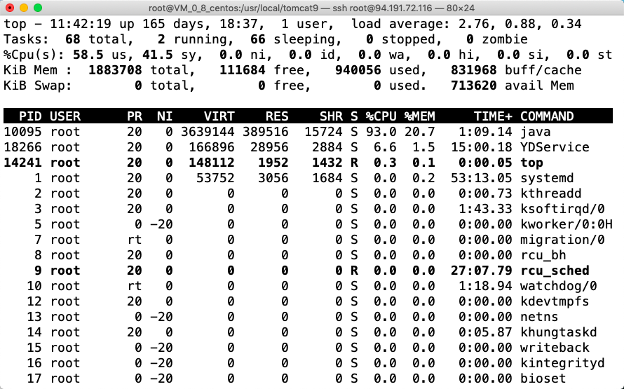

发现Java进程占用了93%的CPU资源，使用`top -H -p 10095`可以看到进程内更详细的信息：

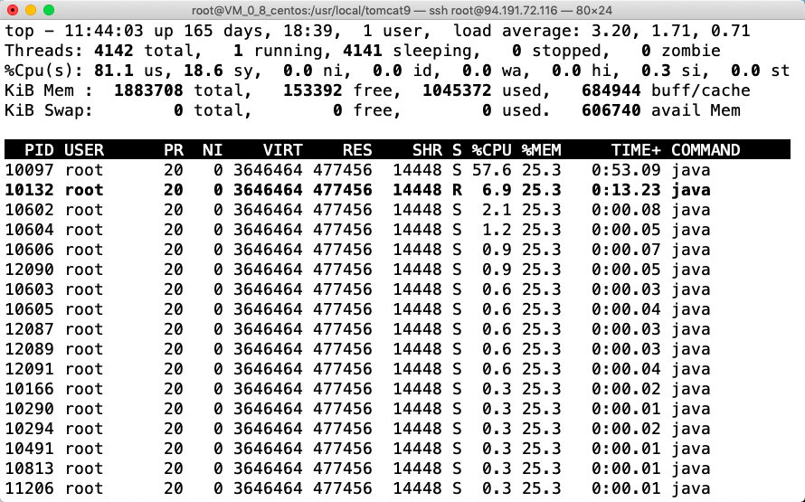

这里可以看到各个线程的一个资源占用情况，由于这里各个线程都没有显示名称，所以更近一步的情况不太好看到，这里记载一下如果能够看到更详细的线程名字时下一步的做法：

```sh
# 输出堆栈信息到log文件里，可以在log文件里查看具体信息
jstack 10095  > 10095.log
# 查看pool-1-thread 在日志文件中出现的数量，可以粗略判断占用情况
grep -o 'pool-1-thread' 10095.log | wc -l
```

进入到日志文件里查看某个线程的状态，这里要理解Java中线程的几种状态：

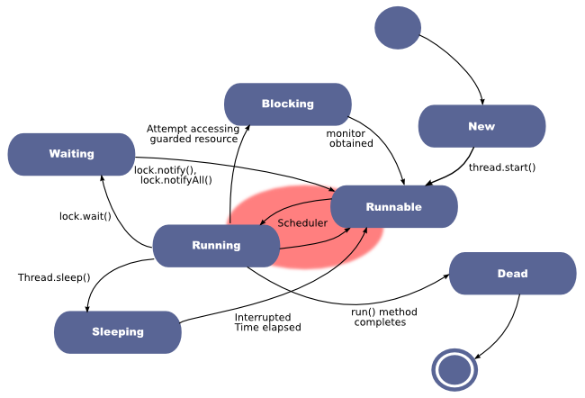

如果看到大量线程处于**blocking**状态，则证明：在等待锁的释放；

如果看到大量线程处于**waiting**状态，则证明：在等待其他线程执行某项操作。

详细的进程内信息表明只占用了不到79%的CPU，那么剩下的CPU开销猜测有可能是发生了大量的线程上下文切换导致的，使用vmstat（[https://linux.die.net/man/8/vmstat](https://linux.die.net/man/8/vmstat)）可以查看：

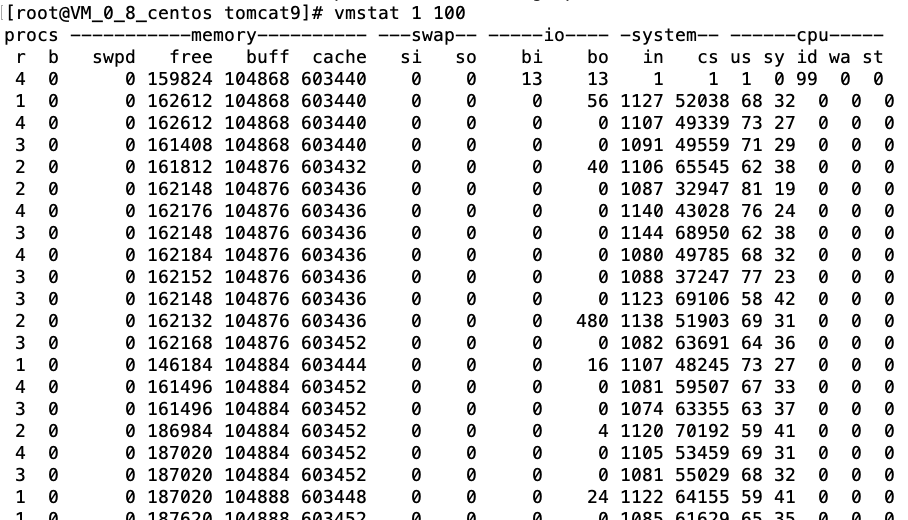

其中，in是CPU中断次数，cs是上下文切换次数。此时我再把这个Java进程停掉，再次查看信息：

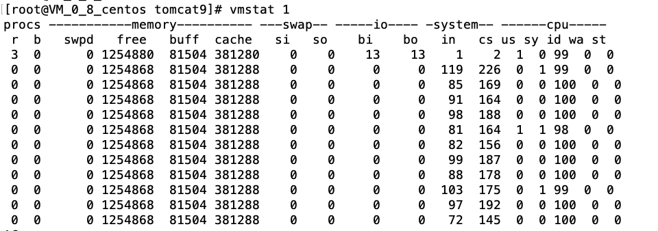

表明就是该Java进程占用了大量CPU资源。

# Jetty性能调优

## 操作系统层面

参数主要在`/etc/security/limits.conf`中，或者直接使用`sysctl`命令进行配置，这些配置理论来说，对于Tomcat也是实用的。

```
## 调整TCP的发送和接收缓冲区
sysctl -w net.core.rmem_max = 16777216
sysctl -w net.core.wmem_max = 16777216
sysctl -w net.ipv4.tcp_rmem =“4096 87380 16777216”
sysctl -w net.ipv4.tcp_wmem =“4096 16384 16777216”
## 控制TCP连接队列大小
sysctl -w net.core.somaxconn = 4096
## 传入数据队列的大小
sysctl -w net.core.netdev_max_backlog = 16384
sysctl -w net.ipv4.tcp_max_syn_backlog = 8192
sysctl -w net.ipv4.tcp_syncookies = 1
## 增加可用端口范围，允许在TIME_WAIT中重用套接字
sysctl -w net.ipv4.ip_local_port_range =“1024 65535”
sysctl -w net.ipv4.tcp_tw_recycle = 1
```

高负载服务器的文件句柄数很容易耗尽，可以在`/etc/security/limits.conf`文件中增加以下配置：

```
用户名 hard nofile 40000
用户名 soft nofile 40000
```

获取内核可用的拥塞控制算法：`sysctl net.ipv4.tcp_available_congestion_control`;

推荐设置为cubic：`sysctl -w net.ipv4.tcp_congestion_control = cubic`

## 容器层面

Acceptor的个数大于等于1并且小于等于CPU核数：因为每个Acceptor是和每一个线程绑定的；

ThreadPool大小 = 应用的TPS `*` 任务最多在等待队列中存在的时间；

线程池合理配置，根据压测数据进行调整，线程池的提升同时也需要提升堆内存，通常线程池数量在50-500之间；

## Jetty性能测试

首先下载Jetty容器jar包：[https://repo1.maven.org/maven2/org/eclipse/jetty/aggregate/jetty-all/9.4.19.v20190610/jetty-all-9.4.19.v20190610-uber.jar](https://repo1.maven.org/maven2/org/eclipse/jetty/aggregate/jetty-all/9.4.19.v20190610/jetty-all-9.4.19.v20190610-uber.jar)；

然后下载apache benchmark 的包，ab集成在了apache中，下载httpd即可：[http://httpd.apache.org/download.cgi](http://httpd.apache.org/download.cgi)，安装过程与Nginx类似，即configure - make - make install的步骤，详情参考：[Nginx安装实践](https://blog.guitar-coder.cn/Nginx%E5%AE%89%E8%A3%85%E5%AE%9E%E8%B7%B5.html)；

编写一个Java文件HelloWorld.java，代码如下：

```java
import org.eclipse.jetty.server.*;
import org.eclipse.jetty.server.handler.AbstractHandler;
import org.eclipse.jetty.util.thread.QueuedThreadPool;

import javax.servlet.ServletException;
import javax.servlet.http.HttpServletRequest;
import javax.servlet.http.HttpServletResponse;
import java.io.IOException;

/**
 * @description:
 * @author: 刘会俊
 * @date: 2019-09-01 16:28
 */
public class HelloWorld extends AbstractHandler {

    @Override
    public void handle(String target, Request baseRequest, HttpServletRequest request, HttpServletResponse response) throws IOException, ServletException {
        response.setContentType("text/html; charset=utf-8");
        response.setStatus(HttpServletResponse.SC_OK);
        response.getWriter().println("<h1>Hello World</h1>");
        baseRequest.setHandled(true);
    }

    public static void main(String[] args) throws Exception {
        // 根据传入的参数控制线程池中最大线程数的大小
        int maxThreads = Integer.parseInt(args[0]);
        System.out.println("maxThreads:" + maxThreads);

        // 创建线程池
        QueuedThreadPool threadPool = new QueuedThreadPool();
        threadPool.setMaxThreads(maxThreads);
        Server server = new Server(threadPool);

        ServerConnector http = new ServerConnector(server,
                new HttpConnectionFactory(new HttpConfiguration()));
        http.setPort(8000);
        server.addConnector(http);

        server.start();
        server.join();
    }
}
```

将jetty的包改名为jetty.jar，并复制到HelloWorld.java同一目录下；

使用Jetty的包编译自己的Handler：`javac -cp jetty.jar HelloWorld.java`；

启动jetty，线程池大小为4：`java -cp .:jetty.jar HelloWorld 4`;

启动ab（20万个请求，100个线程同时发送）：`ab -n 200000 -c 100 http://localhost:8000/`；

(实验中出了些问题，导致访问localhost:8000/的时候一直404所以以下为别人的测试结果)：

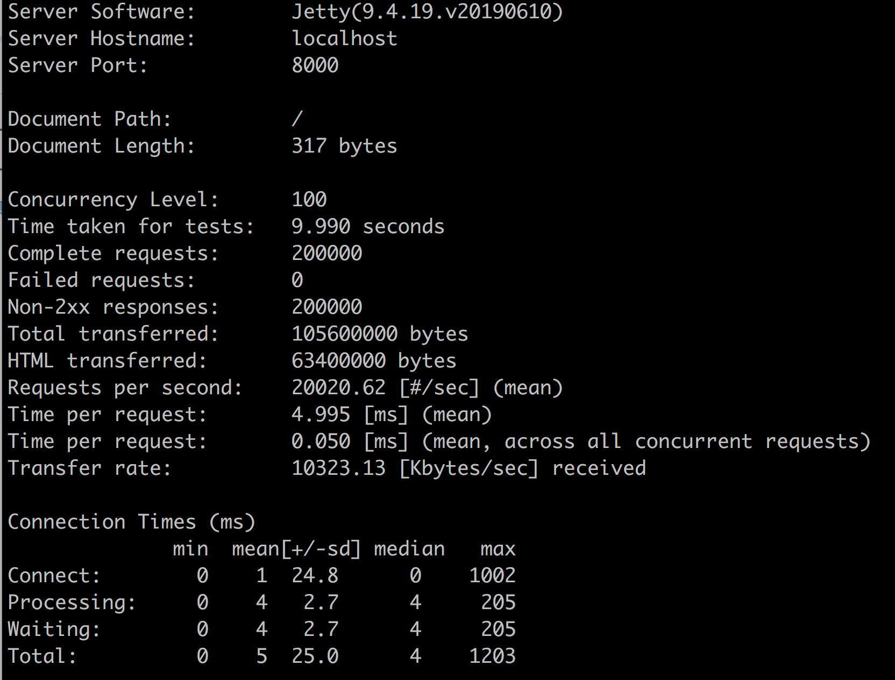

RPS达到了20020，此时逐渐调大线程数到6，8，16等，结果如下：

| maxThread | 4     | 6     | 8     | 16    | 128   | 256   |
| --------- | ----- | ----- | ----- | ----- | ----- | ----- |
| RPS       | 20020 | 23431 | 22571 | 21255 | 17938 | 15296 |

所以，最佳线程数是6，因为这里都是CPU在处理任务，而几乎没有I/O阻塞，对于这种程序，最大最好设置为CPU核数的1.5倍；但是现实的web程序几乎都涉及到I/O阻塞，所以前文中会说jetty通常是50-500。

> Note：
>
> * QPS：Queries Per Second，每秒的请求数，单次请求来算；
> * TPS：Transactions Per Second，每秒事务数，某个接口返回的数据可能中间调用了其他数据，例如一个页面有css、js、html三次请求，一个接口或者一个页面就称为一个事务；
> * PV：Page View，页面浏览量；
> * RV：Repeat Visitors，重复访问者数量；
> * GMV：Gros Merchandise Volume，只要是订单，不管消费者是否付款、卖家是否发货、是否退货，都可以放进GMV；
> * RPS：Requests Per Second，类似于QPS，同一种统计方式的两种叫法。

# Jetty 和 Tomcat

Jetty：简洁小巧，一个Jar包即可，只有不到4M。扩展Handler和剪裁容易，Hadoop和Solr的内置服务容器；

Tomcat：多级、父子容器，扩展Valve较为方便，但学习成本比Jetty稍高。

（由于硬件关系，以下为别人的测试代码，尚未验证）

使用上文中监控一节的休眠代码，模拟I/O阻塞，Jmeter客户端线程数100，压测10分钟，查看统计指标：

tomcat的tps、资源占用如下：

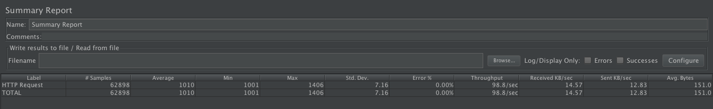

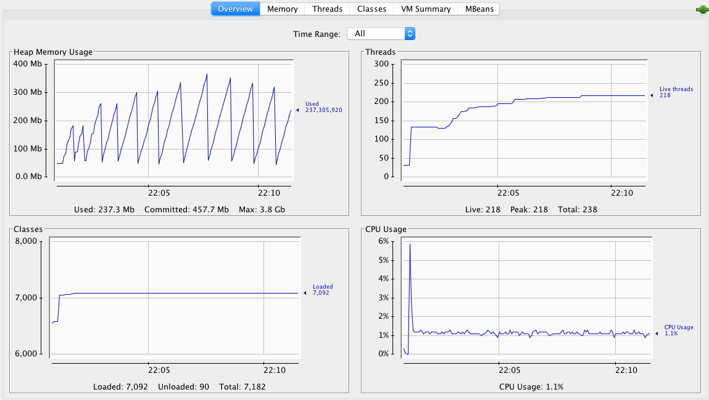

排除Tomcat的包，使用Jetty的包，Jetty的tps、资源占用如下：

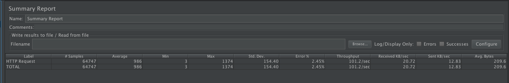

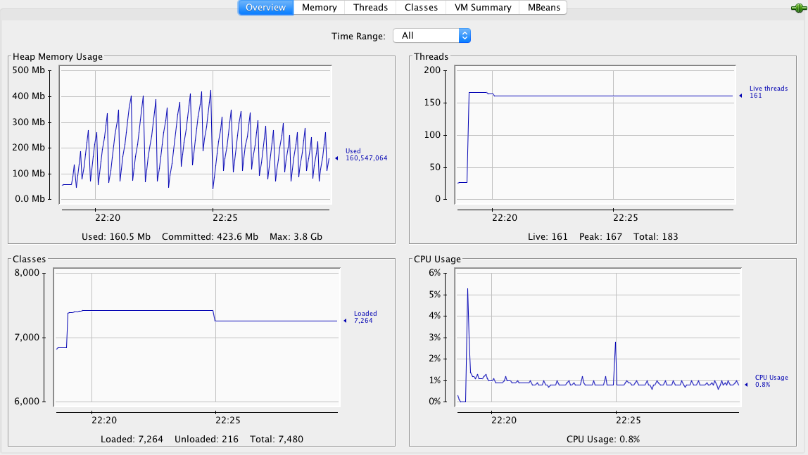

结论：

|        | TPS/s | 平均延迟/ms | 错误率/% | CPU/% | 内存/MB | Class数量 | 线程数 |
| ------ | ----- | ----------- | -------- | ----- | ------- | --------- | ------ |
| Tomcat | 98.8  | 1010        | 0        | 0.8   | 约200   | 7092      | 218    |
| Jetty  | 101.2 | 986         | 2.45     | 1.1   | 约160   | 7264      | 161    |

* Jetty吞吐量、线程开销和资源占用略好于Tomcat，恰好反映其设计很轻量小巧；
* Tomcat比Jetty更加稳定。

