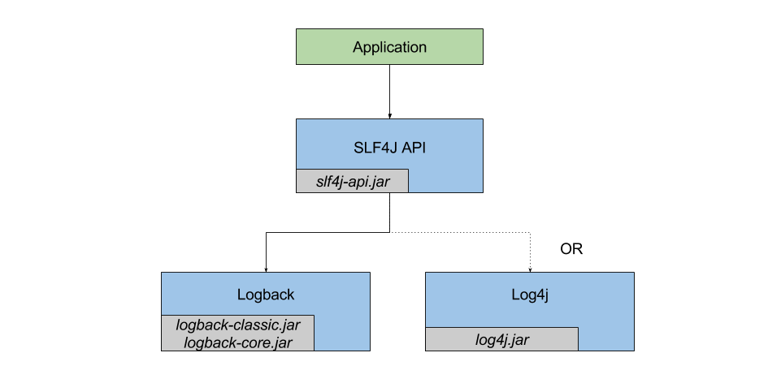

# 日志框架

slf4j：日志接口和门面，记录日志；

JCL：commons logging，和slf4j类似的门面日志；

log4j：第三方日志输出的具体实现；

JUL：Java原生的日志输出；

logback：第三方日志输出，性能由于log4j，也是Spring Boot默认日志框架；

log4j2：第三方日志输出的具体实现，号称目前Java平台性能最好。

<!--more-->

slf4j结构如下：



## Java 日志框架

路径：`java.util.logging`；

* Logger：记录日志；
* Handler：日志输出格式；
* Level：日志的不同等级；
* Formatter：日志信息格式化；

使用示例：

```java
public static void main(String[] args) {
  Logger logger = Logger.getLogger("com.mycompany.myapp");
  logger.setLevel(Level.FINE);
  logger.setUseParentHandlers(false);
  Handler hd = new ConsoleHandler();
  hd.setLevel(Level.FINE);
  logger.addHandler(hd);
  logger.info("start log"); 
}
```

## Tomcat 日志框架

JULI：基于JCL和JUL的处理框架。JVM原生的日志框架是每个JVM用同一份日志配置，但是Tomcat中每个Web应用可能有自己的日志框架；

DirectJDKLog：基于JUL中的Logger类，修改了默认输出格式；

LogFactory：单例，默认使用DirectJDKLog，通过ServiceLoader为Log提供自定义的实现版本；

Handler：

* FileHandler：读写锁实现，在某个特定位置往文件里输出日志；
* AsyncFileHandler：继承自FileHandler，实现了异步写操作，缓存存储通过LinkedBlockingQueue来实现，通过publish方法写入相应文件内。

Formatter：通过format方法将日志记录LogRecord转化成格式化的字符串，JULI提供了三个新的Formatter：

* OnlineFormatter：基本类似于JDK的SimpleFormatter，只不过把所有内容写到了同一行。
* VerbatimFormatter：只记录日志信息，没有任何额外信息；
* JdkLoggerFormatter：格式化了一个轻量级的日志信息。

配置文件：conf/logging.properties；以`1catalina.org.apache.juli.AsyncFileHandler`为例：数字是为了区分同一个类的不同实例；catalina、localhost、manager和host-manager是Tomcat用来区分不同系统日志类的标志，后面的字符串表示了handler具体类型，如果需要添加Tomcat服务器的自定义Handler，需要在字符串里添加。接下来是日志等级，目录和文件前缀等。

```properties
1catalina.org.apache.juli.AsyncFileHandler.level = FINE
1catalina.org.apache.juli.AsyncFileHandler.directory = ${catalina.base}/logs
1catalina.org.apache.juli.AsyncFileHandler.prefix = catalina.
1catalina.org.apache.juli.AsyncFileHandler.maxDays = 90
1catalina.org.apache.juli.AsyncFileHandler.encoding = UTF-8
```

## Tomcat+Slf4j+Logback

* 去下该地址下载适合自己版本的Tomcat：https://github.com/tomcat-slf4j-logback/tomcat-slf4j-logback/releases/；
* 解压以后分别用bin、conf、lib下的内容替换或者复制到自己原有的Tomcat对应目录里；
* 启动Tomcat，可以看到日志格式已经变了：

```verilog
18:06:17.595 INFO  {main} [o.a.c.h.Http11NioProtocol] : Initializing ProtocolHandler ["http-nio-8080"]
18:06:17.996 INFO  {main} [o.a.t.u.n.NioSelectorPool] : Using a shared selector for servlet write/read
18:06:18.010 INFO  {main} [o.a.c.a.AjpNioProtocol] : Initializing ProtocolHandler ["ajp-nio-8009"]
18:06:18.018 INFO  {main} [o.a.t.u.n.NioSelectorPool] : Using a shared selector for servlet write/read
18:06:32.216 INFO  {main} [o.a.j.s.TldScanner] : At least one JAR was scanned for TLDs yet contained no TLDs. Enable debug logging for this logger for a complete list of JARs that were scanned but no TLDs were found in them. Skipping unneeded JARs during scanning can improve startup time and JSP compilation time.
18:06:33.843 INFO  {main} [o.a.c.h.Http11NioProtocol] : Starting ProtocolHandler ["http-nio-8080"]
18:06:33.860 INFO  {main} [o.a.c.a.AjpNioProtocol] : Starting ProtocolHandler ["ajp-nio-8009"]
```


