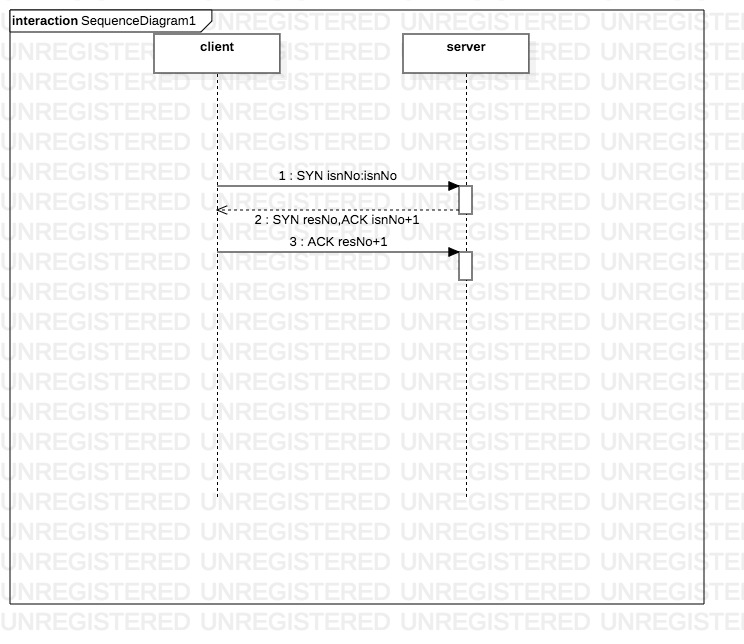
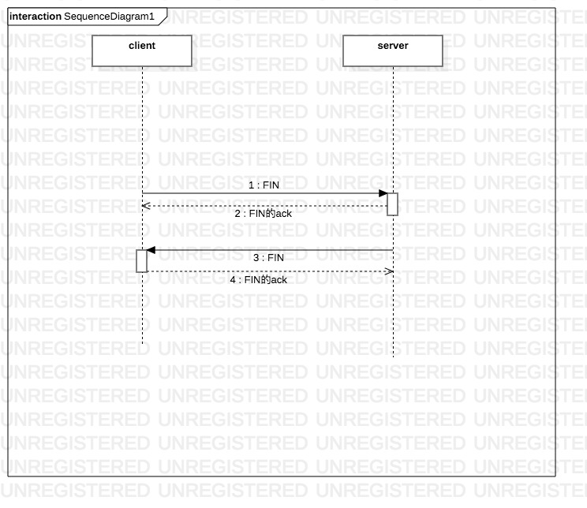
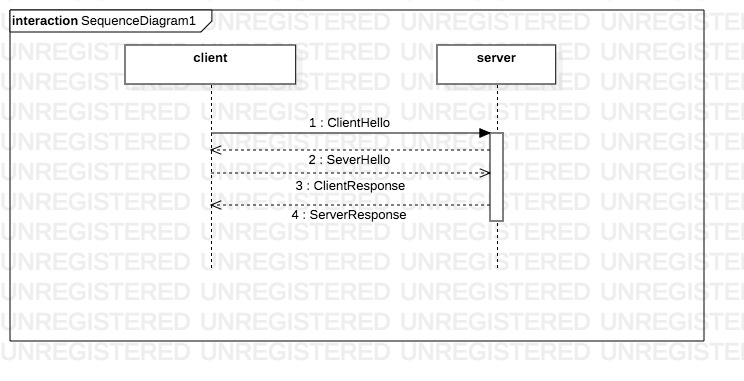
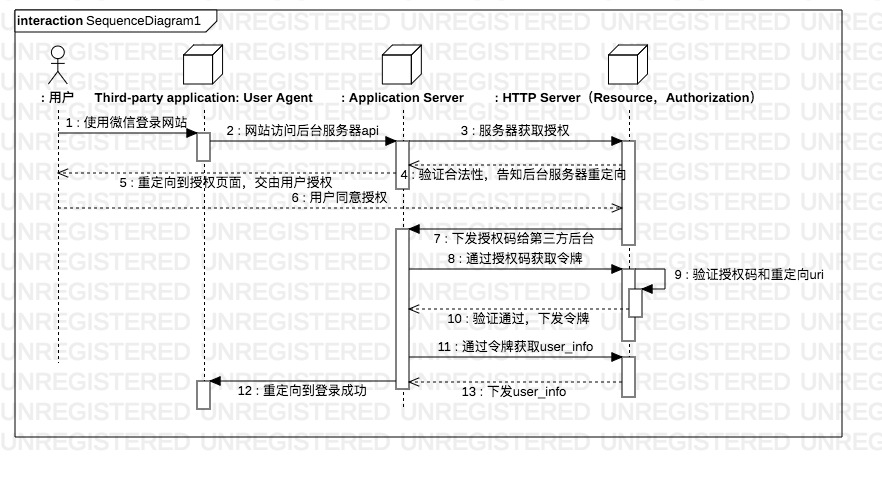

# 概述
## TCP/IP模型
TCP/IP是一组不同层次上的多个协议的组合，通常被认为是一个四层协议系统，自下而上分别为：数据链路层，网络层，传输层，应用层。
数据链路层：发送数据，主要是驱动程序以及网卡等网络接口，常用有ARP和RARP等协议；
网络层：处理网络活动，分组选路等，主要有IP、ICMP、IGMP协议；
传输层：为应用程序提供端到端的通信，主要有TCP、UDP协议；
应用层：处理应用程序细节，主要有SMTP、SMNP、FTP、e-mail等。
网关：现在网关这个术语只用来表述应用层网关，为某个特定的应用程序服务，用来链接两种不同协议族的进程。
<!--more-->
 
## 协议简述
* TCP：提供可靠的运输层服务。
* UDP：为应用程序接受和发送数据报；
* IP：同时被TCP和UDP使用。
* ICMP：IP协议的附属协议，IP层用它来与其他主机或者路由器交换错误报文和其他重要信息，常见应用Ping和Traceroute。
* IGMP：Internet组管理协议，用于把一个UDP数据包多播到多个主机。
* ARP和RARP：地址解析协议和逆地址解析协议，是某些网络接口使用的特殊协议，用来转换IP层和网络接口层使用的地址。

## IP地址
长度：32bit=4byte
A类：0+7位网络号+24位主机号（0.0.0.0~127.255.255.255）
B类：10+14位网络号+16位主机号（128.0.0.0~191.255.255.255）
C类：110+21位网络号+8位主机号（192.0.0.0~233.255.255.255）
D类：1110+28位多播组号（224.0.0.0~239.2552.55.255）
E类：11110+27（待用）（240.0.0.0~255.255.255.255）
 
计算方式：二进制转换为位点分十进制；(为方便查看，使用括号隔开)
四位一组，A组第一位固定为0，所以A组为：0.0.0.0~(27-1).(28-1).(28-1).(28-1)，B组由于前两位确定，转换为十进制时，前8位二进制中只有6位可以用来表示地址，因此B组十进制数第一位在A组基础上加26=64，即128.0.0.0~191.255.255.255，剩下的依此类推。

## 封装
当应用程序使用TCP传送数据时，数据被送入协议栈中，然后逐个通过每一层直到被当作一串bit流送入网络。从上到下依次是：
用户数据--》appl首部+用户数据--》TCP首部+应用数据=TCP段或TCP报文段--》首部+TCP首部+应用数据=IP数据报--》以太网首部+IP首部+TCP首部+应用数据+以太网尾部=以太网帧。
代表着数据每一层的状态，最后一层即是经过网络接口处理得到的数据，其中，以太网首部14字节，以太网尾部4字节，IP首部20字节，TCP首部20字节，IP首部+TCP首部+应用数据长度为46~1500字节之间（如无特殊说明，默认当前所有计算机系统为1byte=8bit）。
TCP首部为20字节，UDP数据格式与TCP基本一致，只不过UDP首部长8字节。
IP的首部会有一个1字节的协议域，表示数据来源于哪一层，1表示ICMP协议，2表示IGMP协议，6表示TCP协议，17表示UDP协议。
同样的，TCP或者UDP首部会有一个2byte的端口号表示不同应用程序，包含了源端口号和目的端口号。
而以太网的首部有一个2byte的帧类型域表明生成数据的网络层协议。

## 分用
以太网帧到达目的主机自下而上的解包。
对于ICMP和IGMP，它们实际上是IP协议的附属协议，也就是网络层，然而ICMP和IGMP又和TCP于UDP一样被封装在IP数据报中，所以ICMP和IGMP在四层模型中无法具体定位。ARP和RARP也与之类似，虽然实际上是数据链路但是它们又和IP数据报一样有自己的以太网数据帧类型。

## 标准化小组
控制TCP/IP协议族，定义新的标准。

* Internet协会（ISOC，Internet Society）
* Internet体系结构委员会（IAB，Internet Architecture Board） 技术监督和协调组织，隶属于ISOC
* Internet工程专门小组（IETF，Internet Engineering Task Force）面向近期标准的组织，隶属于IAB
* Internet研究专门小组（IRIF，internet Research Task Force）研究长远项目的组织，隶属于IAB

## 文档
所有关于Internet的正式标准都以RFC文档出版，大量的RFC并不是正式标准，出版的目的只是为了提供信息。

## 数据链路层
## 简述
目的：
为IP模块发送和接收IP数据报；
为ARP模块和RARP模块发送请求和应答；

* SLIP：Serial Line IP，一种在串行线路上对IP数据报进行封装的简单形式；
* 缺陷：每一端都必须知道对方的IP地址，没有办法把本段的IP地址通知给另一端；数据帧中没有类型字段，因此无法区分上层协议；没有在数据帧中加上校验和，因此无法发现错误，只能通过上层协议实现；
* CSLIP：压缩的SLIP；
* PPP：点对点协议，修复了SLIP的缺陷，最终将取代SLIP。

## 环回接口
允许在同一台主机上的程序和服务器程序通过TCP/IP进行通信，IP地址通常为127.0.0.1，命名为localhost。

* 传给环回地址（一般是127.0.0.1）的任何数据均作为I P输入。
* 传给广播地址或多播地址的数据报复制一份传给环回接口，然后送到以太网上。这是 因为广播传送和多播传送的定义包含主机本身。
* 任何传给该主机IP地址的数据均送到环回接口。

## 最大传输单元MTU
（单位：字节）

* 超通道单元：65535
* 16Mb/s令牌环（IBM）：17914
* 4Mb/s令牌环（IEEE 802.5）：4464
* EDDI：4352
* 以太网：1500
* IEEE 802.3/802.2：1492
* X.25：576
* 点对点（低时延）：296

如果传输的数据报超过了MTU，那么IP层就会进行分片。

# IP：网际协议

## 简述
* 不可靠：仅提供尽力而为的传输服务，可靠性需要由上层协议来实现；
* 无连接：不维护每一个数据报的状态信息，每个数据报的处理相对独立。
 
## IP首部
 通常长度20字节（含有选项字段除外），组成为：4bit版本+4bit首部长度信息+8bit服务类型（TOS）+16bit总字节数长度信息+16bit标识+3bit标志+13bit片偏移+8bit生存时间（TTL）+8bit协议+16bit首部检验和+32bit源IP地址+32bit目的IP地址+选项（如果有）+数据
传输方式：big ending，即先传低位再传高位，又称为网络字节序。
版本：目前协议版本号为4，因此又称为IPV4。
首部长度信息：首部占32bit字的数目，包括任务选项，由于它是一个4bit字段，因此首部最长为60字节。
标识字段：唯一地表示主机发送的每一份数据报，通常每发送一份报文它的值就会+1。
TTL：设置了数据报可以经过的最多路由器数，每经过一个处理它的路由器就会-1，当等于0时，就会丢弃该数据报，并发送ICMP报文通知源主机。
 
## IP路由选择
如果目的主机和源主机直接相连或者都在一个共享网络上，那么IP数据包就直接发送到目的主机上，否则主机会把数据报发往一默认路由器上，由路由器来转发该数据报。IP层在内存中有一个路由表。当受到一份数据报并进行发送时，它都要对该表搜索一次。
路由表的每一项都包含目的IP地址，下一站或者下一跳的IP地址，标志，数据报传输指定接口。IP路由选择是逐跳的（hop-by-hop），首先搜索主机路由，其次搜索网络路由，最后搜索默认路由。
### 子网掩码

一个32bit的地址，值为1的表示网络号和子网号，值为0的表示主机号。例如高位到低位依次为24个1和8个0，即代表子网掩码的点分十进制为255.255.255.0；从高到低位如果是26个1，6个0，则代表子网掩码的点分十进制数为255.255.255.192，通过子网掩码和IP地址，主机就可以确定IP数据报的目的地是：（1）本子网上主机；（2）本网络中其他子网主机；（3）其他网络主机。
 
## IP的未来
* 32位IP地址基本已经耗尽；
* 路由结构没有层次，属于平面型结构，每个网络都需要一个路由表，录入一个由多个网络的网站就必须分配多个C类地址，而不是一个B类地址。
# ARP：地址解析协议
## 简述
ARP地址解析协议是为32bit的IP地址动态映射到48bit的以太网地址（硬件地址）的约定。
ARP发送（广播）一份称作ARP请求的以太网数据帧给以太网中的每个主机，包含目的主机和IP地址，意为：如果你是这个IP地址的拥有者，请回答你的硬件地址。目的主机ARP层收到广播报文后，识别出这是发送端在寻找它的IP地址和硬件地址，于是发送ARP响应给发送端。发送端收到ARP应答后，使ARP进行请求-应答的IP数据报就可以传送了。
 
## ARP高速缓存
ARP高效运行的关键是在于每个主机上都有一个ARP高速缓存，保存着最近Internet地址到硬件地址之间的映射记录，高速缓存中每一项的生存时间一般是20分钟，起始时间为创建时间。
 
## ARP分组格式
6字节以太网目的地址+6字节以太网源地址+2子节帧类型+2字节硬件类型+2字节协议类型+1字节硬件地址长度+1字节协议地址长度+2字节op（操作类型）+6字节发送端以太网地址+4字节发送端IP地址+6字节目的以太网地址+4字节目的IP地址
 
解释：
目的地址全为1的为广播地址；
ARP的以太网帧类型为0x0806；
硬件类型=1表示以太网地址（对于ARP来说是硬件地址）；
协议类型=0x0800表示IP地址；
ARP请求或应答的的硬件地址长度=6（字节），协议地址长度=4（字节）；
op表示操作，ARP请求=1，ARP应答=2，RARP请求=3，RARP应答=4；
以太网数据帧中的以太网源地址（硬件地址）=ARP数据帧中的发送端以太网地址（硬件地址）。
 
> 说明：对于一个ARP请求来说，除目的端硬件地址外的所有其他的字段都有填充值，当系统收到一份目的端为本机的ARP请求报文后，它就把硬件地址填进去，然后用两个目的端地址分别替换两个发送端地址，并把操作字段设置为2，再发送回去。

# RARP：逆地址解析协议
## 简述
RARP协议是许多无盘系统在引导时用来获取IP地址的。RARP请求是以广播的形式，应答是以单播的形式。RARP请求在分组中表明发送端的硬件地址，以请求相应IP地址的响应。
具有本地磁盘的系统引导时，一般是从磁盘中的配置文件读取IP地址。但是无盘机，如无盘工作站，则需要采用其他方法获取ip地址。
网络上的每个系统都具有唯一的硬件地址，他是由网络接口生产厂家配置的。无盘系统的RARP实现过程是从接口卡上读取唯一的硬件地址，然后发送一份RARP请求（一帧在网络上的数据），请求某个主机在无盘系统的IP地址。
RARP服务器的复杂性在于。服务器一般要为多个主机提供硬件地址到IP地址的映射。更为复杂的是，RARP请求作为一个特殊类型的以太网数据帧来传送。这说明RARP服务器必须能够发送和接收这种类型的以太网数据帧。
RARP是许多无盘系统在引导时用来获取IP地址的。RARP实现起来要比ARP复杂，因为RARP请求实在硬件层上广播的。这意味着他们不经过路由器进行转发。为了能让无盘系统在RARP关机的情况下也能引导，通常要在一个网络上（一根电缆）提供多个RARP服务器。
## RARP分组格式
与ARP分组基本一致，主要差别是ARAP请求或应答的帧类型代码为0x8035，而且RARP的操作代码为3，应答操作代码为4。 

# ICMP：Internet控制报文协议
## 简述
ICMP经常被认为是IP层的一个组成部分。它传递差错报文以及其他需要注意的信息，ICMP报文通常被IP或者更高层协议如TCP/UDP使用。一些ICMP报文把差错报文返回给用户进程。ICMP是在IP数据报内部传输的（ICMP报文+20字节IP首部）。ICMP报文通常为8位类型+8位代码+16位检验和=32位，其中类型字段可以与15个不同的值，以描述特定类型的ICMP报文。
## ICMP报文的类型

|类型	|代码|	描述|	查询|	差错
|---|---|---|---|---|
|0|	0|回显应答|1|	 
|3|	|目的不可达||1
|3|0|网络不可达||1
|3|1|主机不可达||1
|3|2|协议不可达||1
|3|3|端口不可达||1
|3|4|需要进行分片但设置了不分片比特||1
|3|5|源站选路失败||1
|3|6|目的网络不认识||1
|3|7|目的主机不认识||1
|3|8|源主机被隔离||1
|3|9|目的网络被强制禁止||1
|3|10|目的主机被强制禁止||1
|3|11|由于服务类型TOS，网络不可达||1
|3|12|由于服务类型TOS，主机不可达||1
|3|13|由于过滤，通信被强制禁止||1
|3|14|主机越权||1
|3|15|优先权中止生效||1
|4|0|源端被关闭||1
|5||重定向||1
|5|0|网络重定向||1
|5|1|主机重定向||1
|5|2|服务类型和网络重定向||1
|5|3|服务类型和主机重定向||1
|8|0|请求回显|1| 
|9	|0|	路由器宣告|1|	 
|10	|0	|路由器请求	|1|	 
|11	| 	|超时	 	 
|11	|0	|传输期间TTL为0||	 	1
|11	|1	|在数据报组装期间生存时间为0||	 	1
|12	| 	|参数问题	 	 
|12	|0	|坏的IP首部，包括各种差错	 	||1
|12	|1	|减少必须的选项	 	||1
|13	|0	|时间戳请求	|1	 
|14	|0	|时间戳应答	|1	 
|15	|0	|信息请求（废弃）|	1	 
|16	|0	|信息应答（废弃）|	1	 
|17	|0	|地址掩码请求	|1	 
|18|0	|地址掩码应答	|1	 

5种场景不会导致产生ICMP差错报文：

* ICMP差错报文；
* 目的地址位广播地址或多播地址的IP数据报；
* 作为链路层广播的数据报
* 不是IP分片的第一片；
* 源地址不是单个主机的数据报。
* ICMP的一个规则是：ICMP差错报文必须包括生成该差错报文的数据报IP首部，还必须至少跟在该IP首部后面的前8个字节。

# Ping程序
ping程序发送一份ICMP回显请求报文给主机，并等待返回ICMP回显应答。Ping还能测出我们到某一台主机的距离，通过当前时间减去在ICMP报文中的时间即是往返时间。

# Traceroute程序
traceroute程序使用ICMP报文和首部中的TTL字段。发送端初始设置一个8bit字段，推荐的初始值由赋值RFC指定，当前值为64，较老系统经常设置为15或者32。

每个处理数据报的路由器都需要把TTL减1或者减去数据报在路由器中停留的秒数。

当路由器收到一份IP数据报，如果TTL字段是0或者1，则路由器不转发该数据报（接收到这种数据报的目的主机可以将它交给应用程序，这是因为不需要转发该数据报，但是在通常情况下，系统不应该接收TTL字段为0的数据报）。相反，路由器将该数据报丢弃，并给源主机发送一份“超时”信息。Traceroute程序的关键在于包含这份ICMP信息的IP报文的信源地址是该路由器的IP地址。

我们现在可以猜想一下Traceroute程序的操作过程。它发送一份TTL字段为1的IP数据报给目的主机。处理这份数据报的第一个路由器将TTL值减1，丢弃该数据报，并发回一份超时ICMP报文。这样就得到了该路径中的第一个路由器的地址。然后Traceroute程序发送一份TTL值为2的数据报，这样我们就可以得到第二个路由器的地址。然后继续这个过程直至该数据报到达目的主机。但是目的主机哪怕接收到TTL值为1的IP数据报，也不会丢弃该数据报并产生一份超时ICMP报文，这是因为数据报已经到达其最终目的地。Traceroute程序发送一份UDP数据报给目的主机，但它会选择一个不可能的值作为UDP端口号（大于30000），使目的主机的UDP模块产生一份：”端口不可达错误“的ICMP报文，这样，Traceroute程序所要做的就是区分接收到的ICMP报文是超时还是端口不可达，以判断什么时候结束。

# IP选路 与 动态选路协议
IP搜索路由表的步骤：

1. 搜索主机路由
1. 搜索网络路由
1. 搜索默认路由

当相邻路由器之间进行通信，以告知对方每个路由器当前所连接的网络，这时候就出现了动态选路，路由器之间必须采用选路协议进行通信。路由器上有一个进程称为路由守护程序，它运行选路协议，并与相邻的一些路由器进行通信，然后它会动态更新路由表。
## RIP：选路信息协议
RIP报文包含于UDP报文中，即8字节UDP首部+RIP报文。
常用UDP端口号是520。
## OSPF：开放最短路径优先
直接包含于IP数据报中，采用多播的形式，逐渐取代RIP中。
## BGP：边界网关协议
不同自治系统的路由器之间进行通信的外部网关协议。
## CIDR：无类型区域间选路
采用一种分配多个IP的方式，使其能够将路由表中的许多表项总和成更少的数目。

# UDP：用户数据报协议
## 简述
简单的面向数据报的传输层协议，进程的每个输出操作都正好产生一个UDP数据报，并组装成一份待发送的IP数据报，全体数据与每一份数据不一定存在关联，传输但不保证可达。
TCP协议是面向字符流的传输层协议。
应用程序必须关心IP数据报的长度，如果超过网络的MTU，则必须进行分片。
组成：8字节UDP首部+UDP数据
规范：RFC768
 
## UDP首部
16位源端口号+16位目的端口号+16位UDP长度+16位UDP校验和
 
## IP分片
把一份IP数据报分片以后，只有到达目的地进行重新组装（这里的重新组装与其他网络协议不同，它们要求在下一站就进行重新组装，而不是在最终目的地）。重新组装有目的地的IP端完成，使得分片和重新组装对传输层是透明的，以防止某些可能的性能降低。已经分片的信息可能会再次分片。IP首部中包含的数据位分片和重新组装提供了足够的信息。
 
## UDP和ARP之间的交互式应用
这是不常被人注意到的一个细节，这是针对一些系统地实现来说的。当ARP缓存还是空的时候。UDP在被发送之前一定要发送一个ARP请求来获得目的主机的MAC地址，如果这个UDP的数据包足够大，大到IP层一定要对其进行分片的时候，想象中，该UDP数据包的第一个分片会发出一个ARP查询请求，所有的分片都辉等到这个查询完成以后再发送。事实上是这样吗？

结果是，某些系统会让每一个分片都发送一个ARP查询，所有的分片都在等待，但是接受到第一个回应的时候，主机却只发送了最后一个数据片而抛弃了其他，这实在是让人匪夷所思。这样，因为分片的数据不能被及时组装，接受主机将会在一段时间内将永远无法组装的IP数据包抛弃，并且发送组装超时的ICMP报文（其实很多系统不产生这个差错），以保证接受主机自己的接收端缓存不被那些永远得不到组装的分片充满。

# 广播、多播和单播
## 简述
仅用于UDP，广播：向网上所有的主机发送数据帧；多播：帧仅传送给说某个多播组的多个主机。
 
## 广播(broadcast)
受限的广播地址是255.255.255.255，该地址用户主机配置过程中IP数据报目的地址。
A类网络广播地址为netid.255.255.0。
指向子网的广播地址全为1且有特定子网号的地址。
广播是主机针对某一个网络上的所有主机发送数据包。这个网络可能是网络，可能是子网，还可能是所有的子网。如果是网络，例如A类网址的广播就是 netid.255.255.255，如果是子网，则是netid.netid.subnetid.255；如果是所有的子网（B类IP）则是则是 netid.netid.255.255。广播所用的MAC地址FF-FF-FF-FF-FF-FF。网络内所有的主机都会收到这个广播数据，网卡只要把 MAC地址为FF-FF-FF-FF-FF-FF的数据交给内核就可以了。一般说来ARP，或者路由协议RIP应该是以广播的形式播发的。
 
## 多播(multicast)
可以说广播是多播的特例，多播就是给一组特定的主机（多播组）发送数据，这样，数据的播发范围会小一些(实际上播发的范围一点也没有变小)，多播的MAC地址是最高字节的低位为一，例 如01-00-00-00-00-00。多播组的地址是D类IP，规定是224.0.0.0-239.255.255.255。
然多播比较特殊，但是究其原理，多播的数据还是要通过数据链路层进行MAC地址绑定然后进行发送。所以一个以太网卡在绑定了一个多播IP地址之后，必 定还要绑定一个多播的MAC地址，才能使得其可以像单播那样工作。这个多播的IP和多播MAC地址有一个对应的算法，这个对应不是一一对应的，主机还是要对多播数据进行过滤。
两类服务：
向多个目的地址传送数据，有许多向多个接收者传递信息的应用：例如交互式会议系统和向多个接收者分发邮件和新闻；
客户对服务器的请求。
 
## 单播(unicast)
单播是说，对特定的主机进行数据传送。例如给某一个主机发送IP数据包。这时候，数据链路层给出的数据头里面是非常具体的目的地址，对于以太网来 说，就是网卡的MAC地址（不是FF-FF-FF-FF-FF-FF这样的地址）。现在的具有路由功能的主机应该可以将单播数据定向转发，而目的主机的网 络接口则可以过滤掉和自己MAC地址不一致的数据。
 

# IGMP：Internet组管理协议
## 简述
用于支持主机和路由器进行多播的Internet组管理协议（IGMP）。它让一个物理网络上的所有系统知道主机当前所在的多播组。
规范：RFC11212
## IGMP报文
4位版本号+4位IGMP类型+8位未使用+16位检验和+32位组地址（D类IP地址）

# DNS：域名系统
## 简述
用于TCP/IP应用程序的分布式数据库，它提供主机名和IP地址之间的转换和有关电子邮件的选路信息。当一个数据库发现自己并没有某查询所需要的数据的时候，它将把查询转发出去，而转发的目的地通常是根服务器，根服 务器从上至下层层转发查询，直到找到目标为止。DNS还有一个特点就是使用高速缓存，DNS把查询过的数据缓存在某处，以便于下次查询时使用。
规范：RFC1035

* 国家域（顶级域）：ae（阿拉伯联合酋长国），us（美国），zw（津巴布韦）
* 普通顶级域：arpa，com，edu，gov，int，mil，net，org
* com：商业组织
* edu：教育机构
* gov：其他美国政府部门
* int：国际组织
* mil：美国军事网店
* net：网络
* org：其他组织
 
## DNS协议
DNS报文定义了一个既可以查询也可以响应的报文格式。对各个字段简单解释如下：

* 最前面的16个bit唯一的标示了问题号码，用于查询端区别自己的查询。
* 紧接着的16个bit又可以做进一步的细分，标示了报文的性质和一些细节，比如说是查询报文还是响应报文，需要递归查询与否（一般服务器都支持递归查询，而且不需要任何设置，BIND就是这样）
* 查询问题后面有查询类型，包括A，NS，CNAME，PTR，HINFO，MX，如果熟悉BIND的话，就知道在zong的配置文件里面，每一条记录都记载了各自的类型，比如A就是IP地址，NS就是名字服务器。
* 响应报文可以回复多个IP，也就是说，域名可以和多个IP地址对应，并且有很多CNAME。
 
DNS服务器支持TCP和UDP两种协议的查询方式，而且端口都是53。而大多数的查询都是UDP查询的，一般需要TCP查询的有两种情况：

* 当查询数据多大以至于产生了数据截断(TC标志为1)，这时，需要利用TCP的分片能力来进行数据传输（看TCP的相关章节）。
* 当主（master）服务器和辅（slave）服务器之间通信，辅服务器要拿到主服务器的zone信息的时候。

# TFTP：简单文件传送协议
## 简述
TFTP（Trivial File Transfer Protocol）简单文件传送协议，最初打算用于引导无盘系统（通常是工作站或X终端），使用UDP。

# TCP：传输控制协议
## 简述
    提供一种面向连接的、可靠的字节流服务。
## 服务
    如何实现可靠性：
数据会被分割为最合适发送的数据块，这和UDP完全不同，应用程序产生的 数据报长度将保持不变。由TCP传递给IP的信息单位称为报文段或段（ segment）。
TCP发出一个报文段后，会启动一个定时器（超时重发和重传）。
收到另一端的数据后，它将发送一个确认。
TCP将保持它首部和数据的检验和。
重排序。
丢弃重复数据。
控制发送端只能发送接收端缓冲区所能接纳的数据（流量控制）。
## 首部
    20字节。16位源端口号+16位目的端口号+32位序号+32位确认序号+4位首部长度+保留6位+16位窗口大小+16位检验和+16位紧急指针
序号：标识从发送端到接收端的数据字节流，表示在这个报文段中的第一个数据字节。序号是32位的无符号数，到达最高后又从0开始。当建立一个新连接时，SYN标志变1，序号字段包含有这个主机选择的该裂解的处事序号ISN，该主机要发送数据的第一个字节序号位ISN加1，因为SYN标志消耗了一个序号
 
TCP首部中有6个标志比特：
URG：紧急指针有效。
ACK：确认序号有效。
PSH：接收方应该尽快将这个报文段交给应用层。
RST：重建连接。
SYN：同步序号用来发起一个连接。
FIN：发送段完成任务
 
## 连接建立与终止
三次握手：

1. 客服端发送一个SYN段指明客户打算连接服务器端口，以及ISN。这个SYN段位报文段1。
1. 服务器发回包含服务器的初始序号的SYN报文段作为应答。同时将确认序号设置位客户的ISN加1以对客户的SYN报文段进行确认，一个SYN将占用一个序号。
1. 客户必须确认序号设置为服务器的ISN加1以对服务器的SYN报文段进行确认。

在建立连接的时候，通信的双方要互相确认对方的最大报文长度(MSS)，以便通信。一般这个SYN长度是MTU减去固定IP首部和TCP首部长度。对于一个以太网，一般可以达到1460字节。当然如果对于非本地的IP，这个MSS可能就只有536字节，而且，如果中间的传输网络的MSS更佳的小的话，这个值还会变得更小。
由于TCP的半关闭，因此关闭连接时，客户端和服务端分别关闭。
四次挥手：

1. 客户端发起带FIN状态的请求。
1. 服务器收到FIN会发回一个ACK，值等于收到的序号加1。
1. 服务端主动请求一次FIN。
1. 客户端收到FIN会发回一个ACK，值等于收到的序号加1。

客户端状态迁移：

* CLOSED->SYN_SENT->ESTABLISHED->FIN_WAIT_1->FIN_WAIT_2->TIME_WAIT->CLOSED
服务端状态迁移：

* CLOSED->LISTEN->SYN收到->ESTABLISHED->CLOSE_WAIT->LAST_ACK->CLOSED

解释：

* LISTEN->SYN_SENT，对于这个解释就很简单了，服务器有时候也要打开连接的嘛。
* SYN_SENT->SYN收到，服务器和客户端在SYN_SENT状态下如果收到SYN数据报，则都需要发送SYN的ACK数据报并把自己的状态调整到SYN收到状态，准备进入ESTABLISHED
* SYN_SENT->CLOSED，在发送超时的情况下，会返回到CLOSED状态。
* SYN_收到->LISTEN，如果受到RST包，会返回到LISTEN状态。
* SYN_收到->FIN_WAIT_1，这个迁移是说，可以不用到ESTABLISHED状态，而可以直接跳转到FIN_WAIT_1状态并等待关闭。

## 超时与重传
对于每个连接，TCP管理4个不同的定时器。

* 重传定时器适用于当希望收到另一端的确认。
* 坚持定时器使窗口大小信息保持不断流动。
* 报活定时器可检测到一个空闲连接的另一端何时崩溃或重启。
* 2MSL定时器测量一个连接处于TIME_WAIT状态的时间。

## 数据流
### 交互式数据类型

小流量数据交换，例如一次交互按键，显示等，telnet、ssh是其中代表。
对于交互性要求比较高的应用，TCP给出两个策略来提高发送效率和减低网络负担：
（1）捎带ACK。(2)Nagle算法（一次尽量多的发数据）。

通常，在网络速度很快的情况下，比如用lo接口进行telnet通信，当按下字母键并要求回显的时候，客户端和服务器将经历 发送按键数据->服务器发送按键数据的ack -> 服务器端发送回显数据->客户端发送回显数据的ACK的过程，而其中的数据流量将是40bit + 41bit+41bit+40bit = 162bit，如果在广域网里面，这种小分组的TCP流量将会造成很大的网络负担。

捎带ACK的发送方式

这个策略是说，当主机收到远程主机的TCP数据报之后，通常不马上发送ACK数据报，而是等上一个短暂的时间，如果这段时间里面主机还有发送到远程主机的TCP数据报，那么就把这个ACK数据报“捎带”着发送出去，把本来两个TCP数据报整合成一个发送。一般的，这个时间是200ms。可以明显地看到这个策略可以把TCP数据报的利用率提高很多。

Nagle算法

上过bbs的人应该都会有感受，就是在网络慢的时候发贴，有时键入一串字符串以后，经过一段时间，客户端“发疯”一样突然回显出很多内容，就好像数据一下子传过来了一样，这就是Nagle算法的作用。
Nagle算法要求一个TCP连接上最多只有一个未被确认的未完成的小分组，在该分组的确认到达（接收方ACK）之前不能发送其他的小分组。当收到ACK时，它会以一个分组的方式发出去。

在编写插口程序的时候，可以通过TCP_NODELAY来关闭这个算法。并且，使用这个算法看情况的，比如基于TCP的X窗口协议，如果处理鼠标事件时还是用这个算法，那么“延迟”可就非常大了。

### 数据成块类型

要求发送方尽可能块地运载数据，常用又停止等待协议和滑动窗口协议，ftp和tftp是其中代表。

    对于FTP这样对于数据吞吐量有较高要求的要求，将总是希望每次尽量多的发送数据到对方主机，就算是有点“延迟”也无所谓。TCP也提供了一整套的策略来支持这样的需求。TCP协议中有16个bit表示“窗口”的大小，这是这些策略的核心。
    
传输数据时ACK的问题

    在解释滑动窗口前，需要看看ACK的应答策略，一般来说，发送端发送一个TCP数据报，那么接收端就应该发送一个ACK数据报。但是事实上却不是这样，发送端将会连续发送数据尽量填满接受方的缓冲区，而接受方对这些数据只要发送一个ACK报文来回应就可以了，这就是ACK的累积特性，这个特性大大减少了发送端和接收端的负担。

滑动窗口

	滑动窗口本质上是描述接受方的TCP数据报缓冲区大小的数据，发送方根据这个数据来计算自己最多能发送多长的数据。如果发送方收到接受方的窗口大小为0的TCP数据报，那么发送方将停止发送数据，等到接受方发送窗口大小不为0的数据报的到来。
关于滑动窗口协议，介绍三个术语，分别是：

* 窗口合拢：当窗口从左边向右边靠近的时候，这种现象发生在数据被发送和确认的时候。
* 窗口张开：当窗口的右边沿向右边移动的时候，这种现象发生在接受端处理了数据以后。
* 窗口收缩：当窗口的右边沿向左边移动的时候，这种现象不常发生。
TCP就是用这个窗口，慢慢的从数据的左边移动到右边，把处于窗口范围内的数据发送出去（但不用发送所有，只是处于窗口内的数据可以发送。）。这就是窗口的意义。窗口的大小是可以通过socket来制定的，4096并不是最理想的窗口大小，而16384则可以使吞吐量大大的增加。

数据拥塞

	上面的策略用于局域网内传输还可以，但是用在广域网中就可能会出现问题，最大的问题就是当传输时出现了瓶颈（比如说一定要经过一个slip低速链路）所产生的大量数据堵塞问题（拥塞），为了解决这个问题，TCP发送方需要确认连接双方的线路的数据最大吞吐量是多少。这，就是所谓的拥塞窗口。
	拥塞窗口的原理很简单，TCP发送方首先发送一个数据报，然后等待对方的回应，得到回应后就把这个窗口的大小加倍，然后连续发送两个数据报，等到对方回应以后，再把这个窗口加倍（先是2的指数倍，到一定程度后就变成线性增长，这就是所谓的慢启动），发送更多的数据报，直到出现超时错误，这样，发送端就了解到了通信双方的线路承载能力，也就确定了拥塞窗口的大小，发送方就用这个拥塞窗口的大小发送数据。要观察这个现象是非常容易的，我们一般在下载数据的时候，速度都是慢慢“冲起来的”。

# HTTPS：加密的通信
## 简述
传统的http通信，是明文的，因此安全性比较低。

而建立在SSL/TLS协议上的HTTPS协议就是为了通信安全而生的。

目前，应用最广泛的是TLS 1.0，接下来是SSL 3.0。但是，主流浏览器都已经实现了TLS 1.2的支持。
TLS 1.0通常被标示为SSL 3.1，TLS 1.1为SSL 3.2，TLS 1.2为SSL 3.3。

## 原理
SSL/TLS基本原理：公钥加密，服务器存放着一个由可信机构颁发的数字证书，证书里包含公钥，同时服务器还持有一个私钥。

但是，每次通信如果都是客户端索要公钥加密，服务端用私钥解密，效率太低。

有没有什么好办法提高效率？有！

客户端和服务端每次会话，生成session key，即会话密钥，公钥只用于加密会话密钥，只要保证在生成会话密钥的阶段使用公钥加密，那么就可以保证会话密钥的安全，在通信时就可以使用会话密钥进行对称解密，对称解密效率远大于非对称解密。
如图：

1.ClientHello

* 协议版本，例如TLS 1.0
* 客户端随机数，用于生成会话密钥
* 支持的加密方法，例如RSA
* 支持的压缩方法

2.ServerHello

* 确认使用的加密通信协议版本，比如TLS 1.0版本。如果浏览器与服务器支持的版本不一致，服务器关闭加密通信 
* 一个服务器生成的随机数，稍后用于生成"会话密钥"
* 确认使用的加密方法，比如RSA公钥加密
* 服务器证书
* 除了上面这些信息，如果服务器需要确认客户端的身份，就会再包含一项请求，要求客户端提供"客户端证书"。比如，金融机构往往只允许认证客户连入自己的网络，就会向正式客户提供USB密钥，里面就包含了一张客户端证书。

3.ClientResponse

* 一个随机数。该随机数用服务器公钥加密，防止被窃听。
* 编码改变通知，表示随后的信息都将用双方商定的加密方法和密钥发送。
* 客户端握手结束通知，表示客户端的握手阶段已经结束。这一项同时也是前面发送的所有内容的hash值，用来供服务器校验。
* 上面第一项的随机数，是整个握手阶段出现的第三个随机数，又称"pre-master key"。有了它以后，客户端和服务器就同时有了三个随机数，接着双方就用事先商定的加密方法，各自生成本次会话所用的同一把"会话密钥"。 如果上一步里，服务器要求客户端证书，也会在这一步发。

4.ServerResponse

* 编码改变通知，表示随后的信息都将用双方商定的加密方法和密钥发送。
* 服务端握手结束通知，表示客户端的握手阶段已经结束。这一项同时也是前面发送的所有内容的hash值，用来供服务器校验。

对于三次随机数，引用一位大神的解释：
> 由于ssl协议中dh份额来源于证书，而证书又是静态的，因此十分有必要引入一种随机因素来保证通过静态证书导出的密钥份额协商出来的密钥的随机性。同时这也是pre_master的意义，那就是随机，对于rsa密钥交换算法来说，pre-master-key本身就是一个随机数，再加上hello消息中的随机，三个随机数通过一个密钥导出器最终导出一个对称密钥，但是对于dh，包括ecdh算法(不考虑匿名dh和瞬时dh)，就只有hello消息中的两个随机数因子了。      pre master的存在在于ssl协议不信任每个主机都能产生完全随机的随机数，如果随机数不随机，那么pre master secret就有可能被猜出来，那么仅适用pre master secret作为密钥就不合适了，因此必须引入新的随机因素，那么客户端和服务器加上pre master secret三个随机数一同生成的密钥就不容易被猜出了，一个伪随机可能完全不随机，可是是三个伪随机就十分接近随机了，每增加一个自由度，随机性增加的可不是一。
> 
>作者：dog250
>
>来源：CSDN
>原文：https://blog.csdn.net/dog250/article/details/5717162 

 最后，依然使用HTTP协议传输数据，只不过会用会话密钥加密内容。
但是，在实际很多的互联网分层项目中，往往会有一个反向代理或者负载均衡的服务器，例如nginx，前端请求nginx时使用https请求，但是代理服务器转发请求时依然是使用的http，所以这样依然会有资源劫持的风险。

# OAuth2.0：用于授权的开放网络标准
## 简述
用户授权自己的资源给第三方应用来进行读取的一种授权协议
规范：RFC6749
举例：开发一个网站，现在需要使用微信登陆该网站，那么该网站肯定要读取你的微信信息（user_info），user_info就是你的个人资源。在oauth之前，传统做法是要你输入微信用户名和密码，然后网站的后台服务就可以拿着你的用户名密码去向微信请求信息。
弊端：

* 用户名密码暴露，不安全；
* 用户不想授权该网站时必须改密码，繁琐；
* 该网站能使用用户所有的权利，越权；
* 该网站一旦被破解，用户信息泄漏，危险。
办法：
    在第三方程序和微信之间设置一个授权层，第三方程序只能登录这个授权层，用户能够在授权层指定第三方程序能读取哪一些信息，第三方根据这个授权层提供的令牌提供范围内资源 。
    
术语：

* Third-party application：第三方应用，即例子中的网站，实际上可以有很多，例如第三方小程序等；
* Http Server：服务提供商，例子中的微信；
* Resource owner：个人资源拥有者；
* User Agent：用户借助来进行授权的代理，例如小程序会调用微信浏览器，第三方网站会调用你用来上网的浏览器；
* Authorization server：认证服务器，即授权层；
* Resource Server：资源服务器，可以和认证服务器是同一台。
摘自RFC6749： 

1. （A）用户打开客户端以后，客户端要求用户给予授权。
1. （B）用户同意给予客户端授权。
1. （C）客户端使用上一步获得的授权，向认证服务器申请令牌。
1. （D）认证服务器对客户端进行认证以后，确认无误，同意发放令牌。
1. （E）客户端使用令牌，向资源服务器申请获取资源。
1. （F）资源服务器确认令牌无误，同意向客户端开放资源。

用户必须授权给客户端，客户端才能通过授权拿到令牌。OAuth2.0定义了四种授权方式：

* 授权码模式（authorization code）
* 简化模式（implicit）
* 密码模式（resource owner password credentials）
* 客户端模式（client credentials）

## 授权码模式

1. （A）用户访问客户端，后者将前者导向认证服务器。
1. （B）用户选择是否给予客户端授权。
1. （C）假设用户给予授权，认证服务器将用户导向客户端事先指定的"重定向URI"（redirection URI），同时附上一个授权码。
1. （D）客户端收到授权码，附上早先的"重定向URI"，向认证服务器申请令牌。这一步是在客户端的后台的服务器上完成的，对用户不可见。
1. （E）认证服务器核对了授权码和重定向URI，确认无误后，向客户端发送访问令牌（access token）和更新令牌（refresh token）。

A步骤中，客户端申请认证的URI，包含以下参数：

1. response_type：表示授权类型，必选项，此处的值固定为"code"
1. client_id：表示客户端的ID，必选项
1. redirect_uri：表示重定向URI，可选项
1. scope：表示申请的权限范围，可选项
1. state：表示客户端的当前状态，可以指定任意值，认证服务器会原封不动地返回这个值。

关于state：
原文如下：
> RECOMMENDED. An opaque value used by the client to maintain state between the request and callback. The authorization server includes this value when redirecting the user-agent back to the client. The parameter SHOULD be used for preventing cross-site request forgery as described in Section 10.12.
> 
> 即该值是一个动态的用来维持请求和回调的状态的，这个值能够避免CSRF漏洞的发生，所以该state应该做成一个动态的，每次不同的请求都是一个不同的state用以辨别传输过程中是否发生了篡改。

例子：微信支付公众号支付的某一个接口：
`"https://open.weixin.qq.com/connect/oauth2/authorize?appid=123&redirect_uri=https://www.baidu.com&response_type=code&scope=snsapi_base&state=123#wechat_redirect"​`
appid即指代client_id。
E步骤中，认证服务器发送的HTTP回复，包含以下参数：

* access_token：表示访问令牌，必选项。
* token_type：表示令牌类型，该值大小写不敏感，必选项，可以是bearer类型或mac类型。
* expires_in：表示过期时间，单位为秒。如果省略该参数，必须其他方式设置过期时间。
* refresh_token：表示更新令牌，用来获取下一次的访问令牌，可选项。
* scope：表示权限范围，如果与客户端申请的范围一致，此项可省略。
结合实际工作经验：

其中：user agent指代浏览器，Application Server知道网站后台服务器，Http Server是代表资源和认证服务器。

## 简化模式
简化模式（implicit grant type）不通过第三方应用程序的服务器，直接在浏览器中向认证服务器申请令牌，跳过了"授权码"这个步骤，因此得名。所有步骤在浏览器中完成，令牌对访问者是可见的，且客户端不需要认证。

1. （A）客户端将用户导向认证服务器。
1. （B）用户决定是否给于客户端授权。
1. （C）假设用户给予授权，认证服务器将用户导向客户端指定的"重定向URI"，并在URI的Hash部分包含了访问令牌。
1. （D）浏览器向资源服务器发出请求，其中不包括上一步收到的Hash值。
1. （E）资源服务器返回一个网页，其中包含的代码可以获取Hash值中的令牌。
1. （F）浏览器执行上一步获得的脚本，提取出令牌。
1. （G）浏览器将令牌发给客户端。

A步骤中，客户端发出的HTTP请求，包含以下参数：

* response_type：表示授权类型，此处的值固定为"token"，必选项。
* client_id：表示客户端的ID，必选项。
* redirect_uri：表示重定向的URI，可选项。
* scope：表示权限范围，可选项。
* state：表示客户端的当前状态，可以指定任意值，认证服务器会原封不动地返回这个值。

C步骤中，认证服务器回应客户端的URI，包含以下参数：

* access_token：表示访问令牌，必选项。
* token_type：表示令牌类型，该值大小写不敏感，必选项。
* expires_in：表示过期时间，单位为秒。如果省略该参数，必须其他方式设置过期时间。
* scope：表示权限范围，如果与客户端申请的范围一致，此项可省略。
* state：如果客户端的请求中包含这个参数，认证服务器的回应也必须一模一样包含这个参数。

## 密码模式
密码模式（Resource Owner Password Credentials Grant）中，用户向客户端提供自己的用户名和密码。客户端使用这些信息，向"服务商提供商"索要授权。

在这种模式中，用户必须把自己的密码给客户端，但是客户端不得储存密码。这通常用在用户对客户端高度信任的情况下，比如客户端是自家服务或者操作系统的一部分，或者由一个著名公司出品。而认证服务器只有在其他授权模式无法执行的情况下，才能考虑使用这种模式。

它的步骤如下：

1. （A）用户向客户端提供用户名和密码。
1. （B）客户端将用户名和密码发给认证服务器，向后者请求令牌。
1. （C）认证服务器确认无误后，向客户端提供访问令牌。

B步骤中，客户端发出的HTTP请求，包含以下参数：

* grant_type：表示授权类型，此处的值固定为"password"，必选项。
* username：表示用户名，必选项。
* password：表示用户的密码，必选项。
* scope：表示权限范围，可选项。

## 客户端模式
客户端模式（Client Credentials Grant）指客户端以自己的名义，而不是以用户的名义，向"服务提供商"进行认证。严格地说，客户端模式并不属于OAuth框架所要解决的问题。在这种模式中，用户直接向客户端注册，客户端以自己的名义要求"服务提供商"提供服务，其实不存在授权问题。

1. （A）客户端向认证服务器进行身份认证，并要求一个访问令牌。
1. （B）认证服务器确认无误后，向客户端提供访问令牌。

A步骤中，客户端发出的HTTP请求，包含以下参数：

* grant_type：表示授权类型，此处的值固定为"client_credentials"，必选项。
* scope：表示权限范围，可选项。

# 更新令牌
如果用户访问的时候，客户端的"访问令牌"已经过期，则需要使用"更新令牌"申请一个新的访问令牌。
客户端发出更新令牌的HTTP请求，包含以下参数：

1. grant\_type：必选项，表示使用的授权模式，固定为"refresh_token"。
1. refresh\_token：表示早前收到的更新令牌，必选项。
1. scope：表示申请的授权范围，不可以超出上一次申请的范围，如果省略该参数，则表示与上一次一致。

