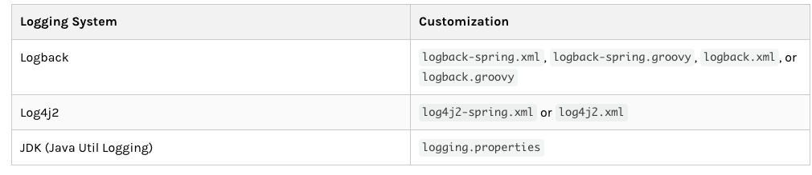

# 简介

日志是软件工程的一部分，是设计中的一处代表设计人员和开发人员工作态度的细节之一，更像是生活中保险，也许它并不一定立即体现作用，但是在日后维护中，优秀的日志可能会节省很多的排查时间，记得看过一句话：”每一行代码写之前思考多一分钟，将来排查可能就少一小时。“

# 环境介绍

1. MAC OS Catalina 10.15.2
2. JDK 8
3. Spring Boot 2.1.6
4. logback

logback官方地址：[http://logback.qos.ch/manual/index.html](http://logback.qos.ch/manual/index.html);

Spring-boot官方地址：https://docs.spring.io/spring-boot/docs/2.2.2.RELEASE/reference/html/spring-boot-features.html#boot-features-logging

（文档就用2.2.2凑合看吧...）

# 代码

根据官网描述，想使用自定义的日志配置文件，可以在resource目录下使用如下文件名：



demo代码比较简单，直接创建一个空的标准Spring Boot项目即可，在resource目录下新建一个名为logback-spring.xml的配置文件，并事先定义好一些配置，如下:

```xml
<?xml version="1.0" encoding="UTF-8"?>
<configuration scan="true" debug="false">
    <include resource="org/springframework/boot/logging/logback/defaults.xml"/>
    <property name="log-path" value="logs"/>
    <property name="max-history" value="240"/>
    <springProperty scope="context" name="sys-log-level" source="sys.default.log.level" defaultVakye="INFO"/>
</configuration>
```

其中，scan=true表示更新自动加载，debug表示输出日志组件状态信息(因为日志组件加载不依赖Spring的ApplictionContext)，`<property>`标签表示定义的变量，`<springProperty>`表示从spring的配置文件中读取的变量，换句话说，是从application.properties里读取的配置，source就是application.properties里key。


