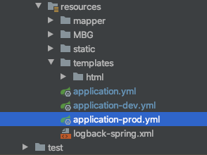
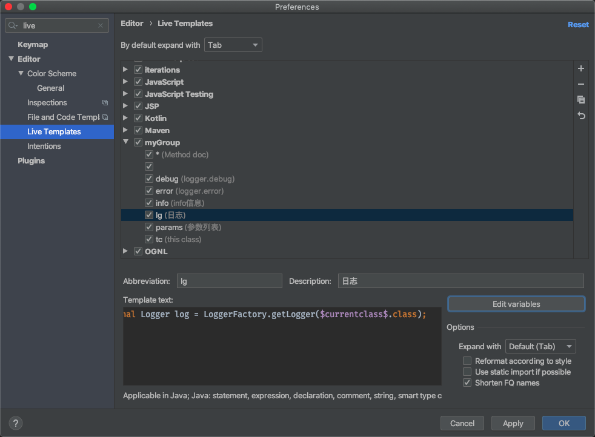
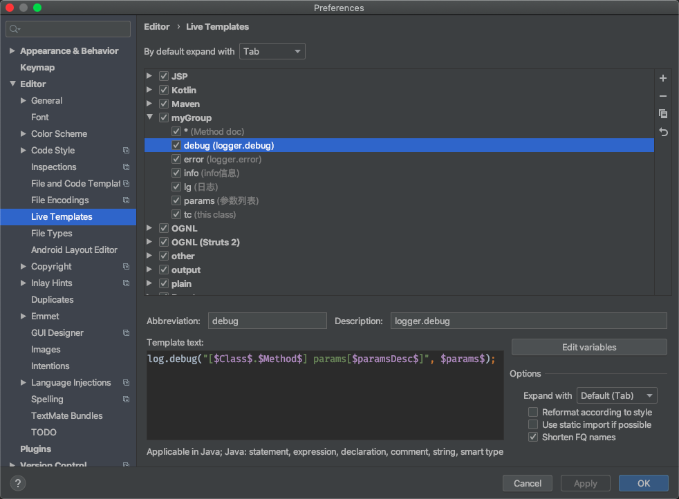
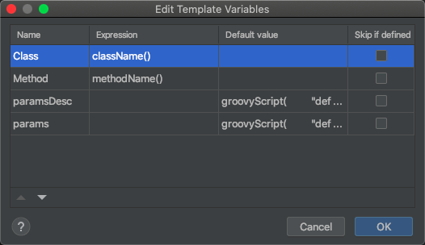

# 简介

日志是软件工程的一部分，是设计中的一处代表设计人员和开发人员工作态度的细节之一，更像是生活中保险，也许它并不一定立即体现作用，但是在日后维护中，优秀的日志可能会节省很多的排查时间，记得看过一句话：”每一行代码写之前思考多一分钟，将来排查可能就少一小时。“

<!--more-->

# 环境介绍

1. MAC OS Catalina 10.15.2
2. JDK 8
3. Spring Boot 2.1.6
4. logback

logback官方地址：[http://logback.qos.ch/manual/index.html](http://logback.qos.ch/manual/index.html);

Spring-boot官方地址：https://docs.spring.io/spring-boot/docs/2.2.2.RELEASE/reference/html/spring-boot-features.html#boot-features-logging

（文档就用2.2.2凑合看吧...）

# 代码

根据官网描述，想使用自定义的日志配置文件，可以在resource目录下使用如下文件名：


demo代码比较简单，直接创建一个空的标准Spring Boot项目即可，在resource目录下新建一个名为logback-spring.xml的配置文件，并事先定义好一些配置，如下:

```xml
<?xml version="1.0" encoding="UTF-8"?>
<configuration scan="true" debug="false">
    <include resource="org/springframework/boot/logging/logback/defaults.xml"/>
    <property name="log-path" value="logs"/>
    <property name="max-history" value="240"/>
    <springProperty scope="context" name="sys-log-level" source="sys.default.log.level" defaultVakye="INFO"/>
</configuration>
```

其中，scan=true表示更新自动加载，debug表示输出日志组件状态信息(因为日志组件加载不依赖Spring的ApplictionContext)，`<property>`标签表示定义的变量，`<springProperty>`表示从spring的配置文件中读取的变量，换句话说，是从application.properties里读取的配置，source就是application.properties里key。

logback主要由appender、logger组成，appender是用来输出日志的组件，logger是记录日志的组件，首先定义一个控制台的日志输出：

```xml
<appender name="CONSOLE" class="ch.qos.logback.core.ConsoleAppender">
        <encoder>
            <pattern>${CONSOLE_LOG_PATTERN}</pattern>
            <charset>utf8</charset>
        </encoder>
    </appender>
```

pattern标签里的表达式，在defaults文件里有，也就是spring boot默认日志格式，也可以自己定义。

然后配置系统文件输出组件：

```xml
<property name="PATH_APPLICATION" value="${LOG_PATH}/application/application.log"/>
    <appender name="APPLICATION" class="ch.qos.logback.core.rolling.RollingFileAppender">
        <file>${PATH_APPLICATION}</file>
        <encoder>
            <pattern>${FILE_LOG_PATTERN}</pattern>
        </encoder>
        <rollingPolicy class="ch.qos.logback.core.rolling.TimeBasedRollingPolicy">
            <fileNamePattern>${PATH_APPLICATION}.%d{yyyy-MM-dd-HH}</fileNamePattern>
            <maxHistory>${MAX_HISTORY}</maxHistory>
        </rollingPolicy>
        <filter class="ch.qos.logback.classic.filter.LevelFilter">
            <level>${SYS_LOG_LEVEL}</level>
            <onMatch>ACCEPT</onMatch>
            <onMismatch>DENY</onMismatch>
        </filter>
    </appender>
<appender name="ASYNC_APPLICATION" class="ch.qos.logback.classic.AsyncAppender">
        <neverBlock>true</neverBlock>
        <discardingThreshold>0</discardingThreshold>
        <queueSize>256</queueSize>
        <appender-ref ref="APPLICATION"/>
    </appender>
<logger name="com.blog">
        <appender-ref ref="ASYNC_APPLICATION"/>
    </logger>
```

分别是日志目录，滚动文件输出组件，滚动策略为定时，并且配置级别过滤器，级别为application.properties中的系统级别。logback的高性能体现在其异步日志输出上，根据官网描述，`AsyncAppender`只是一个日志分发器，所以它必须引用另外的appender才能工作，最后配置日志记录组件，即logger，logger的命名会根据`.`产生继承，例如`com.blog.controller`继承于`com.blog`包，当子记录器没有配置级别，它会继承父记录器级别，这里创建了一个叫`com.blog`的日志记录器。

现在一个标准的配置就完成了，最后配置ROOT：

```xml
<root level="${SYS_LOG_LEVEL}">
            <appender-ref ref="APPLICATION"/>
            <appender-ref ref="CONSOLE"/>
        </root>
```

项目结构如下：



配置dev中日志级别如下，

```yaml
sys:
  default:
    log:
      level: debug
```

prod环境中日志级别：

```yaml
sys:
  default:
    log:
      level: info
```

启动项目，在项目目录下即生成log目录，同时会打印不同级别的日志。

**但是线上其实不需要控制台输出，避免大量IO，只需要文件输出，那ConsoleAppender怎么处理？**

我希望本地调试保持控制台输出和文件，而线上只需要文件输出。

这个时候可以巧妙利用Spring 的profile功能：

```xml
<springProfile name="dev,test">
        <root level="${SYS_LOG_LEVEL}">
            <appender-ref ref="APPLICATION"/>
            <appender-ref ref="CONSOLE"/>
        </root>
    </springProfile>
    <springProfile name="prod">
        <root level="${SYS_LOG_LEVEL}">
            <appender-ref ref="ASYNC_APPLICATION"/>
        </root>
    </springProfile>

```

**我不想把所有的日志都放到这个文件里，对于某些重要的接口或者模块，想单独输出方便排查。**

直接定义一个新的logger，例如mq有关的：

```xml
<property name="MQ" value="${LOG_PATH}/application/mq.log"/>
    <appender name="MQ_APPENDER" class="ch.qos.logback.core.rolling.RollingFileAppender">
        <file>${PATH_APPLICATION}</file>
        <encoder>
            <pattern>${FILE_LOG_PATTERN}</pattern>
        </encoder>
        <rollingPolicy class="ch.qos.logback.core.rolling.TimeBasedRollingPolicy">
            <fileNamePattern>${MQ}.%d{yyyy-MM-dd-HH}</fileNamePattern>
            <maxHistory>${MAX_HISTORY}</maxHistory>
        </rollingPolicy>
        <filter class="ch.qos.logback.classic.filter.LevelFilter">
            <level>${SYS_LOG_LEVEL}</level>
            <onMatch>ACCEPT</onMatch>
            <onMismatch>DENY</onMismatch>
        </filter>
    </appender>
<appender name="ASYNC_MQ" class="ch.qos.logback.classic.AsyncAppender">
        <neverBlock>true</neverBlock>
        <discardingThreshold>0</discardingThreshold>
        <queueSize>256</queueSize>
        <appender-ref ref="MQ_APPENDER"/>
    </appender>
<logger name="com.blog.mq">
        <appender-ref ref="ASYNC_MQ"/>
    </logger>
```

可以通过`private static final Logger mqLog = LoggerFactory.getLogger("com.blog.mq");`获取特定的logger进行输出。

# 其他

**什么时候需要打印日志？**

1. 当我依赖其他服务或者模块时，记录入参和出参，用于排查和复盘，此时谓之边界日志，边界可以配合切面来记录，记录到单独文件；
2. 当执行了某关键操作和计算以后，结果是作为软件成果的一部分；
3. 系统异常、警告、出错，通常也是记录单独文件。

**日志打印格式？**

日志之所以起到作用，是因为输出有用的信息，例如：关键参数，错误码，错误描述等。对于debug日志，还可以在打印之前使用`isDebugEnabled()`进行判断，提高效率，虽然，在info级别下，debug日志不会输出，不过我的浅见是，自己判断了，就省掉了系统去构造打印参数的过程，毕竟，构造参数是在系统判断之前。

**Idea的小技巧**

无论对于eclipse还是idea等ide，都有动态模板可以生成打印debug的信息，这里简单介绍一下idea快速生成log的技巧，打开idea的设置，搜索live templates，新建一个Live Templates，可以首先新建一个自定义的template group，然后创建模板，文本选择`private static final Logger log = LoggerFactory.getLogger($currentclass$.class);`，点击define选择作用范围为Java，点击右边Edit Variables，选择Expression为className，如图：



这样的效果是：当输入lg的时候，就会有智能提示，然后会自动生成当前类的logger。

同样，还可以创建一个debug模板：





这里使用了两段groovyScript来配合自动生成参数名称和参数值：

```groovy
groovyScript("def result='';           def params=\"${_1}\".replaceAll('[\\\\[|\\\\]|\\\\s]', '').split(',').toList();           for(i = 0; i < params.size(); i++) {                   if(params[i] == '')              return result;                  result += i == params.size() - 1 ? params[i] +':{}': params[i]+':{}, ';                   };                    return result",           methodParameters())

groovyScript(          "def result='';           def params=\"${_1}\".replaceAll('[\\\\[|\\\\]|\\\\s]', '').split(',').toList();           for(i = 0; i < params.size(); i++) {                   if(params[i] == '')              return result;                  result += i == params.size() - 1 ? params[i]: params[i]+', ';                   };                    return result",           methodParameters())
```

